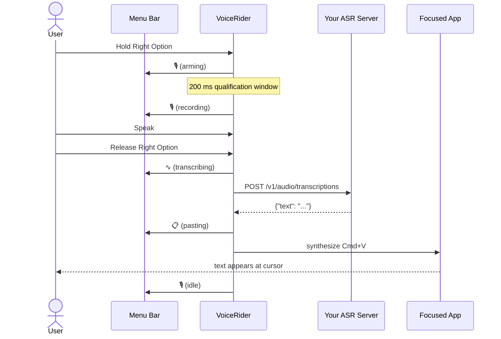
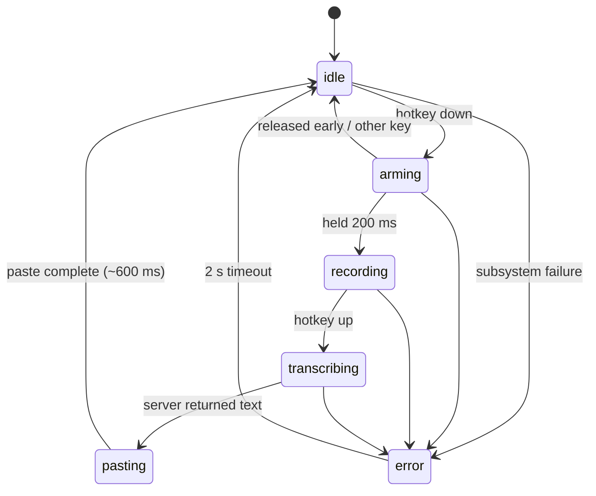
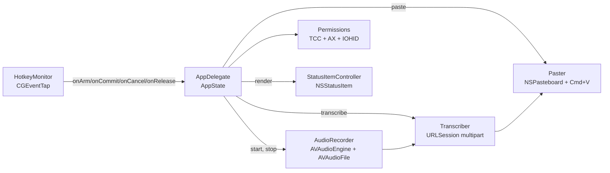

# VoiceRider

> Hold a key. Speak. Release. Text appears at your cursor.

A native macOS push-to-talk dictation tool that lives in your menu bar. Pure
Swift, zero-Electron, no cloud lock-in. Bring your own ASR server.



## Why

Existing dictation tools either (a) ship 200 MB of Electron, (b) require a
SaaS account, or (c) are abandoned and silently broken. VoiceRider is a
~2 MB native menu-bar app that does exactly five things — hotkey, record,
upload, paste, restore clipboard — and gets out of your way.

## Features

- **Push-to-talk hotkey:** hold Right Option, speak, release. A 200 ms
  qualification window filters accidental taps; if you press another
  modifier or key while held, the press is treated as a regular shortcut
  and recording is cancelled.
- **Bring your own ASR server:** any HTTP endpoint that accepts
  `multipart/form-data` and returns `{"text": "..."}` works. See the
  [server protocol](#server-protocol) below.
- **Clipboard-preserving paste:** your previous `.string` clipboard
  content is restored ~600 ms after paste-back. (See
  [limitations](#limitations) for what isn't preserved.)
- **Stays out of the way:** no Dock icon, no Cmd-Tab entry, just a mic
  glyph in the menu bar.
- **TCC-stable:** ad-hoc codesigned with a fixed bundle id, so
  permissions persist across `prod-build.sh` rebuilds.

## Quick start

```bash
git clone https://github.com/YOUR_USER/voicerider
cd voicerider
./prod-build.sh --install
open /Applications/VoiceRider.app
```

On first launch you'll be asked to grant three permissions:

1. **Microphone** — to record your voice.
2. **Accessibility** — to synthesize Cmd+V at the focused app.
3. **Input Monitoring** — to detect Right Option globally.

The first time you actually press the hotkey you'll also see macOS's
**Local Network** prompt (the ASR endpoint is on a LAN host by default).

## Demo

In TextEdit, click into a new document, then:

> Hold Right Option → say *"hello world"* → release.

The text should appear at your cursor.

## State machine

VoiceRider is one process with one `AppState` enum on the AppDelegate.
No parallel `Bool` flags, no shadowed state in subsystems.



## Architecture



Each module has a single public surface area; tests use injected
protocols (`MicrophoneStatusProviding`, etc.). One way to record audio,
one way to transcribe, one way to paste — see
`.kiro/steering/no-orphans-no-dual-paths.md` for the rationale.

## Build scripts

| Script | What it does | When |
|---|---|---|
| `./build.sh` | Debug build + tests. Fast iteration. No `.app` bundle. | While editing code. |
| `./build.sh test` | Just `swift test` | Tighter loop. |
| `./build.sh strict` | Release build with `-strict-concurrency=complete`. Informational; emits warnings under macOS 13's AVFoundation imports. | Before opening a PR that touches concurrency. |
| `./prod-build.sh` | Release build, zero-warning gate, full test run, `.app` bundle, ad-hoc codesign. | When you want something to launch. |
| `./prod-build.sh --skip-tests` | Same, faster, no test step. | Quick repackage. |
| `./prod-build.sh --install` | Same as `prod-build.sh` then `cp -R VoiceRider.app /Applications/`. | First-time setup or reinstall. |

`make` and `make verify` are also still available as alternatives — see
the `Makefile`.

## Configuration

VoiceRider reads three keys from `UserDefaults`:

```bash
defaults write com.voicerider voicerider.serverURL  "http://localhost:8000/v1/audio/transcriptions"
defaults write com.voicerider voicerider.modelName  "whisper-1"
defaults write com.voicerider voicerider.bearerToken "your-token"
```

Both `voicerider.modelName` and `voicerider.bearerToken` are validated
at launch:

| Key | Regex |
|---|---|
| `voicerider.modelName` | `^[A-Za-z0-9._-]{1,128}$` |
| `voicerider.bearerToken` | `^[A-Za-z0-9._~+/=-]{1,512}$` |

Malformed values are rejected at startup; the menu-bar icon will show
⚠️ with the precise reason. The strict regex defends against header /
multipart-body injection — `voicerider.bearerToken` is interpolated
directly into the `Authorization` header, and `voicerider.modelName`
into the multipart `model` part.

> **Security note:** `UserDefaults` is plaintext on disk at
> `~/Library/Preferences/com.voicerider.plist`. The default token
> `local-no-auth` is not a secret. If you configure a real bearer
> token, accept that any process running as your user can read it. A
> Keychain backend is tracked for v0.2.

If you change the host name, you also need to update the
`NSExceptionDomains` entry in `Resources/Info.plist` and rebuild — App
Transport Security blocks plain HTTP otherwise. See
[troubleshooting](#troubleshooting) for the IP-with-CIDR workaround.

## Server protocol

VoiceRider expects an OpenAI-compatible transcription endpoint.

**Request.** `POST <serverURL>` with:

- Header `Authorization: Bearer <bearerToken>`
- Content type `multipart/form-data; boundary=<unique>`
- Field `model`: the value of `voicerider.modelName`, sent verbatim.
  Your server interprets it.
- Field `file`: 16 kHz mono Int16 RIFF/WAVE bytes.

**Response.** `200 OK`, `Content-Type: application/json`:

```json
{"text": "the transcribed text"}
```

Any non-2xx status surfaces as an error. The response body (truncated
to the request log) is shown to the user via the menu-bar tooltip.
Empty / whitespace-only `text` surfaces as `server returned no text`.

### Reference servers

VoiceRider was built against a custom FastAPI shim around NVIDIA NeMo's
[Canary-Qwen-2.5B](https://huggingface.co/nvidia/canary-qwen-2.5b)
model running on CUDA. Anything that respects the contract above will
work — confirmed compatible:

- A 12-line FastAPI shim (below)
- [Speaches](https://github.com/speaches-ai/speaches) (formerly
  faster-whisper-server)
- vLLM with a Whisper model
- Cloudflare Workers AI's transcription endpoint (with a thin proxy
  for the auth shape)

A complete minimal Python reference server:

```python
from fastapi import FastAPI, UploadFile, Form
from your_asr import transcribe_wav    # bring your own

app = FastAPI()

@app.post("/v1/audio/transcriptions")
async def transcribe(file: UploadFile, model: str = Form(...)):
    wav = await file.read()
    text = transcribe_wav(wav, model_name=model)
    return {"text": text}
```

## Tests

```bash
./build.sh test
```

109 Swift Testing cases in 9 suites covering:

- Bearer-token + model-name allow-list (positive, boundary lengths,
  CRLF / null-byte / Unicode injection, RFC-grade fixtures)
- Multipart body byte-pinning (header bytes, file bytes, trailer bytes,
  filename round-trip, 1 MB length math, unique boundary per request)
- HTTP status variants (200/201/204/300/400/401/403/404/413/429/500/503,
  network error, decode error, missing-field, whitespace-only text,
  Unicode round-trip)
- Clipboard semantics (Unicode payloads, 10 KB / 100 KB sizes,
  restore-when-unchanged, no-op-when-changed, nil saved)
- AppState pairwise (in)equality, error message preservation
- WAV header parser fixture (rejects empty/short/missing-magic, parses
  16 kHz mono Int16 fixtures, computes derived fields for stereo
  24-bit)

The audio integration test (real microphone) is gated on
`VOICERIDER_RUN_AUDIO_TESTS=1` because CI typically lacks a default
input device.

## Hotkey

Currently hard-coded to **Right Option** (`kVK_RightOption`, keycode
61). The qualification window is 200 ms. Configurable hotkeys are
tracked for v0.2; see `docs/plans/`.

## Limitations

- **Clipboard preservation only restores `.string` content.** Images,
  file URLs, RTF, custom UTI types are lost during the ~600 ms
  paste-back window. v1 of the design.
- **Clipboard-history pollution.** `NSPasteboard.changeCount` is
  bumped twice per dictation (write + restore). Clipboard managers
  like Maccy / Paste / Alfred record both events. Add VoiceRider to
  your manager's ignore list.
- **Synthesized Cmd+V is ignored by some apps.** Secure-input password
  fields, some Terminal configurations, a few sandboxed text views
  with custom paste handlers. TextEdit / Notes / Slack / browser
  fields all work.
- **Right Option only.** No remapper UI yet.
- **Local-network ASR by default.** ATS exception in `Resources/Info.plist`
  permits HTTP to one host; other hosts require editing the plist and
  rebuilding (or using HTTPS).

## Troubleshooting

### `App Transport Security policy requires the use of a secure connection`

You changed `voicerider.serverURL` but the `NSExceptionDomains` entry
in `Resources/Info.plist` still names the old host. Either:

1. Edit the plist hostname and rebuild, **or**
2. Use the IP address with `/32` CIDR notation (Apple-supported):

```xml
<key>NSExceptionDomains</key>
<dict>
    <key>192.168.1.42/32</key>
    <dict>
        <key>NSExceptionAllowsInsecureHTTPLoads</key><true/>
    </dict>
</dict>
```

### TCC permission re-prompt every launch

You're running `swift run` instead of the bundled `.app`. TCC pins
permissions to bundle id + signature + path; `swift run` produces a
different binary path each build. Use `./prod-build.sh --install` and
launch from `/Applications`.

### Menu-bar icon not visible (notch'd MacBook Pro)

macOS silently clips menu-bar items that don't fit between the app
menus and the system status area, with no overflow indicator. Quit a
few menu-bar apps, or use a third-party tool like Bartender / Hidden
Bar. VoiceRider is running fine; the OS just isn't drawing the icon.

You can verify it's running with:

```bash
pgrep -lf VoiceRider.app/Contents/MacOS/VoiceRider
log show --predicate 'subsystem == "com.voicerider"' --last 60s --info
```

### Reset all permissions

```bash
tccutil reset Microphone     com.voicerider
tccutil reset Accessibility  com.voicerider
tccutil reset ListenEvent    com.voicerider
```

Then relaunch from `/Applications/VoiceRider.app` to re-prompt.

## Project status

v0.1 — works end-to-end. Tracked for v0.2:

- Configurable hotkey (UserDefaults + small picker UI)
- Keychain backend for `voicerider.bearerToken`
- Multi-type clipboard preservation (image / file / RTF)
- Swift 6 strict-concurrency adoption (currently warns under
  `./build.sh strict`)

## Contributing

PRs welcome. Before opening one:

```bash
./build.sh        # debug + tests
./prod-build.sh   # release + bundle (must succeed with zero warnings)
```

The four steering documents in `.kiro/steering/` are the
implementation contract — please read at minimum
`voice-project.md` (locked decisions) and
`no-orphans-no-dual-paths.md` (no unreachable code, no parallel
paths) before changing anything.

## License

[MIT](LICENSE).
