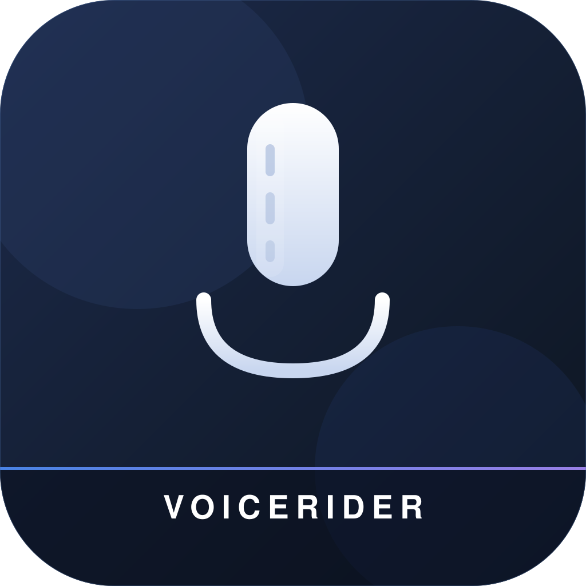
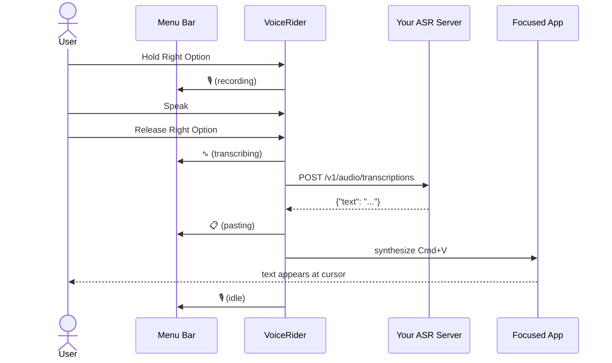
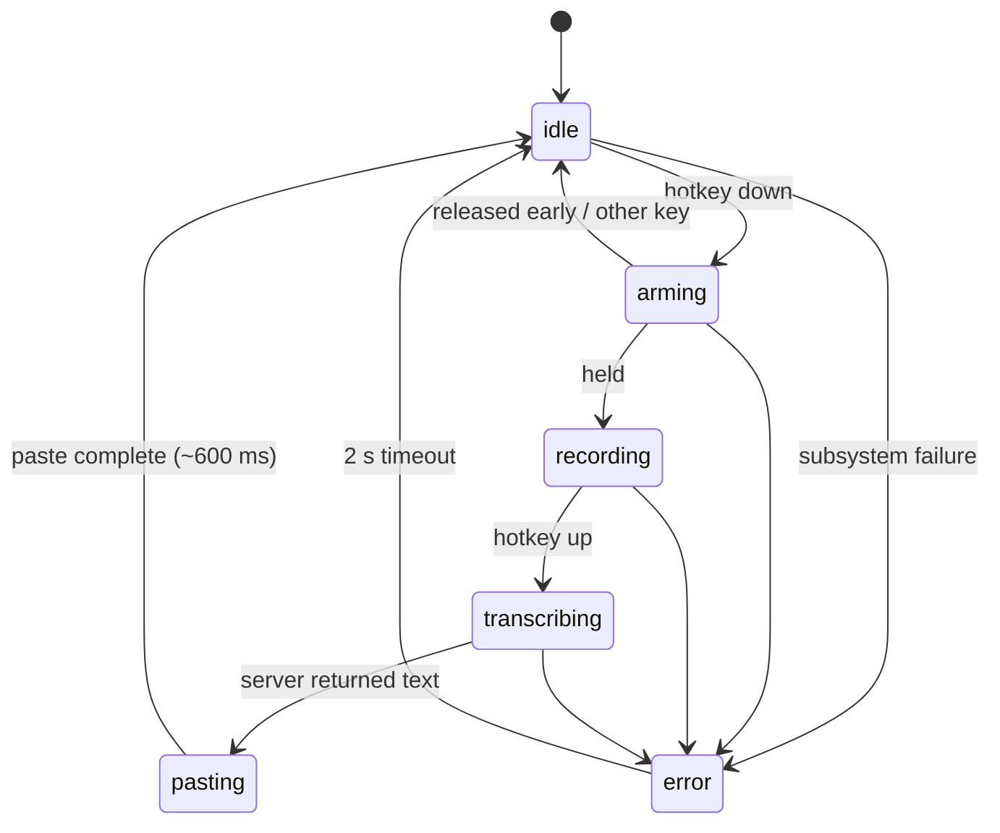
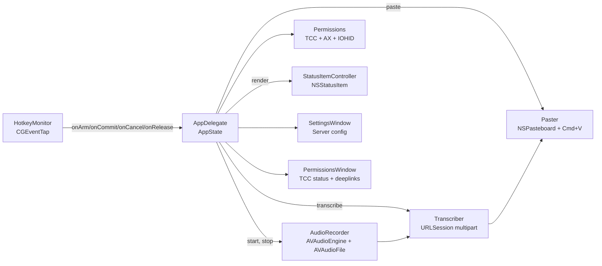

<p align="center">
  
</p>

# VoiceRider

**Native macOS push-to-talk dictation.** Your server, your network, your data. Hold a key, speak, release, and text appears at your cursor.

[**Download for Mac**](https://github.com/ssstonebraker/voicerider/releases/latest/download/VoiceRider.dmg)

macOS 13+ · Apple Silicon & Intel · Free & open source

[](LICENSE)
[](#server-protocol)

```
Hold Right ⌥ ──▶ Speak ──▶ Release ──▶ Text at cursor
```

## Why

I wanted a completely local-network push-to-speak ASR-integrated application
and couldn't find one, so I built one.

## Features

- **Push-to-talk hotkey:** hold Right Option, speak, release. If you press
  another modifier or key while held, the press is treated as a regular
  shortcut and recording is cancelled.
- **Bring your own ASR server:** any HTTP endpoint that accepts
  `multipart/form-data` and returns `{"text": "..."}` works. See
  [server protocol](#server-protocol) below.
- **Settings window:** configure server URL, model name, and bearer token
  from the menu bar. Includes a **Test Connection** button that verifies
  the endpoint with a silent WAV.
- **Permissions window:** live TCC grant state with plain-English
  descriptions, deep-links to the exact System Settings pane, and
  auto-close once all three are granted. Updates within ~200 ms of a
  toggle in Settings.
- **Clipboard-preserving paste:** your previous `.string` clipboard
  content is restored ~600 ms after paste-back. (See
  [limitations](#limitations) for what isn't preserved.)
- **Stays out of the way:** no Dock icon, no Cmd-Tab entry, just a mic
  glyph in the menu bar.
- **TCC-stable:** ad-hoc codesigned with a fixed bundle id, so
  permissions persist across `prod-build.sh` rebuilds.

## Quick start

```bash
git clone https://github.com/ssstonebraker/voicerider
cd voicerider
./prod-build.sh --install
open /Applications/VoiceRider.app
```

On first launch you'll be asked to grant three permissions:

1. **Microphone**: to record your voice.
2. **Accessibility**: to synthesize Cmd+V at the focused app.
3. **Input Monitoring**: to detect Right Option globally.

The first time you actually press the hotkey you'll also see macOS's
**Local Network** prompt (the ASR endpoint is on a LAN host by default).

## Demo

In TextEdit, click into a new document, then:

> Hold Right Option → say *"hello world"* → release.

The text should appear at your cursor.

## How it works



## State machine

VoiceRider is one process with one `AppState` enum on the AppDelegate.
No parallel `Bool` flags, no shadowed state in subsystems.



## Architecture



Each module has a single public surface area; tests use injected
protocols (`MicrophoneStatusProviding`, etc.). One way to record audio,
one way to transcribe, one way to paste. The codebase enforces this
strictly: every internal symbol has a caller (no orphans), and there
is exactly one production path through each subsystem (no parallel
implementations).

## Build scripts

| Script | What it does | When |
|---|---|---|
| `./build.sh` | Debug build + tests. Fast iteration. No `.app` bundle. | While editing code. |
| `./build.sh test` | Just `swift test` | Tighter loop. |
| `./build.sh strict` | Release build with `-strict-concurrency=complete`. Informational; emits warnings under macOS 13's AVFoundation imports. | Before opening a PR that touches concurrency. |
| `./prod-build.sh` | Release build, zero-warning gate, full test run, `.app` bundle, ad-hoc codesign. | When you want something to launch. |
| `./prod-build.sh --skip-tests` | Same, faster, no test step. | Quick repackage. |
| `./prod-build.sh --install` | Same as `prod-build.sh` then `cp -R VoiceRider.app /Applications/`. | First-time setup or reinstall. |

`make` and `make verify` are also still available as alternatives; see
the `Makefile`.

## Configuration

VoiceRider can be configured two ways: a **Settings…** window from the
menu-bar icon (since v0.1.x), or `defaults write` for power users. Both
write to the same three `UserDefaults` keys, so a value set via either
path is read by the next launch.

### From the menu

Click the menu-bar mic icon → **Settings…**. The window has three
fields:

- **Server URL**: the full `/v1/audio/transcriptions` endpoint.
- **Model name**: the value sent in the multipart `model` part.
- **Bearer token**: the `Authorization: Bearer …` value (entered
  into a secure-text field; dots, not characters).

A **Test Connection** button posts a 0.5-second silent WAV to the
endpoint and reports the result inline (HTTP status, decode failure,
ATS block, or "✓ silence accepted"). 15-second timeout to match
dictation; the reference Canary-Qwen server's 30–90 s cold-start
shows up here as a "timed out" message, but a real dictation right
after will succeed once the model is warm.

**Save** persists to `UserDefaults` and rebuilds the in-memory
Transcriber. **Cancel** (or Esc, or window-close) discards changes
with a confirm sheet if anything is dirty.

While the settings window is open VoiceRider briefly appears in
Cmd-Tab and the Dock; it returns to menu-bar-only mode on close.

### From the CLI

VoiceRider reads three keys from `UserDefaults`:

```bash
defaults write com.voicerider voicerider.serverURL  "http://localhost:8000/v1/audio/transcriptions"
defaults write com.voicerider voicerider.modelName  "whisper-1"
defaults write com.voicerider voicerider.bearerToken "your-token"
```

Both `voicerider.modelName` and `voicerider.bearerToken` are validated
at launch:

| Key | Regex |
|---|---|
| `voicerider.modelName` | `^[A-Za-z0-9._-]{1,128}$` |
| `voicerider.bearerToken` | `^[A-Za-z0-9._~+/=-]{1,512}$` |

Malformed values are rejected at startup; the menu-bar icon will show
⚠️ with the precise reason. The strict regex defends against header /
multipart-body injection. `voicerider.bearerToken` is interpolated
directly into the `Authorization` header, and `voicerider.modelName`
into the multipart `model` part.

> **Security note:** `UserDefaults` is plaintext on disk at
> `~/Library/Preferences/com.voicerider.plist`. The default token
> `local-no-auth` is not a secret. If you configure a real bearer
> token, accept that any process running as your user can read it. A
> Keychain backend is tracked for v0.2.

If you change the host name, you also need to make sure your `Info.plist`'s
`NSExceptionDomains` entry matches. App Transport Security blocks
plain HTTP otherwise. See the next section.

## Local config

`Resources/Info.plist` is **generated at build time** from
`Resources/Info.plist.template`, so you can keep your real LAN
hostname or IP in the Info.plist on disk without it leaking into
commits.

Quick-start:

```bash
cp .env.local.example .env.local
$EDITOR .env.local                # set VOICERIDER_LAN_HOST
./prod-build.sh --install         # the build renders Info.plist for you
```

How it resolves:

1. Default value if nothing is set: `localhost`.
2. `.env.local` (gitignored) is sourced for `VOICERIDER_LAN_HOST` if
   it exists.
3. `VOICERIDER_LAN_HOST=foo ./prod-build.sh` overrides everything else
   for that one build.

The generated `Resources/Info.plist` is gitignored. Only the template
and your `.env.local.example` are tracked. To verify your local host
isn't in the index:

```bash
git status                  # Info.plist should NOT appear
git check-ignore -v Resources/Info.plist .env.local
```

If you also need a non-default hostname for the runtime URL, set the
`UserDefault` (orthogonal to the Info.plist generation):

```bash
defaults write com.voicerider voicerider.serverURL \
    "http://my-asr-host:8000/v1/audio/transcriptions"
```

## Server protocol

VoiceRider expects an OpenAI-compatible transcription endpoint.

**Request.** `POST <serverURL>` with:

- Header `Authorization: Bearer <bearerToken>`
- Content type `multipart/form-data; boundary=<unique>`
- Field `model`: the value of `voicerider.modelName`, sent verbatim.
  Your server interprets it.
- Field `file`: 16 kHz mono Int16 RIFF/WAVE bytes (the client always
  resamples to this format before upload).

**Response.** `200 OK`, `Content-Type: application/json`:

```json
{"text": "the transcribed text"}
```

Any non-2xx status surfaces as an error. The response body (truncated
to the request log) is shown to the user via the menu-bar tooltip.
Empty / whitespace-only `text` surfaces as `server returned no text`.

The server **does not need to be on the public internet**. The default
configuration assumes a LAN host (Apple's App Transport Security is
configured for one named host in `Resources/Info.plist`; see
[troubleshooting](#troubleshooting) for swapping in your own).

## Alternative servers

If you don't want to run NeMo locally, anything that respects the
[server protocol](#server-protocol) works:

- **[Speaches](https://github.com/speaches-ai/speaches)**: drop-in
  OpenAI-compatible Whisper server, CPU or GPU.
- **[vLLM](https://github.com/vllm-project/vllm)** with a Whisper
  model: high-throughput serving framework.
- **[whisper.cpp](https://github.com/ggerganov/whisper.cpp/tree/master/examples/server)
  HTTP server**: lightweight, CPU-only feasible.
- **OpenAI's hosted `/v1/audio/transcriptions`**: paid, cloud, but
  works out of the box. Set `voicerider.bearerToken` to your API key
  and `voicerider.serverURL` to
  `https://api.openai.com/v1/audio/transcriptions`.
- **Anything else.** A minimum-viable shim:

```python
from fastapi import FastAPI, UploadFile, Form
from your_asr import transcribe_wav

app = FastAPI()

@app.post("/v1/audio/transcriptions")
async def transcribe(file: UploadFile, model: str = Form(...)):
    wav = await file.read()
    text = transcribe_wav(wav, model_name=model)
    return {"text": text}
```

See [`docs/server-canary-qwen-setup.md`](docs/server-canary-qwen-setup.md)
for a full reference deployment using NVIDIA Canary-Qwen 2.5B on Linux.

## Tests

```bash
./build.sh test
```

214 Swift Testing cases in 23 suites covering:

- Bearer-token + model-name allow-list (positive, boundary lengths,
  CRLF / null-byte / Unicode injection, RFC-grade fixtures)
- Multipart body byte-pinning (header bytes, file bytes, trailer bytes,
  filename round-trip, 1 MB length math, unique boundary per request)
- HTTP status variants (200/201/204/300/400/401/403/404/413/429/500/503,
  network error, decode error, missing-field, whitespace-only text,
  Unicode round-trip)
- Clipboard semantics (Unicode payloads, 10 KB / 100 KB sizes,
  restore-when-unchanged, no-op-when-changed, nil saved)
- AppState pairwise (in)equality, error message preservation
- WAV header parser fixture (rejects empty/short/missing-magic, parses
  16 kHz mono Int16 fixtures, computes derived fields for stereo 24-bit)
- Settings form validation (URL, model, bearer, round-trip, dirty detection)
- Permissions snapshot (all 2^3 combos, cdhash detection)
- Permissions window (snapshot diff, auto-close debounce, H1 suppression)
- Permission row view (render idempotency, state flip, pinned strings)

The audio integration test (real microphone) is gated on
`VOICERIDER_RUN_AUDIO_TESTS=1` because CI typically lacks a default
input device.

## Hotkey

Currently hard-coded to **Right Option** (`kVK_RightOption`, keycode
61). Recording starts instantly on key-down. Configurable hotkeys are
tracked for v0.2; see `docs/plans/`.

## Limitations

- **Clipboard preservation only restores `.string` content.** Images,
  file URLs, RTF, custom UTI types are lost during the ~600 ms
  paste-back window. v1 of the design.
- **Clipboard-history pollution.** `NSPasteboard.changeCount` is
  bumped twice per dictation (write + restore). Clipboard managers
  like Maccy / Paste / Alfred record both events. Add VoiceRider to
  your manager's ignore list.
- **Synthesized Cmd+V is ignored by some apps.** Secure-input password
  fields, some Terminal configurations, a few sandboxed text views
  with custom paste handlers. TextEdit / Notes / Slack / browser
  fields all work.
- **Right Option only.** No remapper UI yet.
- **Local-network ASR by default.** ATS exception in `Resources/Info.plist`
  permits HTTP to one host; other hosts require editing the plist and
  rebuilding (or using HTTPS).

## Troubleshooting

### `App Transport Security policy requires the use of a secure connection`

You changed `voicerider.serverURL` but the `NSExceptionDomains` entry
in `Resources/Info.plist` still names the old host. Either:

1. Edit the plist hostname and rebuild, **or**
2. Use the IP address with `/32` CIDR notation (Apple-supported):

```xml
<key>NSExceptionDomains</key>
<dict>
    <key>192.0.2.42/32</key>
    <dict>
        <key>NSExceptionAllowsInsecureHTTPLoads</key><true/>
    </dict>
</dict>
```

### TCC permission re-prompt every launch

You're running `swift run` instead of the bundled `.app`. TCC pins
permissions to bundle id + signature + path; `swift run` produces a
different binary path each build. Use `./prod-build.sh --install` and
launch from `/Applications`.

### "VoiceRider doesn't appear in Input Monitoring" (or grants reset every rebuild)

This is a fundamental limitation of **ad-hoc code signing**, not a bug
in VoiceRider. Per Apple DTS engineer Quinn "The Eskimo!" in
[Developer Forum #795739](https://developer.apple.com/forums/thread/795739):

> "macOS tracks code identity using the code's designated requirement.
> Ad hoc signed code does not include a stable DR, and thus macOS is
> unable to tell that version N+1 of your app is the 'same code' as
> version N."

**Workaround when the prompt doesn't appear:**

1. Open *System Settings → Privacy & Security → Input Monitoring*.
2. If you see no `+` button, first toggle ON some other app already
   in the list to force the `+` to appear, then toggle that other
   app back off.
3. Click `+`, navigate to `/Applications/VoiceRider.app`, select it.
4. Toggle VoiceRider ON. Repeat for *Accessibility* if needed.
5. Quit and relaunch VoiceRider.

Or: click the menu-bar icon → **Open Permission Settings…** to use the
in-app permissions window, which deep-links to the exact pane and
shows live status.

### Menu-bar icon not visible (notch'd MacBook Pro)

macOS silently clips menu-bar items that don't fit. Quit a few
menu-bar apps, or use Bartender / Hidden Bar. Verify it's running:

```bash
pgrep -lf VoiceRider.app/Contents/MacOS/VoiceRider
log show --predicate 'subsystem == "com.voicerider"' --last 60s --info
```

### Reset all permissions

```bash
tccutil reset Microphone     com.voicerider
tccutil reset Accessibility  com.voicerider
tccutil reset ListenEvent    com.voicerider
```

Then relaunch from `/Applications/VoiceRider.app` to re-prompt.

## Project status

v0.1: works end-to-end. Tracked for v0.2:

- Configurable hotkey (UserDefaults + small picker UI)
- Keychain backend for `voicerider.bearerToken`
- Multi-type clipboard preservation (image / file / RTF)
- Swift 6 strict-concurrency adoption (currently warns under
  `./build.sh strict`)

## Contributing

PRs welcome. Before opening one:

```bash
./build.sh        # debug + tests
./prod-build.sh   # release + bundle (must succeed with zero warnings)
```

The contributing rules:

- **No orphans.** Every internal `func` / `enum case` / property must
  have at least one caller in `Sources/` or `Tests/`.
- **No dual paths.** Audio capture happens in exactly one place
  (`AudioRecorder`); transcription in one place (`Transcriber`); paste
  in one place (`Paster`); state lives on one type (`AppState` on
  `AppDelegate`).
- **No `print`, `try!`, `as!`, IUOs, or non-`final` classes** in
  production code. Use `os.Logger`, throwing functions, and explicit
  unwrapping. Zero warnings on release build.
- **Tests with fixtures, not mocks where possible.** See
  `Tests/VoiceRiderTests/TranscriberHTTPFixtures.swift` for the style.

## License

[MIT](LICENSE).
