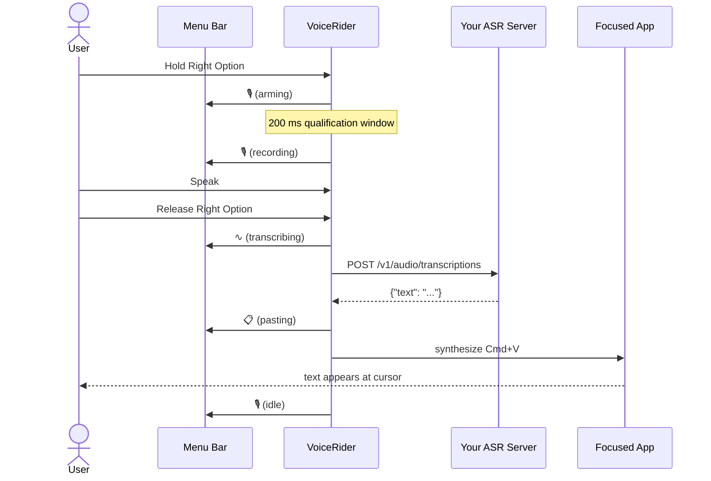
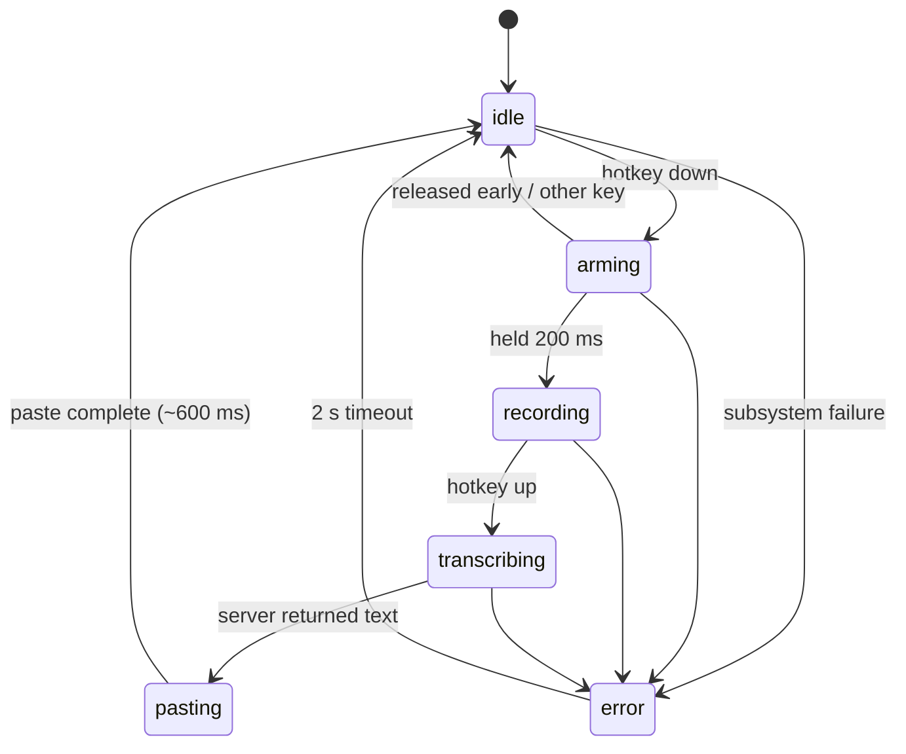
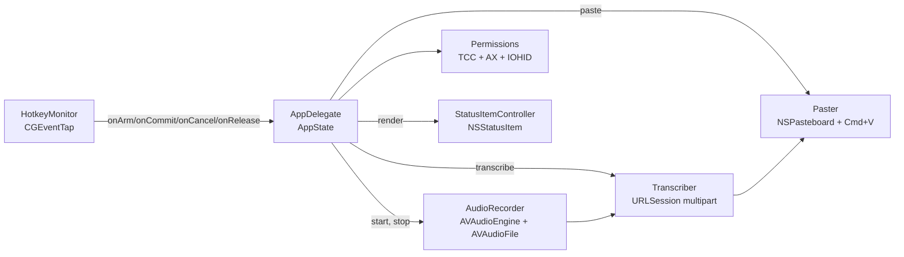

# VoiceRider

> Hold a key. Speak. Release. Text appears at your cursor.

A native macOS push-to-talk dictation tool that lives in your menu bar. Pure
Swift, zero-Electron, no cloud lock-in. Bring your own ASR server.



## Why

Existing dictation tools either (a) ship 200 MB of Electron, (b) require a
SaaS account, or (c) are abandoned and silently broken. VoiceRider is a
~2 MB native menu-bar app that does exactly five things — hotkey, record,
upload, paste, restore clipboard — and gets out of your way.

## Features

- **Push-to-talk hotkey:** hold Right Option, speak, release. A 200 ms
  qualification window filters accidental taps; if you press another
  modifier or key while held, the press is treated as a regular shortcut
  and recording is cancelled.
- **Bring your own ASR server:** any HTTP endpoint that accepts
  `multipart/form-data` and returns `{"text": "..."}` works. See the
  [server protocol](#server-protocol) below.
- **Clipboard-preserving paste:** your previous `.string` clipboard
  content is restored ~600 ms after paste-back. (See
  [limitations](#limitations) for what isn't preserved.)
- **Stays out of the way:** no Dock icon, no Cmd-Tab entry, just a mic
  glyph in the menu bar.
- **TCC-stable:** ad-hoc codesigned with a fixed bundle id, so
  permissions persist across `prod-build.sh` rebuilds.

## Quick start

```bash
git clone https://github.com/YOUR_USER/voicerider
cd voicerider
./prod-build.sh --install
open /Applications/VoiceRider.app
```

On first launch you'll be asked to grant three permissions:

1. **Microphone** — to record your voice.
2. **Accessibility** — to synthesize Cmd+V at the focused app.
3. **Input Monitoring** — to detect Right Option globally.

The first time you actually press the hotkey you'll also see macOS's
**Local Network** prompt (the ASR endpoint is on a LAN host by default).

## Demo

In TextEdit, click into a new document, then:

> Hold Right Option → say *"hello world"* → release.

The text should appear at your cursor.

## State machine

VoiceRider is one process with one `AppState` enum on the AppDelegate.
No parallel `Bool` flags, no shadowed state in subsystems.



## Architecture



Each module has a single public surface area; tests use injected
protocols (`MicrophoneStatusProviding`, etc.). One way to record audio,
one way to transcribe, one way to paste. The codebase enforces this
strictly: every internal symbol has a caller (no orphans), and there
is exactly one production path through each subsystem (no parallel
implementations).

## Build scripts

| Script | What it does | When |
|---|---|---|
| `./build.sh` | Debug build + tests. Fast iteration. No `.app` bundle. | While editing code. |
| `./build.sh test` | Just `swift test` | Tighter loop. |
| `./build.sh strict` | Release build with `-strict-concurrency=complete`. Informational; emits warnings under macOS 13's AVFoundation imports. | Before opening a PR that touches concurrency. |
| `./prod-build.sh` | Release build, zero-warning gate, full test run, `.app` bundle, ad-hoc codesign. | When you want something to launch. |
| `./prod-build.sh --skip-tests` | Same, faster, no test step. | Quick repackage. |
| `./prod-build.sh --install` | Same as `prod-build.sh` then `cp -R VoiceRider.app /Applications/`. | First-time setup or reinstall. |

`make` and `make verify` are also still available as alternatives — see
the `Makefile`.

## Configuration

VoiceRider can be configured two ways: a **Settings…** window from the
menu-bar icon (since v0.1.x), or `defaults write` for power users. Both
write to the same three `UserDefaults` keys, so a value set via either
path is read by the next launch.

### From the menu

Click the menu-bar mic icon → **Settings…**. The window has three
fields:

- **Server URL** — the full `/v1/audio/transcriptions` endpoint.
- **Model name** — the value sent in the multipart `model` part.
- **Bearer token** — the `Authorization: Bearer …` value (entered
  into a secure-text field; dots, not characters).

A **Test Connection** button posts a 0.5-second silent WAV to the
endpoint and reports the result inline (HTTP status, decode failure,
ATS block, or "✓ silence accepted"). 15-second timeout to match
dictation; the reference Canary-Qwen server's 30–90 s cold-start
shows up here as a "timed out" message — a real dictation right
after will succeed once the model is warm.

**Save** persists to `UserDefaults` and rebuilds the in-memory
Transcriber. **Cancel** (or Esc, or window-close) discards changes
with a confirm sheet if anything is dirty.

While the settings window is open VoiceRider briefly appears in
Cmd-Tab and the Dock; it returns to menu-bar-only mode on close.

### From the CLI

VoiceRider reads three keys from `UserDefaults`:

```bash
defaults write com.voicerider voicerider.serverURL  "http://localhost:8000/v1/audio/transcriptions"
defaults write com.voicerider voicerider.modelName  "whisper-1"
defaults write com.voicerider voicerider.bearerToken "your-token"
```

Both `voicerider.modelName` and `voicerider.bearerToken` are validated
at launch:

| Key | Regex |
|---|---|
| `voicerider.modelName` | `^[A-Za-z0-9._-]{1,128}$` |
| `voicerider.bearerToken` | `^[A-Za-z0-9._~+/=-]{1,512}$` |

Malformed values are rejected at startup; the menu-bar icon will show
⚠️ with the precise reason. The strict regex defends against header /
multipart-body injection — `voicerider.bearerToken` is interpolated
directly into the `Authorization` header, and `voicerider.modelName`
into the multipart `model` part.

> **Security note:** `UserDefaults` is plaintext on disk at
> `~/Library/Preferences/com.voicerider.plist`. The default token
> `local-no-auth` is not a secret. If you configure a real bearer
> token, accept that any process running as your user can read it. A
> Keychain backend is tracked for v0.2.

If you change the host name, you also need to make sure your `Info.plist`'s
`NSExceptionDomains` entry matches — App Transport Security blocks
plain HTTP otherwise. See the next section.

## Local config (don't commit your LAN host)

`Resources/Info.plist` is **generated at build time** from
`Resources/Info.plist.template`, so you can keep your real LAN
hostname or IP in the Info.plist on disk without it leaking into
commits.

Quick-start:

```bash
cp .env.local.example .env.local
$EDITOR .env.local                # set VOICERIDER_LAN_HOST
./prod-build.sh --install         # the build renders Info.plist for you
```

How it resolves:

1. Default value if nothing is set: `localhost`.
2. `.env.local` (gitignored) is sourced for `VOICERIDER_LAN_HOST` if
   it exists.
3. `VOICERIDER_LAN_HOST=foo ./prod-build.sh` overrides everything else
   for that one build.

The generated `Resources/Info.plist` is gitignored. Only the template
and your `.env.local.example` are tracked. To verify your local host
isn't in the index:

```bash
git status                  # Info.plist should NOT appear
git check-ignore -v Resources/Info.plist .env.local
```

If you also need a non-default hostname for the runtime URL, set the
`UserDefault` (orthogonal to the Info.plist generation):

```bash
defaults write com.voicerider voicerider.serverURL \
    "http://my-asr-host:8000/v1/audio/transcriptions"
```

## Server protocol

VoiceRider expects an OpenAI-compatible transcription endpoint.

**Request.** `POST <serverURL>` with:

- Header `Authorization: Bearer <bearerToken>`
- Content type `multipart/form-data; boundary=<unique>`
- Field `model`: the value of `voicerider.modelName`, sent verbatim.
  Your server interprets it.
- Field `file`: 16 kHz mono Int16 RIFF/WAVE bytes (the client always
  resamples to this format before upload).

**Response.** `200 OK`, `Content-Type: application/json`:

```json
{"text": "the transcribed text"}
```

Any non-2xx status surfaces as an error. The response body (truncated
to the request log) is shown to the user via the menu-bar tooltip.
Empty / whitespace-only `text` surfaces as `server returned no text`.

The server **does not need to be on the public internet**. The default
configuration assumes a LAN host (Apple's App Transport Security is
configured for one named host in `Resources/Info.plist`; see
[troubleshooting](#troubleshooting) for swapping in your own).

## Reference server: Canary-Qwen 2.5B on Linux + RTX 4080

VoiceRider was developed against a self-hosted [NVIDIA Canary-Qwen
2.5B](https://huggingface.co/nvidia/canary-qwen-2.5b) running on a
single Linux box on the LAN. As of mid-2025 Canary-Qwen-2.5B is the
top-ranked open-source English ASR model on the [Hugging Face Open ASR
Leaderboard](https://huggingface.co/spaces/hf-audio/open_asr_leaderboard)
(~5.6% WER) and runs in ~10–14 GB of VRAM at bf16, which fits on a
single RTX 4080.

> **This setup is illustrative, not prescriptive.** The reference
> instructions below place all server data under a single base
> directory referred to as `$ASR_ROOT` (e.g. `/srv/asr`,
> `/opt/canary`, `/data/asr` — wherever you have ≥30 GB of fast
> disk). Set `export ASR_ROOT=/your/path` once before following the
> guide; every command below uses it. Your distro and hardware will
> differ — anything that honors the [contract above](#server-protocol)
> works — see [alternatives](#alternative-servers) below if you don't
> want to run NeMo locally.

### What you need

- **GPU.** NVIDIA, ≥10 GB VRAM. Tested on RTX 4080 (16 GB). Smaller
  cards may work at fp16 / int8 with `bitsandbytes` but aren't
  documented here.
- **Driver.** NVIDIA proprietary driver ≥550 (`nvidia-smi` should
  report CUDA 12.4+).
- **OS.** Any Linux with a recent kernel. Reference is Linux Mint /
  Ubuntu-derived; nothing distro-specific.
- **Python.** 3.10 or 3.11. NeMo 2.x doesn't yet support 3.12.
- **Disk.** ~20 GB for the model + Python deps. The reference setup
  pins this to a non-`$HOME` SSD via `HF_HOME=$ASR_ROOT/models/hf-cache`.

### Stack

| Component | Choice | Why |
|---|---|---|
| Web framework | FastAPI + `uvicorn[standard]` | Async file uploads, OpenAPI/Swagger for free at `/docs` |
| ASR runtime | [NeMo Toolkit 2.0](https://github.com/NVIDIA/NeMo) `[asr]` extra | Official NVIDIA SpeechLM2 / SALM loader for Canary-Qwen |
| Audio I/O | `librosa` + `soundfile` | Resample arbitrary inputs to 16 kHz mono before inference |
| Auth | None (LAN-only, validated by upstream firewall) | The bearer header is accepted but not verified |
| Process supervision | `systemd` unit | Auto-restart, journal log, model warm across reboots |
| Firewall | `ufw` allow rules for LAN CIDRs | Keeps port 8000 off the public internet |

### Reference server source

A trimmed FastAPI shim that loads NeMo SALM, accepts uploads, resamples
to 16 kHz mono, runs inference, and returns `{"text": "..."}`. Full
setup notes — apt packages, virtualenv, model download via
`huggingface-cli`, `systemd` unit, smoke tests with `arecord` /
`ffmpeg`, ufw rules — live in
[`docs/server-canary-qwen-setup.md`](docs/server-canary-qwen-setup.md).

```python
# $ASR_ROOT/git/canary-server/server.py  (abbreviated)
import os, tempfile, torch, soundfile as sf, librosa
from fastapi import FastAPI, UploadFile, File, Form, HTTPException
from fastapi.responses import JSONResponse
from nemo.collections.speechlm2.models import SALM

MODEL_DIR = os.environ.get("MODEL_DIR", "$ASR_ROOT/models/canary-qwen-2.5b")
DEVICE    = "cuda" if torch.cuda.is_available() else "cpu"
DTYPE     = torch.bfloat16 if DEVICE == "cuda" else torch.float32

model = SALM.from_pretrained(MODEL_DIR).to(DEVICE).to(DTYPE).eval()
app   = FastAPI(title="Canary-Qwen 2.5B ASR (OpenAI-compatible)")

@app.get("/health")
def health():
    return {"status": "ok", "device": DEVICE, "model": "nvidia/canary-qwen-2.5b"}

@app.post("/v1/audio/transcriptions")
async def transcribe(file: UploadFile = File(...),
                     model_name: str | None = Form("canary-qwen-2.5b", alias="model"),
                     prompt: str | None = Form(None)):
    suffix = os.path.splitext(file.filename or "audio.wav")[1] or ".wav"
    with tempfile.NamedTemporaryFile(suffix=suffix, delete=False) as f:
        f.write(await file.read())
        tmp_in = f.name
    wav, _ = librosa.load(tmp_in, sr=16000, mono=True)
    tmp_16k = tmp_in + ".16k.wav"
    sf.write(tmp_16k, wav, 16000, subtype="PCM_16")

    user_text = prompt or "Transcribe the following:"
    prompts = [[{
        "role": "user",
        "content": f"{user_text} {model.audio_locator_tag}",
        "audio": [tmp_16k],
    }]]
    with torch.inference_mode():
        ids = model.generate(prompts=prompts, max_new_tokens=512)[0]
    text = model.tokenizer.ids_to_text(ids.cpu().tolist()).strip()
    return JSONResponse({"text": text})
```

### Operational quirks worth knowing

- **Cold start is 30–90 seconds.** First model load reads ~10 GB of
  weights from disk and JIT-compiles CUDA kernels. The systemd unit
  uses `TimeoutStartSec=300` for this. After warm-up, real
  transcription is sub-second on a 5-second clip.
- **VoiceRider always sends 16 kHz mono Int16**, but the reference
  server *also* runs `librosa.load(..., sr=16000, mono=True)` as a
  defensive resample. Costs a few ms; saves a debugging session if a
  future client doesn't honor the spec.
- **The `prompt` field is forwarded to the model.** Canary-Qwen is a
  SpeechLM, not a pure ASR model — it accepts a textual prompt and
  steers transcription accordingly. VoiceRider doesn't currently send
  one (omitted = "Transcribe the following:" default).
- **Model weights belong on fast disk, not in `$HOME`.** The
  reference setup pins `HF_HOME=$ASR_ROOT/models/hf-cache` so weights
  live on whichever SSD `$ASR_ROOT` resolves to, not on the system
  disk. This is purely operational, not a protocol requirement.

## Alternative servers

If you don't want to run NeMo locally, anything that respects the
[server protocol](#server-protocol) works:

- **[Speaches](https://github.com/speaches-ai/speaches)** (formerly
  faster-whisper-server) — drop-in OpenAI-compatible Whisper server,
  CPU or GPU.
- **[vLLM](https://github.com/vllm-project/vllm)** with a Whisper
  model — high-throughput serving framework, Whisper plug-in.
- **[whisper.cpp](https://github.com/ggerganov/whisper.cpp/tree/master/examples/server)
  HTTP server** — lightweight, CPU-only feasible.
- **OpenAI's hosted `/v1/audio/transcriptions`** itself — paid, cloud,
  but if you're fine with that and have a real API key, it just works.
  Set `voicerider.bearerToken` to your real key and
  `voicerider.serverURL` to `https://api.openai.com/v1/audio/transcriptions`.
  Note: requires editing `Resources/Info.plist` to drop the LAN ATS
  exception (HTTPS to OpenAI doesn't need one).
- **Anything else.** A complete minimum-viable shim:

```python
from fastapi import FastAPI, UploadFile, Form
from your_asr import transcribe_wav    # bring your own

app = FastAPI()

@app.post("/v1/audio/transcriptions")
async def transcribe(file: UploadFile, model: str = Form(...)):
    wav = await file.read()
    text = transcribe_wav(wav, model_name=model)
    return {"text": text}
```

## Tests

```bash
./build.sh test
```

109 Swift Testing cases in 9 suites covering:

- Bearer-token + model-name allow-list (positive, boundary lengths,
  CRLF / null-byte / Unicode injection, RFC-grade fixtures)
- Multipart body byte-pinning (header bytes, file bytes, trailer bytes,
  filename round-trip, 1 MB length math, unique boundary per request)
- HTTP status variants (200/201/204/300/400/401/403/404/413/429/500/503,
  network error, decode error, missing-field, whitespace-only text,
  Unicode round-trip)
- Clipboard semantics (Unicode payloads, 10 KB / 100 KB sizes,
  restore-when-unchanged, no-op-when-changed, nil saved)
- AppState pairwise (in)equality, error message preservation
- WAV header parser fixture (rejects empty/short/missing-magic, parses
  16 kHz mono Int16 fixtures, computes derived fields for stereo
  24-bit)

The audio integration test (real microphone) is gated on
`VOICERIDER_RUN_AUDIO_TESTS=1` because CI typically lacks a default
input device.

## Hotkey

Currently hard-coded to **Right Option** (`kVK_RightOption`, keycode
61). The qualification window is 200 ms. Configurable hotkeys are
tracked for v0.2; see `docs/plans/`.

## Limitations

- **Clipboard preservation only restores `.string` content.** Images,
  file URLs, RTF, custom UTI types are lost during the ~600 ms
  paste-back window. v1 of the design.
- **Clipboard-history pollution.** `NSPasteboard.changeCount` is
  bumped twice per dictation (write + restore). Clipboard managers
  like Maccy / Paste / Alfred record both events. Add VoiceRider to
  your manager's ignore list.
- **Synthesized Cmd+V is ignored by some apps.** Secure-input password
  fields, some Terminal configurations, a few sandboxed text views
  with custom paste handlers. TextEdit / Notes / Slack / browser
  fields all work.
- **Right Option only.** No remapper UI yet.
- **Local-network ASR by default.** ATS exception in `Resources/Info.plist`
  permits HTTP to one host; other hosts require editing the plist and
  rebuilding (or using HTTPS).

## Troubleshooting

### `App Transport Security policy requires the use of a secure connection`

You changed `voicerider.serverURL` but the `NSExceptionDomains` entry
in `Resources/Info.plist` still names the old host. Either:

1. Edit the plist hostname and rebuild, **or**
2. Use the IP address with `/32` CIDR notation (Apple-supported):

```xml
<key>NSExceptionDomains</key>
<dict>
    <key>192.0.2.42/32</key>
    <dict>
        <key>NSExceptionAllowsInsecureHTTPLoads</key><true/>
    </dict>
</dict>
```

### TCC permission re-prompt every launch

You're running `swift run` instead of the bundled `.app`. TCC pins
permissions to bundle id + signature + path; `swift run` produces a
different binary path each build. Use `./prod-build.sh --install` and
launch from `/Applications`.

### "VoiceRider doesn't appear in Input Monitoring" (or grants reset every rebuild)

This is a fundamental limitation of **ad-hoc code signing**, not a bug
in VoiceRider. Per Apple DTS engineer Quinn "The Eskimo!" in
[Developer Forum #795739](https://developer.apple.com/forums/thread/795739):

> "macOS tracks code identity using the code's designated requirement.
> Ad hoc signed code does not include a stable DR, and thus macOS is
> unable to tell that version N+1 of your app is the 'same code' as
> version N."

Practical consequences:

- **Every rebuild** of VoiceRider (including `./prod-build.sh
  --install`) produces a new code-directory hash. macOS treats it as
  a brand-new app, and any previously granted Accessibility / Input
  Monitoring permissions are invalidated.
- **The macOS prompt sometimes does not appear** after a re-grant
  cycle. VoiceRider calls both `IOHIDRequestAccess()` (IOKit) and
  `CGRequestListenEventAccess()` (Quartz) to maximize the chance, but
  Apple confirms a known bug
  ([Forum #128641](https://developer.apple.com/forums/thread/128641),
  rdar://55284204) where the **`+` button in Input Monitoring is
  hidden when the list is empty**.
- **Workaround when the prompt doesn't appear:**
    1. Open *System Settings → Privacy & Security → Input Monitoring*.
    2. If you see no `+` button, first toggle ON some other app already
       in the list to force the `+` to appear, then toggle that other
       app back off.
    3. Click `+`, navigate to `/Applications/VoiceRider.app`, select it.
    4. Toggle VoiceRider ON. Repeat for *Accessibility* if needed.
    5. Quit and relaunch VoiceRider.
- **VoiceRider's cdhash-change alert** (the dialog that appears after
  a rebuild) has a *Reveal in Finder* button that pre-selects
  `VoiceRider.app` so you can drag it into the Settings panel.

The only way to make grants persist across rebuilds is to sign with
a stable identity (Apple Developer ID, $99/year). For end users
installing once, this isn't an issue — the prompt fires on first
launch, they grant, and grants persist until they update.

### Menu-bar icon not visible (notch'd MacBook Pro)

macOS silently clips menu-bar items that don't fit between the app
menus and the system status area, with no overflow indicator. Quit a
few menu-bar apps, or use a third-party tool like Bartender / Hidden
Bar. VoiceRider is running fine; the OS just isn't drawing the icon.

You can verify it's running with:

```bash
pgrep -lf VoiceRider.app/Contents/MacOS/VoiceRider
log show --predicate 'subsystem == "com.voicerider"' --last 60s --info
```

### Reset all permissions

```bash
tccutil reset Microphone     com.voicerider
tccutil reset Accessibility  com.voicerider
tccutil reset ListenEvent    com.voicerider
```

Then relaunch from `/Applications/VoiceRider.app` to re-prompt.

## Project status

v0.1 — works end-to-end. Tracked for v0.2:

- Configurable hotkey (UserDefaults + small picker UI)
- Keychain backend for `voicerider.bearerToken`
- Multi-type clipboard preservation (image / file / RTF)
- Swift 6 strict-concurrency adoption (currently warns under
  `./build.sh strict`)

## Contributing

PRs welcome. Before opening one:

```bash
./build.sh        # debug + tests
./prod-build.sh   # release + bundle (must succeed with zero warnings)
```

The contributing rules — boiled down to the minimum a PR author needs
to know — are:

- **No orphans.** Every internal `func` / `enum case` / property must
  have at least one caller in `Sources/` or `Tests/`. Dead code is
  removed in the same PR that introduces it.
- **No dual paths.** Audio capture happens in exactly one place
  (`AudioRecorder`); transcription in one place (`Transcriber`); paste
  in one place (`Paster`); state lives on one type (`AppState` on
  `AppDelegate`). New features extend these; they do not run in
  parallel with them.
- **No `print`, `try!`, `as!`, IUOs, or non-`final` classes** in
  production code. Use `os.Logger`, throwing functions, and explicit
  unwrapping. The release build must compile under default Swift 5
  mode with **zero warnings**.
- **Match the existing concurrency model.** UI types are `@MainActor`;
  audio happens on the audio render thread; subsystem state is
  protected by `os_unfair_lock` where appropriate. See
  `Sources/VoiceRider/AudioRecorder.swift` for the canonical pattern.
- **Tests with fixtures, not mocks where possible.** New features
  should ship with bytes-level fixtures (see
  `Tests/VoiceRiderTests/TranscriberHTTPFixtures.swift` and
  `WAVHeaderFixtures.swift` for the style).

## License

[MIT](LICENSE).
