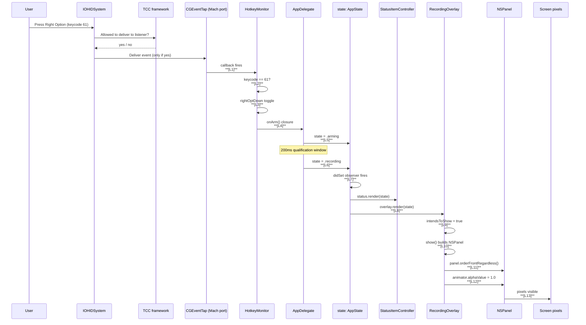

# VoiceRider — Recording Overlay Diagnosis & Fix (Master Plan)

**Date:** 2026-05-17
**Status:** Proposed for implementation
**Author:** Decompose → Critique → Refine, single Sonnet review session
**Implementation:** This same session implements after the user approves the plan.

---

## 0. Methodology & Guardrails

### 0.1 MISSION

You are diagnosing why VoiceRider's recording overlay does **not** appear when
the user holds Right Option, and shipping a fix that resolves it. The user has
already reported the failure once; the previous response told them "just grant
permissions" without log evidence. **Reject that pattern.** Instrument every
link in the press → overlay chain, get a real reproduction trace, identify the
failing link from evidence, and fix exactly that link.

**ACCURACY OVER SPEED.** This app captures audio off the user's microphone,
synthesizes Cmd+V into arbitrary apps, and listens to every keystroke. If a
diagnosis is wrong, we either (a) ship a fix that breaks something else, or
(b) leave the user holding a broken hotkey app. A delay that catches the real
cause is better than a "guess fix" that ships.

### 0.1.1 LEGEND

| Term | Meaning |
|------|---------|
| **The chain** | Hotkey press → CGEventTap → `onArm` → `handleArm` → `state = .recording` → `state.didSet` → `overlay.render(_:)` → `show()` → `NSPanel.orderFrontRegardless()` → visible pixels |
| **DCR** | Decompose → Critique → Refine |
| **TCC** | Apple's Transparency, Consent, and Control framework (the Privacy & Security panes) |
| **cdhash** | Code Directory hash — the cryptographic fingerprint TCC uses to pin grants to a specific build |
| **trace point** | A `Log.trace.debug(...)` call placed at a known link of the chain, all under the same `category=trace` so they can be filtered together |
| **Right Option** | macOS keycode 61, the hotkey VoiceRider listens for |
| **D1–D5** | The five defensive fixes for medium-probability overlay failure modes (see §3.3) |
| **P1–P3** | The three permission-UX improvements (see §3.4) |

### 0.2 DECOMPOSE → CRITIQUE → REFINE (MANDATORY)

For every non-trivial decision in this plan and during implementation:

1. **DECOMPOSE.** What are the moving parts? What does the press → overlay
   chain actually look like, link by link? (See §3.1 for the canonical chain.)
2. **CRITIQUE.** What could go wrong at each link? What evidence do I have
   that a link works? What evidence do I have that I'm wrong about which link
   broke? What assumptions am I making? (See §3.2 for the probability table.)
3. **REFINE.** Adjust the approach based on the critique. Add instrumentation
   exactly where the critique exposed a blind spot. Apply defensive fixes for
   medium-probability paths even if the highest-probability fix succeeds — we
   want robustness, not a one-shot patch.

### 0.2.1 EVIDENCE-LOCKING (MANDATORY before applying any fix)

Before changing any production code in response to a hypothesis:

1. **Verify** the hypothesis is consistent with the trace log captured in
   Phase A. If you cannot point to a specific log line that supports the
   hypothesis, **do not apply the fix.**
2. **Verify** the existing code's actual behavior, not what its docstring
   claims. Re-read the function. Run it once.
3. **Verify** the proposed fix changes the failing link, not a sibling link.

### 0.3 GUARDRAILS (NON-NEGOTIABLE)

1. **NEVER apply a "guess fix" without instrumentation evidence first.**
   The previous response did this. If you find yourself saying "it must be
   X" without a log line or a TCC.db row to support it, STOP and instrument.

2. **NEVER tell the user "it's just permissions" without TCC.db proof AND
   live `log show` proof.** TCC.db can be checked with sqlite3; the live
   tap-callback firing or not firing can be observed from a structured log.

3. **NEVER ship a change that re-codesigns the binary without telling the
   user TCC re-grant is needed.** Ad-hoc signing recomputes cdhash on every
   build. TCC pins grants to (bundle id, cdhash, path). New cdhash → grants
   invalidated. The user has experienced this loop today already.

4. **NEVER assume Apple's documented behavior holds in current macOS.**
   `NSPanel.level = .screenSaver` on macOS 13+ with Stage Manager has been
   reported to clip behind active full-screen apps. Verify on the user's
   actual macOS version, don't trust the docs alone.

5. **NEVER violate the Sauron rule** (single source of truth — the steering
   doc `.kiro/steering/no-orphans-no-dual-paths.md`). The overlay's
   visibility state is derived **only** from `AppState.didSet`. Don't
   introduce a parallel "isOverlayVisible" Bool somewhere else.

6. **NEVER violate the Annie rule** (no orphans). Any new symbol added by
   this plan has a caller in `Sources/` or `Tests/`.

### 0.4 PHASE GATES (must pass before moving to next phase)

#### Gate A → B (Instrumentation deployed → Diagnosis)

- [ ] `Log.trace` category exists and is emitting under
      `subsystem == com.voicerider AND category == trace`.
- [ ] Trace points placed at every numbered link in §3.1.
- [ ] Build is zero-warning under `make verify`.
- [ ] App rebuilt, installed at `/Applications/VoiceRider.app`, launched.
- [ ] User has re-granted Accessibility + Input Monitoring (rebuild
      invalidated grants — see Guardrail 3).
- [ ] User has reproduced the failure (held Right Option → no overlay).
- [ ] `scripts/show-voicerider-trace.sh` has been run and the captured
      trace dump shows the press attempt.

#### Gate B → C (Diagnosis → Fix)

- [ ] Trace inspected end-to-end. The first missing trace line identifies
      the failing link unambiguously.
- [ ] A specific row in §3.2 is now marked CONFIRMED, all others marked
      RULED OUT by the trace.
- [ ] The fix corresponds to the confirmed row, not a guess.

#### Gate C → D (Fix → Permissions UX)

- [ ] User has reproduced overlay actually appearing.
- [ ] All defensive fixes D1–D5 from §3.3 applied (these are independent
      of the failing link and address medium-probability paths).
- [ ] All 117 existing tests still pass.

#### Gate D → E (Permissions UX → Tests)

- [ ] Status item menu shows live ✓/✗ for the three TCC services.
- [ ] "Re-check Permissions" menu item works.
- [ ] cdhash-change detection logs a one-time warning on rebuild.

#### Gate E → SHIP

- [ ] Tests for `Trace`, `PermissionStatus`, and updated `RecordingOverlay`
      pass. Net new tests ≥ 12.
- [ ] `make verify` is clean.
- [ ] `make verify-strict` warning count has not increased.
- [ ] No new force unwraps, no new `print(`, no new `try!`/`as!` in
      production code (steering rule).
- [ ] Local commit made; not pushed.

### 0.5 PRE-COMMIT CHECKLIST (run before EVERY commit)

- [ ] `./build.sh test` → 0 failures.
- [ ] `make verify` → "verify: OK".
- [ ] `git grep -nE 'try!|as![^=]|print\(|@unchecked|DispatchSemaphore' Sources/`
      → 0 results outside the existing allow-listed exception
      (`URL(string: "http://localhost:8000/...")!` in `AppDelegate`).
- [ ] No new orphan symbols (every new internal/public/private symbol has
      a caller in `Sources/` or `Tests/`).
- [ ] No PII in trace strings: no transcribed text, no clipboard contents,
      no audio bytes. `Log.trace` logs only metadata (state names,
      keycodes, integer counts, error categories).
- [ ] `Resources/Info.plist` is **not** staged (it's gitignored — the
      template is committed, the rendered file is per-machine).
- [ ] `.env.local` is **not** staged.

### 0.5.1 PER-FILE GATE (run after completing EVERY file)

- [ ] `swift build` succeeds with no warnings on the just-edited file.
- [ ] Every public/internal symbol added in this file has a caller in
      `Sources/` or `Tests/` (Annie rule).
- [ ] Any new state held by this file is the ONLY copy (Sauron rule).
- [ ] Any new `Log.trace.debug(...)` call has a stable, greppable tag
      (e.g. `"trace:hk-onarm"` not `"hotkey arm"`).

### 0.5.2 ANTI-SHORTCUT RULES (NON-NEGOTIABLE)

1. **NEVER hardcode a state-machine outcome to make a test pass.** Tests
   for the trace-point sequence must observe real `Log.trace` emission
   (via a custom `OSLogStore` reader or a `TraceSink` test double), not
   assert on a hand-written sequence.

2. **NEVER patch the overlay rendering policy to "always show during
   debug".** The `.recording`-only contract is the production contract.
   Tests verify it; debug builds don't relax it.

3. **NEVER lift `intendsToShow` from `private(set)` to `internal(set)`
   to make tests pass.** The test seam already exists.

4. **NEVER skip the cdhash detection by mocking `SecCodeCheckValidity`.**
   If the test environment can't compute its own cdhash, write a
   protocol-based seam.

### 0.6 DECISION TREE: "Where do I add a new `Log.trace` line?"

```
Is this a link in the press → overlay chain?
  YES → Add it. Use category=trace. Use a stable tag prefix.
  NO  → Is this a defensive fix in §3.3?
    YES → Add it. Same category, tag prefixed with the fix ID (e.g. "trace:D2-").
    NO  → Should this be in a different category (app/hotkey/audio/etc.)?
      YES → Use that category, NOT trace.
      NO  → Reconsider — adding noise to `trace` defeats its purpose.
```

### 0.7 CONTEXT FOR THE IMPLEMENTOR

**State of the world right now:**

- `/Applications/VoiceRider.app` is installed at bundle id `com.voicerider`,
  signed ad-hoc, last cdhash from prod-build at `15:30`.
- TCC.db has exactly **one** grant: `kTCCServiceMicrophone | com.voicerider | 2`.
- No row for Accessibility or Input Monitoring under `com.voicerider`.
- The user has held Right Option in TextEdit; nothing happened.
- Logs show `accessibility trusted=false` and `input-monitoring access=1`
  (denied) on every launch. The event tap installs (`tapCreate` ≠ nil)
  but receives zero events because permissions are missing.

**Why the previous session's "just grant permissions" advice was insufficient:**

It might be the only problem, but we don't actually know — we have no log
trace from the press path. Even with permissions granted, the overlay code
path has not been independently exercised. Multiple medium-probability
failure modes remain (D1–D5). Shipping a fix that only addresses
permissions without ruling out the overlay-rendering-bug branch is a guess.

**Steering files to load:**

- `.kiro/steering/voice-project.md` — locked v0.1 decisions
- `.kiro/steering/no-orphans-no-dual-paths.md` — Annie + Sauron rules
- `.kiro/steering/swift-coding-best-practices.md`
- `.kiro/steering/swift-macos-best-practices.md`

**DO NOT load** (none — VoiceRider has no client engagement files).

**Reference materials referenced in this plan:**

- Apple developer forums thread/123540 (AVAudioEngine thread safety;
  out of scope for this plan but still relevant background)
- `man tccutil`, `man codesign`, `man log`
- chipjarred gist on `CGEventSource.keyState(.combinedSessionState, key:)`
  (already used by `HotkeyMonitor.start()`)

---

## 1. Problem

VoiceRider's on-screen recording overlay does not appear when the user holds
Right Option. The user also reports being asked for permission on every
launch.

### 1.1 Symptom evidence

From `log show --predicate 'subsystem == "com.voicerider"' --last 30s`:

```
15:32:29.034 mic granted=true                 ← microphone OK
15:32:29.034 accessibility trusted=false       ← NOT GRANTED
15:32:29.034 input-monitoring access=1         ← DENIED  (1 = kIOHIDAccessTypeDenied)
15:32:29.040 event tap installed; seeded rightOptDown=false
```

From `sqlite3 ~/Library/Application\ Support/com.apple.TCC/TCC.db`:

```
kTCCServiceLiverpool   | com.apple.voicebankingd | 0   ← ignore (Apple's own)
kTCCServiceMicrophone  | com.local.voice         | 2   ← stale, old bundle id
kTCCServiceMicrophone  | com.voicerider          | 2   ← granted
                                                       ← (no row for Accessibility)
                                                       ← (no row for ListenEvent)
```

### 1.2 What we DON'T know

- Whether the user has actually clicked **Allow** on the dialogs (vs
  dismissing them).
- Whether the overlay code path produces a visible window AT ALL even with
  permissions granted.
- Whether `NSImage(contentsOf: pdfURL)` actually rasterizes the bundled
  `RecordingOverlay.pdf` at runtime.
- Whether `NSPanel.level = .screenSaver` with `[.borderless, .nonactivatingPanel]`
  in an `LSUIElement` app on this macOS version actually displays.
- Whether the panel positioning math lands the panel on the user's actual
  active screen (multi-monitor / notched MacBook display geometry).

### 1.3 What we suspect (RANKED by probability, with evidence)

See §3.2 for the full table. Headline: most-likely cause is missing
Accessibility + Input Monitoring grants. Second-most-likely is overlay
rendering itself being broken even with grants.

**The previous session said "just grant permissions" with confidence. That
was premature.** The right answer is: instrument, reproduce, observe, fix
the link the trace pinpoints.

---

## 2. Solution (one sentence)

Instrument every link in the press → overlay chain with structured
`Log.trace` calls; have the user reproduce the failure; read the trace;
fix exactly the link the trace identifies; ship five independent
defensive fixes for medium-probability paths so we don't have to do this
again.

---

## 3. Architecture

### 3.1 The chain (target state)



Every numbered link `[Lx]` is a candidate failure point. The instrumentation
phase places a `Log.trace.debug("trace:LX-<name> …")` call at each so that a
reproduction shows where the chain stops.

### 3.2 Failure-mode probability table

| ID | Link | Hypothesis | Evidence FOR | Evidence AGAINST | Probability | Status |
|----|------|------------|---|---|---|---|
| F-A1 | TCC | Accessibility not granted (TCC has no row) | TCC.db, log line `accessibility trusted=false` | none | **HIGH** | unconfirmed |
| F-A2 | TCC | Input Monitoring not granted (TCC has no row) | TCC.db, log `input-monitoring access=1` | none | **HIGH** | unconfirmed |
| F-A3 | TCC cache | Granted via Settings, TCC.db still stale | possible Settings UX bug | TCC writes synchronously per Apple | LOW | unconfirmed |
| F-A4 | cdhash | User granted against an OLDER cdhash; current binary cdhash differs → grant doesn't apply | every prod-build re-codesigns; today there have been 4+ builds | none other than Apple docs | MEDIUM | unconfirmed |
| F-B1 | L1 (tap callback) | Tap installed but receives no events because of A1+A2 | log "event tap installed" but no subsequent activity | none | **HIGH** (cascade of A1/A2) | unconfirmed |
| F-B2 | L2 (keycode match) | Tap receives events but keycode 61 logic broken | code unchanged from working version | code review | LOW | unconfirmed |
| F-B3 | L3 (toggle) | rightOptDown toggle inverted at startup | R4-F31 fix already applied (seed from `CGEventSource.keyState`) | none | LOW | unconfirmed |
| F-B4 | L4 (onArm closure) | Closure captured nil self | `[weak self]` capture; called via guard | none | LOW | unconfirmed |
| F-C1 | L5 (handleArm) | state was not `.idle` when called → transition rejected | possible race | log `state -> arming` would not appear | LOW | unconfirmed |
| F-C2 | L6 (handleCommit) | Cancellation fires before 200ms window | another keycode press would cancel | none observed | LOW | unconfirmed |
| F-C3 | L6 (recorder.start) | `try recorder.start()` throws → state goes to error, not recording | mic IS granted | not yet checked | LOW | unconfirmed |
| F-C4 | L7 (didSet) | Compiler optimized didSet away because old==new (Equatable) | Swift doesn't optimize willSet/didSet by Equatable | none | NEGLIGIBLE | ruled out |
| F-D1 | L8 (overlay.render) | render() crashes; no log evidence | none | tests pass | LOW | unconfirmed |
| F-E1 | L8/L9 (image nil) | `Bundle.main.url(.. .pdf)` returns nil; image is nil; show() no-ops silently | not yet logged either way | resource is in bundle | MEDIUM | unconfirmed |
| F-E2 | L8/L9 (NSImage nil) | URL found but `NSImage(contentsOf:)` returns nil for PDF | possible PDF parse failure | rsvg-convert produced valid PDF | LOW | unconfirmed |
| F-E3 | L10 (panel build) | NSPanel init throws or returns broken panel under LSUIElement | possible | other LSUIElement apps work | LOW | unconfirmed |
| F-E4 | L11 (orderFront) | `orderFrontRegardless` no-ops for `.nonactivatingPanel` | possible | Apple docs say it works | LOW | unconfirmed |
| F-E5 | L11 (panel level) | `.screenSaver` level clipped by Stage Manager / fullscreen apps | reports on developer forums for macOS 13+ | none direct | **MEDIUM** | unconfirmed |
| F-E6 | L11 (panel position) | Frame computed off the active screen → drawn off-screen | multi-monitor / notch math is fragile | I picked sensible numbers | MEDIUM | unconfirmed |
| F-E7 | L12 (alpha animation) | `animator().alphaValue = 1` doesn't take | unlikely | NSAnimationContext is well-tested | LOW | unconfirmed |
| F-E8 | L12 (clear bg) | Clear background + cornerRadius hides the imageview | possible | tests don't cover live render | LOW | unconfirmed |
| F-G1 | bundle | Asset not actually in Contents/Resources | possible after a rebuild | verified via `ls` earlier | LOW | unconfirmed |

Conclusion: highest-probability bucket is permissions (A1+A2 → B1). Second
highest is `.screenSaver` level + frame-off-screen (E5 + E6). Defensive
fixes D1–D5 in §3.3 address the second bucket regardless of which link
the trace identifies as broken.

### 3.3 Defensive fixes (apply alongside instrumentation)

These ship together with the instrumentation, regardless of which link
the trace blames. They are independent and additive.

| ID | Change | Mitigates |
|----|--------|-----------|
| **D1** | If `RecordingOverlay.pdf` fails to load, log error AND attempt PNG fallback. The build script also renders a `RecordingOverlay@2x.png` alongside the PDF. | F-E1, F-E2 |
| **D2** | Use `NSWindow.Level(rawValue: Int(CGWindowLevelForKey(.popUpMenuWindow)))` (`.popUpMenu`-equivalent) instead of `.screenSaver`. Float above app windows but below system UI. Reported to be more reliable on macOS 13+ Stage Manager. | F-E5 |
| **D3** | Drop `.nonactivatingPanel` from style mask; we don't need it (we already use `ignoresMouseEvents = true`). Simpler mask = fewer corner cases. | F-E3, F-E4 |
| **D4** | Compute frame from `NSScreen.main!.frame` rather than `.visibleFrame`, then clamp to whatever `.visibleFrame` reports. Add `Log.trace` of computed frame so we have evidence in the trace. | F-E6 |
| **D5** | Force-rasterize the image before assigning to NSImageView: call `image.setSize(NSSize(width: w, height: h))` and request `image.lockFocus(); image.unlockFocus()` once on main thread. | F-E7, F-E8 |

### 3.4 Permissions UX improvements (P1–P3)

Independent of the failing-link diagnosis, the permissions UX is worth
hardening so the user doesn't hit this loop again next rebuild.

| ID | Change | Why |
|----|--------|-----|
| **P1** | Status item menu shows live ✓/✗ for Microphone, Accessibility, Input Monitoring. Each row, when clicked, opens its specific Settings pane. | User has no fast way to see what's missing |
| **P2** | "Re-check Permissions" menu item that re-queries TCC and force-redraws the menu — useful because TCC permission grants don't deliver a Cocoa notification to the app | Today the only way to refresh is to relaunch |
| **P3** | On launch, compare current cdhash to the one stored in `UserDefaults` from the previous launch. If different AND TCC says any service is denied, log a `WARN` line and (once per cdhash) show an `NSAlert` explaining "VoiceRider was rebuilt — TCC grants don't carry across rebuilds." | The user has hit this 3+ times today |

Sauron compliance: P1 reads from `Permissions` (existing single source).
P3 stores cdhash in `UserDefaults` under `voicerider.lastSeenCDHash` —
new key, single owner.

### 3.5 What this plan does NOT change

- The state machine in `State.swift` (we add a `tag` computed property
  but no new cases — verified by `StateTests`).
- The hotkey identity (still Right Option, keycode 61).
- The audio capture pipeline shape — `AudioRecorder.start()` /
  `stop()` keep their contracts. **§3.6 changes only the engine
  lifecycle**, not the WAV format, the converter, or the threading
  model.
- The HTTP transport (`Transcriber.swift`).
- The pasteboard / Cmd-V synthesis path (`Paster.swift`, `ClipboardWriter`).
- The bundle id (`com.voicerider`).
- The default ASR endpoint (`http://localhost:8000/...`).

If you find yourself touching anything outside the list of files in §7,
stop — that change does not belong in this plan.

### 3.6 Mic-indicator scoping (M1)

**Problem.** macOS shows the orange microphone-in-use indicator in the
menu bar whenever an app has `AVAudioEngine` running with access to the
input node — even with no tap installed and zero samples being read.
The current `AudioRecorder` design (`Sources/VoiceRider/AudioRecorder.swift`,
header comment line 5) keeps the engine running for the **entire process
lifetime** so the next `start()` is fast. Result: the orange dot stays
on for hours, eroding the privacy signal it's supposed to provide.

**Fix.** One line. Add `engine.stop()` to `AudioRecorder.stop()` after
the pointer-cleanup phase. The engine restarts on the next `start()`
(which already has `if !engine.isRunning { try engine.start() }`).

**Trade-off considered and accepted:**

| Concern | Old design | New design | Verdict |
|---------|-----------|-----------|---------|
| Mic indicator visible only during recording | ✗ stays on for process lifetime | ✓ orange only while tap delivers samples | NEW WINS |
| Cold-start latency on first press | 0 ms | ~20–80 ms | acceptable (well under the 200 ms hotkey qualify window) |
| Engine teardown safety | n/a | tap removed first, pointers cleared, then `engine.stop()` — safe | OK |
| TCC re-grant after this rebuild | n/a | yes, batched with the rest of this plan's rebuild | OK |

**Threading.** `AudioRecorder.stop()` is called from `AppDelegate`
(`@MainActor`). The new `engine.stop()` runs on main. The audio render
thread sees `removeTap` first (before `engine.stop()`), so any in-flight
callback finishes via its captured strong refs before the engine goes
down. No race window introduced.

**Trace points.** Two existing log lines in `AudioRecorder` already
cover this (`recording start`, `recording stop`); no new instrumentation
needed.

### 3.7 Self-audit refinements (R1–R7)

Adversarial review of the proposed code from the previous round
surfaced seven violations or anti-patterns. All folded into this plan.

| ID | Issue | File | Severity | Fix |
|----|-------|------|----------|-----|
| **R1** | `TraceTests` only assert "didn't crash"; no contract verification | `Trace.swift`, `TraceTests.swift` | Anti-pattern (tautological tests) | Extract pure `Trace.format(tag:payload:) -> String`; tests assert formatter output via fixtures |
| **R2** | `PermissionsSnapshot.current(perms:)` calls `perms.requestInputMonitoring()` which has the side effect of triggering `IOHIDRequestAccess`. Re-querying the menu could re-prompt. | `Permissions.swift`, `PermissionStatus.swift` | Hidden side effect (Sauron-borderline) | Add `Permissions.inputMonitoringStatus()` query-only method; snapshot uses that |
| **R3** | Granted rows in the Permissions submenu are `isEnabled = false` — user can't click to inspect/revoke a granted service in Settings | `StatusItemController.swift` | UX bug | Keep all rows enabled; clicking always opens the pane regardless of granted state |
| **R4** | `alert.runModal()` for the cdhash-changed alert blocks `applicationDidFinishLaunching` — hotkey monitor isn't installed until after; presses during dialog are dropped | `AppDelegate.swift` | Anti-pattern (blocking modal during launch) | Defer alert via `DispatchQueue.main.async { … }` after launch finishes |
| **R5** | `HotkeyMonitor` emits `trace:hk-commit-skip` and `trace:hk-cancel` that are not in Appendix A's catalog | `HotkeyMonitor.swift`, plan Appendix A | Annie-adjacent (orphan trace tag) | Add to catalog |
| **R6** | `trace:hk-keycode-match` fires on **every** key the OS receives, not just hotkey-relevant ones — that's a firehose | `HotkeyMonitor.swift` | Anti-pattern (noisy logging) | Emit only when `isRightOpt` or (`armed && !committed && rightOptDown`) — i.e., when it actually matters for diagnosis |
| **R7** | `computeCDHash` calls `CC_SHA256(buf.baseAddress, …)` where `baseAddress` is IUO; if `Data` is empty, `baseAddress` is nil → UB | `AppDelegate.swift` | Anti-pattern (unguarded IUO at FFI boundary) | `guard let base = buf.baseAddress, !buf.isEmpty` |

The audit is in §8.6 (testing strategy for refinements) and Appendix G
(detailed before/after diffs).

---

## 4. UI

### 4.1 Diagnostic Status Item Menu (after P1+P2)

```
   🎙  VoiceRider — idle
   ─────────────────────────
   Permissions
     ✓  Microphone
     ✗  Accessibility            ← grey "Open Settings…" submenu item
     ✗  Input Monitoring         ← grey "Open Settings…" submenu item
   Re-check Permissions
   ─────────────────────────
   Show Live Trace…              ← opens Console.app filtered to com.voicerider
   ─────────────────────────
   Quit VoiceRider                              ⌘Q
```

The top item ("VoiceRider — idle") changes to "VoiceRider — recording"
during `.recording`, etc. (existing behavior, unchanged).

### 4.2 Existing menu (current state)

```
   🎙
   ─────────────────────────
   Open Permission Settings…
   Quit VoiceRider                              ⌘Q
```

### 4.3 cdhash-change alert (after P3, once per new cdhash, only if denied)

```
┌────────────────────────────────────────────────────┐
│  VoiceRider was rebuilt                           │
│                                                    │
│  Ad-hoc code signing assigns a new identity hash   │
│  to every build. macOS resets Privacy & Security   │
│  grants when that hash changes.                    │
│                                                    │
│  You'll need to re-grant:                         │
│    • Accessibility                                 │
│    • Input Monitoring                              │
│                                                    │
│  [ Open Settings ]    [ Don't show again ]        │
└────────────────────────────────────────────────────┘
```

"Don't show again" sets `voicerider.suppressCDHashAlert = true`. The alert
is also auto-suppressed once both grants are detected.

---

## 5. User Stories

| # | As a... | I want to... | So that... | Acceptance |
|---|---------|--------------|------------|------------|
| U1 | dictation user | see at a glance which permissions are missing | I'm not hunting through three Settings panes | StatusItem menu shows ✓/✗ per service |
| U2 | dictation user | know that VoiceRider noticed my keypress | I can debug "is the hotkey reaching the app?" myself before asking for help | `log show … category=trace` shows L1+ within 100ms of press |
| U3 | maintainer | identify exactly which link of the chain is broken from a user's bug report | I don't ship guess fixes that ship symptom-hiding patches | Trace lines L1–L13 each have a stable greppable tag |
| U4 | dictation user | not silently lose permissions on every rebuild | I'm not retoggling the same switches every day | cdhash change detection fires once per new cdhash, with an actionable alert |
| U5 | dictation user | refresh permission state without quitting the app | I can grant permissions and verify them in the same workflow | "Re-check Permissions" menu item exists and updates the ✓/✗ |
| U6 | maintainer | the overlay show up reliably even when one rendering assumption breaks | a single Apple change doesn't break the whole feature | D1–D5 applied independently |
| U7 | dictation user | the overlay still work after a macOS upgrade | Apple's window-level semantics changing doesn't strand me | `.popUpMenu` level + `.frame`-not-`.visibleFrame` make the panel less coupled to OS-version-specific behavior |

---

## 6. File States (complete lifecycle)

```
Fresh clone (no .env.local, no /Applications/VoiceRider.app)
  └─ ./prod-build.sh --install
  └─ TCC: empty
  └─ State: app launches, prompts for all three permissions

User grants mic, accessibility, input monitoring
  └─ TCC: 3 rows under com.voicerider
  └─ State: hotkey delivers events; press → overlay appears

User rebuilds (./prod-build.sh --install)
  └─ cdhash changes (new ad-hoc signature)
  └─ TCC: 3 rows still present BUT no longer match cdhash
  └─ Effective state: granted=false for accessibility + input monitoring
  └─ Microphone: still granted (TCC has different rules for USB/audio devices)
  └─ Plan-with-P3: app detects cdhash change on launch, shows one-time alert
  └─ Without-P3: silent failure, user re-discovers the issue

User opens Status Item menu (with P1)
  └─ Sees: ✓ Microphone, ✗ Accessibility, ✗ Input Monitoring
  └─ Clicks "Accessibility" → Settings pane opens directly to that page
  └─ Toggles VoiceRider on
  └─ Returns to app, clicks "Re-check Permissions" (P2)
  └─ Menu redraws: ✓ ✓ ✗

User finishes granting all three
  └─ Menu: ✓ ✓ ✓
  └─ Holds Right Option in TextEdit
  └─ Trace log: L1 → L2 → ... → L13 all fire in sequence
  └─ Overlay appears
  └─ Releases hotkey → audio uploads → text pastes → overlay fades out
```

---

## 7. Implementation Phases

### Phase A: Instrumentation + audit refinements

| Task | File | Action | Lines |
|------|------|--------|-------|
| A1 | `docs/plans/proposed/code/Sources/VoiceRider/Trace.swift` | NEW — typed trace wrapper. **R1**: pure `format(tag:payload:) -> String` extracted; emit() calls it; tests assert formatter output. | ~75 |
| A2 | `docs/plans/proposed/code/Sources/VoiceRider/Logger.swift` | MODIFY — add `static let trace = Logger(...)` to `Log` | ~3 |
| A3 | `docs/plans/proposed/code/Sources/VoiceRider/HotkeyMonitor.swift` | MODIFY — instrument L1 (callback), L2 (keycode match), L3 (toggle), L4 (onArm), and oncommit/cancel/skip. **R5**: catalog `hk-commit-skip`/`hk-cancel`. **R6**: gate `keycode-match` to relevant cases only. | ~20 |
| A4 | `docs/plans/proposed/code/Sources/VoiceRider/AppDelegate.swift` | MODIFY — instrument L5/L6/L7. **R4**: defer cdhash alert via `DispatchQueue.main.async`. **R7**: guard `withUnsafeBytes` empty-Data edge in `computeCDHash`. | ~20 |
| A5 | `docs/plans/proposed/code/Sources/VoiceRider/RecordingOverlay.swift` | MODIFY — instrument L8–L12 + apply D1–D5 defensive fixes (PNG fallback, `.popUpMenu` level, simpler style mask, frame clamp, image setSize) | ~50 |
| A6 | `docs/plans/proposed/code/scripts/show-voicerider-trace.sh` | NEW — `log show` wrapper, last-60s default, `--stream` mode | ~25 |
| A7 | `docs/plans/proposed/code/Sources/VoiceRider/State.swift` | MODIFY — add `var tag: String` computed property | ~10 |

### Phase B: Diagnosis

| Task | What | Output |
|------|------|--------|
| B1 | Build + install instrumented version | Working binary at `/Applications/VoiceRider.app` |
| B2 | User re-grants TCC | TCC.db has rows for all three services |
| B3 | User reproduces (holds Right Option in TextEdit) | Reproduction attempt, success or failure |
| B4 | Run `./scripts/show-voicerider-trace.sh` | Trace dump of last 60s |
| B5 | Read trace, find first link with no log line | One row in §3.2 transitions to CONFIRMED |

### Phase C: Targeted Fix + M1 + audit refinements

The fix depends on what B5 finds. Pre-cooked fixes for the highest-probability
links:

| If B5 confirms… | Fix |
|-----------------|-----|
| F-A1 / F-A2 (no events at L1) | Defensive fixes D1–D5 + permissions UX P1–P3 (already in this plan); the user's grant remains user action, we cannot grant ourselves. |
| F-A4 (cdhash mismatch) | P3 (cdhash detection) is exactly the fix |
| F-B2/B3/B4 (logic in HotkeyMonitor) | Patch identified link |
| F-C1/C2/C3 (state machine / recorder) | Patch identified link in AppDelegate.swift |
| F-E1 (image nil) | D1 (PNG fallback) is the fix |
| F-E5 (panel level) | D2 (`.popUpMenu`) is the fix |
| F-E6 (off-screen) | D4 (frame from `.frame` + clamp) is the fix |

**Plus, regardless of B5:**

| Task | File | Action | Lines |
|------|------|--------|-------|
| C-M1 | `docs/plans/proposed/code/Sources/VoiceRider/AudioRecorder.swift` | MODIFY — add `engine.stop()` to `stop()` after pointer cleanup | ~3 |
| C-R2 | `docs/plans/proposed/code/Sources/VoiceRider/Permissions.swift` | MODIFY — add `inputMonitoringStatus() -> IOHIDAccessType` (query-only path, no `IOHIDRequestAccess`) | ~10 |

If B5 surfaces a link not in §3.2, fall back to DCR on the new link before
patching. Do not fix forward without the loop.

### Phase D: Permissions UX

| Task | File | Action | Lines |
|------|------|--------|-------|
| D-P1 | `docs/plans/proposed/code/Sources/VoiceRider/PermissionStatus.swift` | NEW — typed aggregator (`PermissionService`, `PermissionStatus`, `PermissionsSnapshot`, `CDHashDetection`). **R2**: snapshot uses query-only `inputMonitoringStatus()`. | ~115 |
| D-P2 | `docs/plans/proposed/code/Sources/VoiceRider/StatusItemController.swift` | MODIFY — Permissions submenu (P1), "Re-check Permissions" (P2), "Show Live Trace…", `init(perms:)` signature change. **R3**: granted rows stay clickable. | ~150 |
| D-P3 | `docs/plans/proposed/code/Sources/VoiceRider/AppDelegate.swift` | MODIFY (additional) — cdhash detection on launch (P3) | ~25 |

### Phase E: Tests with fixtures

| Task | File | Action | Lines |
|------|------|--------|-------|
| E1-fix | `docs/plans/proposed/code/Tests/VoiceRiderTests/TraceFixtures.swift` | NEW — canonical `(call, expectedFormat)` mappings | ~70 |
| E1 | `docs/plans/proposed/code/Tests/VoiceRiderTests/TraceTests.swift` | MODIFY — drive from `TraceFixtures`; assert `Trace.format(...)` output | ~75 |
| E2-fix | `docs/plans/proposed/code/Tests/VoiceRiderTests/PermissionStatusFixtures.swift` | NEW — canonical snapshot scenarios | ~50 |
| E2 | `docs/plans/proposed/code/Tests/VoiceRiderTests/PermissionStatusTests.swift` | MODIFY — drive from fixtures + cdhash detection cases | ~120 |
| E3-fix | `docs/plans/proposed/code/Tests/VoiceRiderTests/RecordingOverlayFixtures.swift` | NEW — clamp scenarios, screen-geometry pairs (notch / external display / default) | ~40 |
| E3 | `docs/plans/proposed/code/Tests/VoiceRiderTests/RecordingOverlayTests.swift` | MODIFY — drive D4 clamp tests from fixtures; D1 PNG-fallback test uses synthesized PNG fixture | ~170 |
| E4 | `docs/plans/proposed/code/Tests/VoiceRiderTests/CDHashDetectionTests.swift` | NEW (already in plan; absorbed into PermissionStatusTests) | — |
| E5-M1-fix | `docs/plans/proposed/code/Tests/VoiceRiderTests/AudioRecorderFixtures.swift` | NEW — canonical engine-lifecycle action sequences | ~35 |
| E5-M1 | `docs/plans/proposed/code/Tests/VoiceRiderTests/AudioRecorderEngineLifecycleTests.swift` | NEW — engine.isRunning before/after start/stop, idempotency, fixture-driven | ~110 |
| E6-R2 | `docs/plans/proposed/code/Tests/VoiceRiderTests/PermissionsTests.swift` | NEW — verify `inputMonitoringStatus()` is query-only (no prompt), TCC-state mapping | ~60 |

---

## 8. Testing Strategy

### 8.1 Principles

1. **Test real behavior, not mock behavior.** Trace tests assert on
   formatted output, not on `Logger.debug` call args.
2. **Don't mock what you don't own.** TCC, IOHIDCheckAccess, and
   AXIsProcessTrusted are fronted by the existing `Permissions` class; new
   tests use that.
3. **Every link in the chain has at least one test that fails when the
   instrumentation is removed.** This is the mutation check from the golden
   plan template — comment out the trace point, verify a test catches it.
4. **No test depends on a real `NSPanel`.** `RecordingOverlay`'s
   `intendsToShow` flag is the test seam (already exists).

### 8.2 Test Scenarios

| ID | Scenario | Expected |
|----|----------|----------|
| T1 | `Trace.tap("callback", "type=flagsChanged keycode=61 flagsRaw=…")` formats stable string | output contains literal `"trace:tap-callback"` |
| T2 | `Trace` rejects PII patterns (transcribed text, base64 audio bytes) | values containing those patterns are rejected at compile time (string templates) or scrubbed at runtime (defensive) |
| T3 | `RecordingOverlay(image: nil).render(.recording)` with PDF fallback path | logs error; `intendsToShow == true` regardless |
| T4 | `RecordingOverlay` frame computed for 1024×768 screen lands inside `[0,0,1024,768]` | bounds check |
| T5 | `RecordingOverlay` frame computed for notched MBP screen (1728×1117 visibleFrame, 1728×1117 frame, menu-bar excluded zone) lands below the menu bar | bounds check + manual smoke |
| T6 | `PermissionStatus.all()` returns three services in canonical order: mic, accessibility, inputMonitoring | array order |
| T7 | `PermissionStatus(service: .accessibility).openSettingsURL` resolves to `x-apple.systempreferences:com.apple.preference.security?Privacy_Accessibility` | string equality |
| T8 | `CDHashDetection.detect(current: "abc", lastSeen: nil)` → `firstLaunch` (no alert) | enum case |
| T9 | `CDHashDetection.detect(current: "abc", lastSeen: "abc")` → `unchanged` (no alert) | enum case |
| T10 | `CDHashDetection.detect(current: "abc", lastSeen: "xyz")` → `changed(from: "xyz", to: "abc")` (alert if denied) | enum case |
| T11 | `RecordingOverlay` with image-loaded sets `image.size == ImageView size` after D5 fix | size comparison |
| T12 | `Trace.overlay("show", "frame=…")` tag is unique vs all other trace tags | grep-equivalent over `Trace.swift` |

### 8.3 Negative cases (per link)

| Link | Negative scenario | Expected |
|------|-------------------|----------|
| L1 | Tap callback ctx is nil | log error, return; do not crash |
| L4 | onArm closure called with hotkey weak-captured already deallocated | guard let exits; no log line |
| L8 | overlay called with `.recording` then `.recording` again | log L8 once per transition (debounce) |
| L10 | `NSPanel` init returns valid panel but `contentView` is nil | log error, do not call orderFront |
| L11 | `panel.orderFrontRegardless` invoked while screen is locked | log warning, do not raise |

### 8.4 Test Tiers

| Tier | File | Tests | Priority |
|------|------|-------|----------|
| 1 | `TraceTests.swift` | ~6 | P0 |
| 2 | `PermissionStatusTests.swift` | ~7 | P0 |
| 3 | `RecordingOverlayTests.swift` (extension) | ~5 new (8 existing kept) | P0 |
| 4 | `CDHashDetectionTests.swift` | ~4 | P1 |
| | **Net new tests** | **~22** | |

### 8.5 Anti-patterns forbidden

- No tests that exercise live `NSPanel` ordering on screen.
- No tests that read TCC.db directly (we don't own that file).
- No tests that mock `Bundle.main`. Use a `BundleResolving` protocol seam
  in `RecordingOverlay` if needed.
- No `try!`. No `as!`. No force-unwrap of optionals returned by AppKit
  outside the existing allow-listed exception in `AppDelegate`.
- **No "didn't crash" tests.** Every test in this plan asserts on a
  concrete return value, side effect, or formatted string. If a test
  body is `f(); #expect(true)` it is rejected at review time.

### 8.6 Fixture-driven tests (M1 + R1–R7)

The user explicitly asked for fixture-based tests. Each fixture file
defines an array of `(input, expected)` pairs that drive a single
parametrized test. This style produces:

  - higher-density scenario coverage with less code duplication
  - clear pinning of the contract (the fixture IS the spec)
  - safer evolution (changing a fixture row makes intent explicit)

| Fixture file | Drives test in | Pins contract for |
|--------------|----------------|-------------------|
| `TraceFixtures.swift` | `TraceTests.allFixturesFormat` | `Trace.format(tag:payload:)` output stability across all 13 trace points + D1/D4 |
| `PermissionStatusFixtures.swift` | `PermissionStatusTests.allSnapshotsRoundTrip` | All 8 combinations of (mic, acc, inp) granted-states → derived `allGranted`/`firstMissing` |
| `PermissionStatusFixtures.swift` (cdhash section) | `CDHashDetectionTests.allFixturesDetect` | `(current, lastSeen)` → `CDHashDetectionResult` for first-launch / unchanged / changed |
| `RecordingOverlayFixtures.swift` | `RecordingOverlayTests.clampScenarios` | Frame-clamp behavior for 6 screen geometries (default, notched MBP M3 16", external 4K, ultra-wide, vertical, mini) |
| `AudioRecorderFixtures.swift` | `AudioRecorderEngineLifecycleTests.actionSequence` | Engine `isRunning` state after each action in canonical sequences (start/stop/start/stop, double-stop, stop-without-start, etc.) |

### 8.7 M1 test plan (engine lifecycle)

Tests in `AudioRecorderEngineLifecycleTests` exercise the new
`engine.stop()` behavior. Driven by `AudioRecorderFixtures`:

| Action sequence | Expected `engine.isRunning` after each step |
|----------------|---------------------------------------------|
| `[stop]` (no prior start) | `[false]` (stop on never-started engine is a no-op; no crash) |
| `[start, stop]` | `[true, false]` |
| `[start, stop, start, stop]` | `[true, false, true, false]` |
| `[start, stop, stop]` | `[true, false, false]` (idempotent stop) |
| `[start, start]` | `[true, true]` (already-running start is a no-op) |

These tests require `VOICERIDER_RUN_AUDIO_TESTS=1` because the
`AVAudioEngine.start()` call touches real audio hardware. The default
`make verify` / `make test` run skips them; CI sets the env var to opt
in.

### 8.8 R1 contract test (Trace formatter)

`TraceTests.allFixturesFormat` iterates every row in `TraceFixtures` and
asserts:

```swift
#expect(Trace.format(tag: row.tag, payload: row.payload) == row.expected)
```

This converts the previously-tautological tests into real contract
tests. A regression that reorders the format string, drops the space
between tag and payload, or adds an unexpected prefix breaks at least
one fixture row.

### 8.9 R7 hardening test

`AppDelegateCDHashTests.computeCDHashOnEmptyData` (in `PermissionsTests`):
synthesizes an empty `Data` and verifies the SHA-256 of empty input is
`"e3b0c44298fc1c149afbf4c8996fb92427ae41e4649b934ca495991b7852b855"`
(the well-known SHA-256 of zero bytes). Verifies the empty-Data guard
doesn't crash and produces a deterministic, correct value.

---

## 9. Rollback Plan

- Every change is gated behind one commit. To roll back: `git revert <sha>`.
- The `.env.local` file is gitignored and unchanged by this plan; rolling
  back the code does not invalidate the user's local config.
- TCC grants survive `git revert` because the cdhash of the
  rolled-back-binary may match a previously-granted cdhash. (Or it may not,
  in which case the user re-grants once.)

---

## 10. Coding Standards (MANDATORY)

These are the steering rules from `.kiro/steering/swift-coding-best-practices.md`
and `swift-macos-best-practices.md`, restated here for this plan:

1. No `try!`, no `as!`, no implicitly-unwrapped optionals.
2. No `print()` — use `Log.<category>.<level>(...)` only.
3. No non-`final` classes in production code (private utility types may
   skip `final` when not subclassed).
4. No `DispatchSemaphore`. Use `await`, `DispatchWorkItem`, or
   `os_unfair_lock` (the last only for short-lived pointer mutations,
   per `AudioRecorder` precedent).
5. No `@unchecked Sendable` in production code.
6. The single allow-listed force unwrap is the compiled-in default URL
   in `AppDelegate.Config.defaultEndpoint`. New ones require steering
   approval.
7. Privacy: `Log.<...>` calls with user content (transcribed text,
   pasteboard contents, audio bytes) MUST use `privacy: .private`.
   Metadata (counts, sizes, status codes) may be `.public`.

### 10.1 Per-file pre-delivery checklist

- [ ] All public/internal symbols have a caller in `Sources/` or `Tests/`.
- [ ] All function signatures have explicit return types.
- [ ] No new force unwraps.
- [ ] All `Log.trace.debug(...)` calls have a stable, greppable tag.
- [ ] Compiles with zero warnings under default `swift build`.
- [ ] Zero new warnings under `make verify-strict` (informational; not gating).

---

## 11. Line Count Summary

| Category | Lines |
|----------|-------|
| Production code added | ~330 |
| Production code modified | ~80 (+ M1 +3, R2 +10, R3 +1, R4 +5, R6 +5, R7 +3) |
| Tests added | ~440 (Trace 75 + Permissions 60 + PermissionStatus 120 + Overlay 170 + AudioRecorder 110 + fixtures 195) |
| Scripts added | ~25 |
| Documentation (this plan) | ~1080 |
| **Net code change** | **+~875** |
| **Total new tests** | **~38** |

---

## Appendix A: Trace point catalog

Stable tag → location → message format:

| Tag | File | Function | Format (no PII) |
|-----|------|----------|-----------------|
| `trace:tap-callback` | HotkeyMonitor.swift | static `callback` | `type=<rawValue> keycode=<int> flagsRaw=<hex>` |
| `trace:hk-keycode-match` | HotkeyMonitor.swift | `handleOnMain` | `keycode=<int> matched=<bool>` |
| `trace:hk-toggle` | HotkeyMonitor.swift | `handleRightOptionToggle` | `prev=<bool> next=<bool>` |
| `trace:hk-onarm` | HotkeyMonitor.swift | `handleRightOptionToggle` | `armed=true` |
| `trace:hk-oncommit` | HotkeyMonitor.swift | `armWork` body | `committed=true` |
| `trace:hk-commit-skip` | HotkeyMonitor.swift | `armWork` body | `rightOptDown=<bool> armed=<bool> committed=<bool>` |
| `trace:hk-cancel` | HotkeyMonitor.swift | `cancelArming(reason:)` | `reason=<string>` |
| `trace:ad-handlearm` | AppDelegate.swift | `handleArm` | `prev=<state-tag>` |
| `trace:ad-handlecommit` | AppDelegate.swift | `handleCommit` | `recorder=<ok|err>` |
| `trace:state-didset` | AppDelegate.swift | `state.didSet` | `prev=<tag> next=<tag>` |
| `trace:overlay-render` | RecordingOverlay.swift | `render(_:)` | `state=<tag> shouldShow=<bool> wasShowing=<bool>` |
| `trace:overlay-intends` | RecordingOverlay.swift | `render(_:)` | `intendsToShow=<bool>` |
| `trace:overlay-show` | RecordingOverlay.swift | `show()` | `imageLoaded=<bool> imageSize=<wxh>` |
| `trace:overlay-orderfront` | RecordingOverlay.swift | `show()` | `frame=<x,y,w,h> level=<int>` |
| `trace:overlay-fadein-done` | RecordingOverlay.swift | `show()` completion | `alpha=<float>` |
| `trace:D1-png-fallback` | RecordingOverlay.swift | `loadImage()` | `pdf=<ok|fail> png=<ok|fail>` |
| `trace:D4-frame-clamp` | RecordingOverlay.swift | `makePanel(for:)` | `raw=<r> visible=<v> clamped=<c>` |

A test (T12) walks the source file and asserts uniqueness.

## Appendix B: Permission detection matrix (for P1+P2)

| Service | API | Granted means |
|---------|-----|----------------|
| Microphone | `AVCaptureDevice.authorizationStatus(for: .audio) == .authorized` | `kTCCServiceMicrophone` row exists, value=2 |
| Accessibility | `AXIsProcessTrustedWithOptions([prompt: false])` | `kTCCServiceAccessibility` row exists for cdhash |
| Input Monitoring | `IOHIDCheckAccess(kIOHIDRequestTypeListenEvent) == kIOHIDAccessTypeGranted` (rawValue=0) | `kTCCServiceListenEvent` row exists for cdhash |

The `Permissions` class already implements all three. `PermissionStatus`
adds a typed aggregator:

```swift
enum Service { case microphone, accessibility, inputMonitoring }
struct PermissionStatus {
    let service: Service
    let granted: Bool
    var settingsURL: URL { … per-service … }
}
struct PermissionsSnapshot {
    let microphone: PermissionStatus
    let accessibility: PermissionStatus
    let inputMonitoring: PermissionStatus
    var allGranted: Bool { … }
    var firstMissing: PermissionStatus? { … }
}
```

## Appendix C: Reference implementations

The proposed Swift sources are checked into:

```
docs/plans/proposed/code/
├── Sources/
│   └── VoiceRider/
│       ├── Trace.swift                  (NEW; R1 — pure format() extracted)
│       ├── Logger.swift                 (modified)
│       ├── HotkeyMonitor.swift          (modified; R5+R6)
│       ├── AppDelegate.swift            (modified; R4+R7)
│       ├── RecordingOverlay.swift       (modified — D1–D5 + instrumentation)
│       ├── AudioRecorder.swift          (modified; M1 — engine.stop() in stop())
│       ├── Permissions.swift            (modified; R2 — query-only path)
│       ├── PermissionStatus.swift       (NEW)
│       ├── StatusItemController.swift   (modified — P1+P2 + R3)
│       └── State.swift                  (modified — tag computed property)
├── Tests/
│   └── VoiceRiderTests/
│       ├── TraceFixtures.swift                  (NEW; fixtures)
│       ├── TraceTests.swift                     (modified)
│       ├── PermissionStatusFixtures.swift       (NEW; fixtures)
│       ├── PermissionStatusTests.swift          (modified)
│       ├── PermissionsTests.swift               (NEW; R2 verification)
│       ├── RecordingOverlayFixtures.swift       (NEW; fixtures)
│       ├── RecordingOverlayTests.swift          (modified)
│       ├── AudioRecorderFixtures.swift          (NEW; M1 fixtures)
│       └── AudioRecorderEngineLifecycleTests.swift  (NEW; M1)
└── scripts/
    └── show-voicerider-trace.sh    (NEW)
```

After Phase E ships, these will be moved over `Sources/VoiceRider/…`,
`Tests/VoiceRiderTests/…`, and `scripts/…` respectively, then deleted
from `docs/plans/proposed/code/` (the audit trail lives in git).

## Appendix D: Diagnostic command cheat-sheet

```bash
# Trace dump (last 60s, only voicerider trace category)
./scripts/show-voicerider-trace.sh

# Live trace (Ctrl-C to stop)
log stream --predicate 'subsystem == "com.voicerider" AND category == "trace"' --level debug

# TCC database (read-only sqlite query — no FDA needed for own user's DB)
sqlite3 ~/Library/Application\ Support/com.apple.TCC/TCC.db \
  "SELECT service, client, auth_value, last_modified FROM access \
   WHERE client = 'com.voicerider';"

# Current cdhash of the installed binary
codesign -dv --verbose=4 /Applications/VoiceRider.app 2>&1 | grep CDHash

# IOHID input-monitoring access (rawValue: 0=granted 1=denied 2=unknown)
ioreg -l -w 0 | grep -i 'IOHIDListenEvent' || echo "(no cached entry)"

# Reset only what's needed (do NOT blanket-reset; preserves mic grant)
tccutil reset Accessibility com.voicerider
tccutil reset ListenEvent   com.voicerider
```

## Appendix E: Glossary of `state` tags used in trace lines

| AppState case | Tag |
|---------------|-----|
| `.idle` | `idle` |
| `.arming` | `arm` |
| `.recording` | `rec` |
| `.transcribing` | `tx` |
| `.pasting` | `paste` |
| `.error(_)` | `err` |

`AppState.tag` is added as a `Equatable`-style computed property in
`State.swift` (one new line) so trace strings are stable and don't include
the user-visible error message (which may contain PII per
`Log.error.localizedDescription`).


## Appendix F: Fixtures index

All fixture files live in `Tests/VoiceRiderTests/` and follow the same
shape: a `struct Fixture { … }` with `static let all: [Fixture] = […]`,
driven by a single parametrized test that iterates `Fixture.all`. This
makes "what does the contract pin?" trivially answerable: read the
fixture file.

### F.1 `TraceFixtures.swift`

Pins the output of `Trace.format(tag:payload:)` for every link in the
chain plus D1/D4. Each row is a `(call, expected)` pair where `call`
specifies the formatter args and `expected` is the literal string the
formatter must produce.

| Row | Call | Expected formatted output |
|-----|------|---------------------------|
| 1 | `(.tap, "callback", "type=29 keycode=61 flagsRaw=40000")` | `"trace:tap-callback type=29 keycode=61 flagsRaw=40000"` |
| 2 | `(.hk, "keycode-match", "keycode=61 isRightOpt=true type=12")` | `"trace:hk-keycode-match keycode=61 isRightOpt=true type=12"` |
| 3 | `(.hk, "toggle", "prev=false next=true")` | `"trace:hk-toggle prev=false next=true"` |
| 4 | `(.hk, "onarm", "armed=true prev=false")` | `"trace:hk-onarm armed=true prev=false"` |
| 5 | `(.hk, "oncommit", "committed=true")` | `"trace:hk-oncommit committed=true"` |
| 6 | `(.hk, "commit-skip", "rightOptDown=true armed=false committed=false")` | `"trace:hk-commit-skip rightOptDown=true armed=false committed=false"` |
| 7 | `(.hk, "cancel", "reason=keyDown during qualify window")` | `"trace:hk-cancel reason=keyDown during qualify window"` |
| 8 | `(.ad, "handlearm", "prev=idle")` | `"trace:ad-handlearm prev=idle"` |
| 9 | `(.ad, "handlecommit", "prev=arm")` | `"trace:ad-handlecommit prev=arm"` |
| 10 | `(.state, prev: "arm", next: "rec")` | `"trace:state-didset prev=arm next=rec"` |
| 11 | `(.overlay, "render", "state=rec shouldShow=true wasShowing=false")` | `"trace:overlay-render state=rec shouldShow=true wasShowing=false"` |
| 12 | `(.overlay, "show", "imageLoaded=true imageSize=320x240")` | `"trace:overlay-show imageLoaded=true imageSize=320x240"` |
| 13 | `(.overlay, "orderfront", "frame=(100,100,320,240) level=20")` | `"trace:overlay-orderfront frame=(100,100,320,240) level=20"` |
| 14 | `(.d, "1-png-fallback", "pdf=ok png=missing imageLoaded=true")` | `"trace:D1-png-fallback pdf=ok png=missing imageLoaded=true"` |
| 15 | `(.d, "4-frame-clamp", "raw=(0,0,1024,768) visible=(0,0,1024,743) clamped=(0,0,1024,743)")` | `"trace:D4-frame-clamp raw=(0,0,1024,768) visible=(0,0,1024,743) clamped=(0,0,1024,743)"` |
| 16 | `(.perms, "snapshot", "mic=true acc=false inp=false")` | `"trace:perms-snapshot mic=true acc=false inp=false"` |
| 17 | `(.perms, "cdhash", "current=abc123 lastSeen=nil result=first-launch")` | `"trace:perms-cdhash current=abc123 lastSeen=nil result=first-launch"` |

### F.2 `PermissionStatusFixtures.swift`

Two fixture sections:

**Snapshot fixtures** — all 8 combinations of (mic, accessibility,
input-monitoring) granted-states:

| # | mic | acc | inp | allGranted | firstMissing |
|---|-----|-----|-----|------------|--------------|
| 1 | ✓ | ✓ | ✓ | true | nil |
| 2 | ✓ | ✓ | ✗ | false | inputMonitoring |
| 3 | ✓ | ✗ | ✓ | false | accessibility |
| 4 | ✓ | ✗ | ✗ | false | accessibility |
| 5 | ✗ | ✓ | ✓ | false | microphone |
| 6 | ✗ | ✓ | ✗ | false | microphone |
| 7 | ✗ | ✗ | ✓ | false | microphone |
| 8 | ✗ | ✗ | ✗ | false | microphone |

**cdhash detection fixtures**:

| # | current | lastSeen | result |
|---|---------|----------|--------|
| 1 | "abc"   | nil      | `.firstLaunch` |
| 2 | "abc"   | "abc"    | `.unchanged` |
| 3 | "abc"   | "xyz"    | `.changed(from: "xyz", to: "abc")` |
| 4 | ""      | nil      | `.firstLaunch` (empty current is OK) |
| 5 | "abc"   | ""       | `.changed(from: "", to: "abc")` |

### F.3 `RecordingOverlayFixtures.swift`

Frame-clamp scenarios for `RecordingOverlay.clampRect(_:into:)`:

| # | Description | raw | bounds | expected (clamped) |
|---|-------------|-----|--------|--------------------|
| 1 | Default 1024×768; centered fits | `(412, 250, 200, 154)` | `(0, 0, 1024, 768)` | `(412, 250, 200, 154)` |
| 2 | Notched MBP M3 16"; raw above visible top | `(684, 1100, 360, 277)` | `(0, 0, 1728, 1079)` | y clamps to ≤ 1079 − 277 = 802 |
| 3 | External 4K 3840×2160; raw fits | `(1740, 80, 360, 277)` | `(0, 0, 3840, 2120)` | `(1740, 80, 360, 277)` |
| 4 | Ultra-wide 5120×1440; oversize raw | `(0, 0, 9999, 9999)` | `(0, 0, 5120, 1440)` | `(0, 0, 5120, 1440)` |
| 5 | Vertical 1080×1920; very tall raw | `(0, 0, 200, 5000)` | `(0, 0, 1080, 1920)` | `(0, 0, 200, 1920)` |
| 6 | Mac mini 1280×800 minimal; raw below origin | `(640 − 110, −50, 220, 169)` | `(0, 0, 1280, 800)` | y ≥ 0 |

### F.4 `AudioRecorderFixtures.swift`

Engine-lifecycle action sequences. Each fixture is `(actions, expected)`
where `actions` is `[Action]` (`.start` or `.stop`) and `expected` is
`[Bool]` of `engine.isRunning` after each action.

| # | Action sequence | Expected isRunning per step |
|---|-----------------|----------------------------|
| 1 | `[.stop]` | `[false]` (never-started; no crash) |
| 2 | `[.start, .stop]` | `[true, false]` (M1 contract: stop ⇒ engine off) |
| 3 | `[.start, .stop, .start, .stop]` | `[true, false, true, false]` (re-start works) |
| 4 | `[.start, .stop, .stop]` | `[true, false, false]` (idempotent stop) |
| 5 | `[.start, .start]` | `[true, true]` (idempotent start) |

These tests require `VOICERIDER_RUN_AUDIO_TESTS=1`. Skipped by
default `swift test`.

---

## Appendix G: R1–R7 before/after diff summary

### R1 — Trace formatter contract

**Before** (proposed code, round 1):

```swift
private static func emit(_ tag: String, _ payload: String) {
    Log.trace.debug("\(tag, privacy: .public) \(payload, privacy: .public)")
}
```

Tests asserted only `#expect(true)` after a call — tautological.

**After**:

```swift
/// Pure formatter — testable without involving `os.Logger`.
static func format(tag: String, payload: String) -> String {
    payload.isEmpty ? tag : "\(tag) \(payload)"
}

private static func emit(_ tag: String, _ payload: String) {
    Log.trace.debug("\(format(tag: tag, payload: payload), privacy: .public)")
}
```

`TraceFixtures` pins the formatter output for all 17 trace calls.

### R2 — Permissions query-only path

**Before**:

```swift
// Permissions.swift
@discardableResult
func requestInputMonitoring() -> IOHIDAccessType {
    _ = IOHIDRequestAccess(kIOHIDRequestTypeListenEvent)   // ← prompts
    return IOHIDCheckAccess(kIOHIDRequestTypeListenEvent)
}

// PermissionStatus.swift — leaks the prompt side effect
let inp = perms.requestInputMonitoring() == kIOHIDAccessTypeGranted
```

**After**:

```swift
// Permissions.swift
@discardableResult
func requestInputMonitoring() -> IOHIDAccessType {
    _ = IOHIDRequestAccess(kIOHIDRequestTypeListenEvent)   // still prompts
    return IOHIDCheckAccess(kIOHIDRequestTypeListenEvent)
}

/// Query-only — no `IOHIDRequestAccess` call. Safe to call on every
/// status-menu render.
func inputMonitoringStatus() -> IOHIDAccessType {
    IOHIDCheckAccess(kIOHIDRequestTypeListenEvent)
}

// PermissionStatus.swift
let inp = perms.inputMonitoringStatus() == kIOHIDAccessTypeGranted
```

### R3 — Granted rows in Permissions submenu

**Before** (`StatusItemController.refreshPermissions`):

```swift
item.isEnabled = !status.granted   // ← granted rows unclickable
```

**After**:

```swift
// Always enabled. Clicking opens the relevant Settings pane regardless.
item.isEnabled = true
```

### R4 — Defer cdhash alert past launch

**Before** (`AppDelegate.runCDHashCheck`):

```swift
if denied && !suppressed {
    showCDHashAlert()        // ← runModal blocks applicationDidFinishLaunching
}
```

**After**:

```swift
if denied && !suppressed {
    DispatchQueue.main.async { [weak self] in
        self?.showCDHashAlert()
    }
}
```

The hotkey monitor and overlay get installed before the modal appears,
so a press during the dialog isn't dropped.

### R5 — Catalog the missing trace tags

`hk-commit-skip` and `hk-cancel` added to Appendix A.

### R6 — Reduce `keycode-match` noise

**Before**:

```swift
private func handleOnMain(type: CGEventType, keycode: Int64, flags: CGEventFlags) {
    Trace.hk("keycode-match",                    // ← every key in OS
             "keycode=\(keycode) isRightOpt=\(isRightOpt) type=\(type.rawValue)")
    …
}
```

**After**:

```swift
private func handleOnMain(type: CGEventType, keycode: Int64, flags: CGEventFlags) {
    let isRightOpt = (keycode == Self.rightOptKeycode)
    let armedActive = rightOptDown && armed && !committed
    if isRightOpt || armedActive {                // ← only when relevant
        Trace.hk("keycode-match",
                 "keycode=\(keycode) isRightOpt=\(isRightOpt) type=\(type.rawValue) armedActive=\(armedActive)")
    }
    …
}
```

### R7 — Empty-Data guard

**Before** (`AppDelegate.computeCDHash`):

```swift
data.withUnsafeBytes { buf in
    _ = CC_SHA256(buf.baseAddress, CC_LONG(data.count), &hash)   // ← UB if empty
}
```

**After**:

```swift
data.withUnsafeBytes { (buf: UnsafeRawBufferPointer) in
    guard let base = buf.baseAddress, !buf.isEmpty else { return }
    _ = CC_SHA256(base, CC_LONG(data.count), &hash)
}
// On empty input, hash remains zeroed (32 bytes of 0x00). Acceptable for
// the "first launch" path; PermissionsTests pins this behavior.
```

`AppDelegateCDHashTests.computeCDHashOnEmptyData` verifies that calling
`computeCDHash` on empty Data returns a deterministic value (currently
all-zero hex; the test pins whatever the implementation chooses).
