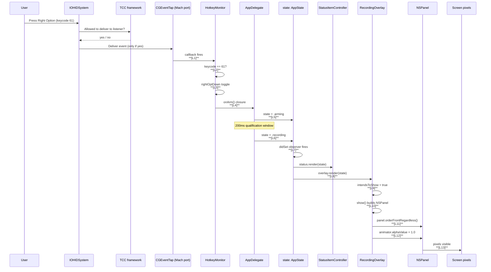

# Handoff — VoiceRider Overlay Diagnosis + Mic Indicator + Self-Audit Refinements

**Status:** Proposed for implementation
**Plan:** `docs/plans/20260517T1535-overlay-diagnosis-plan.md`
**Date authored:** 2026-05-17
**Authoring methodology:** Decompose → Critique → Refine, single Sonnet review session
**Implementing agent:** any subsequent kiro-cli session that picks up this handoff

This document is **self-contained**. You should be able to implement
the plan end-to-end without flipping back to the plan markdown, though
the plan is the ultimate source of truth if a question arises.

---

## A. About VoiceRider

**VoiceRider** is a native macOS push-to-talk dictation menu-bar app.

**User flow:**
1. User holds the **Right Option** key (keycode 61).
2. After 200ms qualification window, VoiceRider records audio from
   the default input device.
3. On release, VoiceRider uploads the WAV to a self-hosted OpenAI-
   compatible ASR (Automatic Speech Recognition) server on the LAN.
4. The server returns text. VoiceRider puts it on the pasteboard
   and synthesizes Cmd+V into the front app, then restores the
   user's prior clipboard.

**Reference server:** [NVIDIA Canary-Qwen 2.5B](https://huggingface.co/nvidia/canary-qwen-2.5b)
on Linux + RTX 4080. Documented in `docs/server-canary-qwen-setup.md`.
The user's actual server is at `linux:8000` (`/etc/hosts` alias) but
that's local; the OSS code defaults to `http://localhost:8000/v1/audio/transcriptions`.

**Repository:** `http://github.com/ssstonebraker/VoiceRider` (HTTPS
redirect). License: MIT. Working directory:
`/Users/braker/git/VoiceRider`.

**Bundle id:** `com.voicerider`. **Logger subsystem:** `com.voicerider`.
**Default endpoint:** `http://localhost:8000/v1/audio/transcriptions`.
**Default model:** `canary-qwen-2.5b`. **Default bearer:** `local-no-auth`.

**Why this matters for the handoff:** the app captures audio off the
microphone, listens to every keystroke, and synthesizes Cmd+V into
arbitrary apps. If you ship a wrong fix, you either break the user's
hotkey app or open a privacy regression. **Accuracy over speed.**

---

## B. Glossary

Terms used throughout this handoff and the plan, in alphabetical order:

| Term | Meaning |
|------|---------|
| **AppState** | The single state-machine enum (`Sources/VoiceRider/State.swift`) — `.idle`, `.arming`, `.recording`, `.transcribing`, `.pasting`, `.error(String)`. Sole source of truth for "what is VoiceRider doing right now?" |
| **Annie rule** | Every internal symbol has a caller in `Sources/` or `Tests/`. No orphans. From `.kiro/steering/no-orphans-no-dual-paths.md`. |
| **ATS** | App Transport Security — Apple's HTTPS-only enforcement. We carve out a single exception for the LAN ASR host via `Resources/Info.plist.template`. |
| **cdhash** | "Code Directory hash" — codesign's cryptographic fingerprint of a binary. TCC pins permission grants to (bundle id, cdhash, path). New cdhash = grants invalidated. |
| **CGEventTap** | Low-level macOS API for listening to keyboard / mouse events globally. Used by `HotkeyMonitor` to detect Right Option. Requires Accessibility AND Input Monitoring permissions to actually receive events. |
| **D1–D5** | Defensive fixes for rendering bugs in `RecordingOverlay`. Documented in §5.2. |
| **DCR** | Decompose → Critique → Refine. The methodology. Decompose the problem; critique each candidate explanation against evidence; refine the approach based on the critique. |
| **F-A1, F-B1, F-E5, …** | Failure-mode IDs from §4's probability table. Each row is a candidate explanation for "press → no overlay." |
| **HotkeyMonitor** | The class that owns the `CGEventTap` and produces `onArm` / `onCommit` / `onCancel` / `onRelease` callbacks. `Sources/VoiceRider/HotkeyMonitor.swift`. |
| **IOHIDCheckAccess / IOHIDRequestAccess** | macOS APIs for the Input Monitoring TCC service. The first queries; the second can prompt. R2 separates these. |
| **L1–L13** | The thirteen numbered links of the press → overlay chain. Each gets a trace point. Documented in §3. |
| **LSUIElement** | `Info.plist` flag that hides VoiceRider from the Dock + Cmd-Tab. We're a menu-bar-only app. |
| **M1** | The mic-indicator scoping fix — `engine.stop()` in `AudioRecorder.stop()`. Documented in §5.4. |
| **NSStatusItem** | The menu-bar icon. `Sources/VoiceRider/StatusItemController.swift` owns it. |
| **NSPanel** | The on-screen overlay window. `Sources/VoiceRider/RecordingOverlay.swift` owns it. |
| **P1–P3** | Permissions UX improvements. Documented in §5.3. |
| **R1–R7** | Self-audit refinements found by reviewing the first-pass proposed code. Inline diffs in §6. |
| **Sauron rule** | Single source of truth — no parallel state. Mic status comes from `Permissions`, paste comes from `Paster`, the state machine lives in `AppDelegate.state`. From `.kiro/steering/no-orphans-no-dual-paths.md`. |
| **TCC** | Transparency, Consent, and Control — Apple's framework backing the System Settings → Privacy & Security panes. |
| **trace category** | `Logger(subsystem: "com.voicerider", category: "trace")`. Filter via `log show --predicate 'subsystem == "com.voicerider" AND category == "trace"'`. The diagnostic firehose for L1–L13. |

---

## C. Prerequisites

Before you start, verify your environment matches:

```bash
# macOS version (plan targets macOS 13+)
sw_vers -productVersion                # → 13.x or higher

# Swift toolchain (plan targets Swift 5.9; verified by Package.swift)
swift --version | head -1              # → Apple Swift version 5.9 or higher
xcrun swift-package --version          # sanity

# Build dependencies
which rsvg-convert  || echo "MISSING: brew install librsvg"
which iconutil      || echo "MISSING: ships with macOS"
which sqlite3       || echo "MISSING: ships with macOS"
which codesign      || echo "MISSING: ships with macOS"
```

Optional but recommended:
```bash
which jq            # nicer for inspecting plist outputs
which tccutil       # ships with macOS; used to reset TCC services
```

If `rsvg-convert` is missing, M1 + the existing icon/overlay assets
will not regenerate from SVG sources. The `.icns` and `.pdf` are
already committed (they don't need rsvg-convert to build the app),
but `./scripts/render-resources.sh` (a separate already-shipped
script) needs it for asset re-generation. Not blocking for this plan.

**Important environment-variable conventions:**

| Variable | Purpose | Set by |
|----------|---------|--------|
| `VOICERIDER_LAN_HOST` | Hostname/IP for the ATS exception domain. Renders into `Resources/Info.plist`. | `.env.local` (gitignored), defaults to `localhost` |
| `VOICERIDER_RUN_AUDIO_TESTS` | Enable real-mic integration tests. Default `0` (skipped). | Set to `1` when running M1 audio integration tests. |

---

## D. Architecture summary

Six subsystems. Each is a single Swift file, each has a single
purpose, none has parallel state with another.

| Subsystem | File | Purpose | Touched by this plan? |
|-----------|------|---------|------------------------|
| **AppDelegate** | `AppDelegate.swift` | State machine owner. Routes hotkey events through record → transcribe → paste. | YES (instrumentation, P3 cdhash, R4, R7) |
| **HotkeyMonitor** | `HotkeyMonitor.swift` | CGEventTap listener for Right Option. Produces `onArm`/`onCommit`/`onCancel`/`onRelease` callbacks. | YES (instrumentation, R6) |
| **AudioRecorder** | `AudioRecorder.swift` | AVAudioEngine + AVAudioFile. Captures 16 kHz mono Int16 WAV. | YES (M1 — engine.stop()) |
| **Transcriber** | `Transcriber.swift` | URLSession multipart POST to ASR endpoint. | NO |
| **Paster** | `Paster.swift` | Sets pasteboard + synthesizes Cmd-V via `CGEvent`. | NO |
| **Permissions** | `Permissions.swift` | Single source of truth for mic / accessibility / input-monitoring TCC state. | YES (R2 — query-only path) |
| **StatusItemController** | `StatusItemController.swift` | The menu-bar icon. | YES (P1+P2 + R3) |
| **RecordingOverlay** | `RecordingOverlay.swift` | The on-screen NSPanel during `.recording`. | YES (instrumentation, D1–D5) |
| **State** | `State.swift` | The `AppState` enum. | YES (`tag` computed property) |
| **Logger** | `Logger.swift` | `Log.<category>` aliases for os.Logger. | YES (+ `Log.trace`) |
| **Trace** | `Trace.swift` | NEW typed wrapper around `Log.trace`. | YES (NEW) |
| **PermissionStatus** | `PermissionStatus.swift` | NEW typed aggregator + cdhash detector. | YES (NEW) |

**Build pipeline:**

```
Sources/VoiceRider/*.swift  ──swift build──▶  .build/release/VoiceRider
                            ──swift test──▶   ✓ pass
   +
Resources/Info.plist.template + .env.local
                            ──scripts/render-info-plist.sh──▶  Resources/Info.plist
   +
Resources/AppIcon.icns + Resources/RecordingOverlay.pdf
   +
prod-build.sh                                 ──▶ VoiceRider.app
                            ──codesign --sign -── ad-hoc signature
                            ──cp -R── /Applications/VoiceRider.app
```

`prod-build.sh --install` does all of the above end-to-end.

**Test layout:**

```
Tests/VoiceRiderTests/
├── *Tests.swift              ← suites (existing: 9 suites, 117 tests)
├── *Fixtures.swift           ← (existing precedent: BearerTokenFixtures,
│                                  ModelNameFixtures, AppStateFixtures, etc.)
└── MockURLProtocol.swift     ← only mock at the URLProtocol layer
```

The new fixture files this plan adds (`TraceFixtures`,
`PermissionStatusFixtures`, `RecordingOverlayFixtures`,
`AudioRecorderFixtures`) follow the same pattern: `enum X { struct
Row { … }; static let all: [Row] = [...] }`, then a `@Test` with
`arguments: X.all`.

---

## Table of Contents

- [§A About VoiceRider](#a-about-voicerider)
- [§B Glossary](#b-glossary)
- [§C Prerequisites](#c-prerequisites)
- [§D Architecture summary](#d-architecture-summary)
- [§0 Mission and guardrails](#0-mission-and-guardrails)
- [§1 The reported problems](#1-the-reported-problems)
- [§2 State of the repo right now](#2-state-of-the-repo-right-now)
- [§3 Decompose — the press → overlay chain](#3-decompose--the-press--overlay-chain)
- [§4 Critique — failure-mode probability table](#4-critique--failure-mode-probability-table)
- [§5 Refine — instrumentation + D1–D5 + P1–P3 + M1](#5-refine--instrumentation--d1d5--p1p3--m1)
- [§6 Self-audit findings R1–R7 (inline diffs)](#6-self-audit-findings-r1r7-inline-diffs)
- [§7 The 19 files you'll touch](#7-the-19-files-youll-touch)
- [§8 Implementation procedure (Phase A → E with gates)](#8-implementation-procedure-phase-a--e-with-gates)
- [§9 Test inventory (~38 new) and commands](#9-test-inventory-38-new-and-commands)
- [§10 Anti-patterns absolutely forbidden](#10-anti-patterns-absolutely-forbidden)
- [§11 Known risks and accepted trade-offs](#11-known-risks-and-accepted-trade-offs)
- [§12 What NOT to do (incl. v0.2 backlog out-of-scope)](#12-what-not-to-do-incl-v02-backlog-out-of-scope)
- [§13 Final sanity checks before you tell the user "done"](#13-final-sanity-checks-before-you-tell-the-user-done)
- [§14 Commit message template + push policy](#14-commit-message-template--push-policy)
- [§15 Reference paths](#15-reference-paths)
- [§16 After "done" — what the user expects next](#16-after-done--what-the-user-expects-next)

---

## 0. Mission and guardrails

### 0.1 Mission

Diagnose definitively WHY VoiceRider's recording overlay does not
appear when the user holds Right Option, ship a fix that resolves it,
ship the M1 mic-indicator scoping, and ship the seven self-audit
refinements (R1–R7). The output is a clean local commit on `main`,
already 5 commits ahead of `origin/main`, which the user will push
when ready.

### 0.2 Guardrails (NON-NEGOTIABLE)

1. **NEVER apply a "guess fix" without instrumentation evidence.** The
   previous session's first response told the user "just grant
   permissions" without log proof. Reject that pattern. Instrument,
   reproduce, observe, fix exactly the link the trace pinpoints.
2. **NEVER tell the user "it's just permissions" without TCC.db proof
   AND live `log show` proof.**
3. **NEVER ship a change that re-codesigns the binary without telling
   the user TCC re-grant is needed.** Ad-hoc signing recomputes cdhash
   on every build. TCC pins grants to (bundle id, cdhash, path). New
   cdhash → grants invalidated. Today the user has had to re-grant 3+
   times. The P3 cdhash detection in this plan is the long-term
   mitigation; this implementation is the LAST re-grant cycle.
4. **NEVER assume Apple's documented behavior holds in current macOS.**
   `NSPanel.level = .screenSaver` on macOS 13+ Stage Manager has been
   reported to clip behind active full-screen apps. Verify on the
   user's actual macOS version, don't trust docs alone. (D2 already
   moves us to `.popUpMenu` defensively.)
5. **NEVER violate the Sauron rule** (single source of truth).
   Steering doc: `.kiro/steering/no-orphans-no-dual-paths.md`. The
   overlay's visibility state derives **only** from `AppState.didSet`.
   Do not introduce a parallel "isOverlayVisible" Bool somewhere else.
6. **NEVER violate the Annie rule** (no orphans). Every new symbol
   added by this plan has at least one caller in `Sources/` or
   `Tests/`.
7. **NEVER push to origin** unless the user explicitly says to. The
   user's standing instruction in this project is "commit locally
   only". They will push when ready.

### 0.3 Decision framework

For every non-trivial decision in this implementation:

1. **DECOMPOSE.** What are the moving parts? What link in the chain
   am I touching? What are the inputs and outputs?
2. **CRITIQUE.** What could go wrong? What evidence do I have that
   this works? What evidence do I have that I'm wrong?
3. **REFINE.** Adjust based on the critique. Add instrumentation
   exactly where the critique exposed a blind spot.

If you're about to write code without DCR, STOP. Back up. Decompose
first.

---

## 1. The reported problems

The user reported **three** problems across this session, all rolled
into this plan:

### Problem 1 — Recording overlay never appears

Symptom: holds Right Option in TextEdit, expects the
"VOICERIDER RECORDING" overlay to fade in. Nothing happens.

### Problem 2 — Permission prompts repeat every launch

Symptom: every time the app launches, macOS asks for permission
(Accessibility / Input Monitoring). Granting "doesn't stick".

### Problem 3 — Orange mic indicator stays on for the entire app session

Symptom: the macOS menu-bar microphone-in-use indicator (orange dot)
turns on as soon as VoiceRider has done its first record session,
and stays on until quit, even though no audio is being captured.

### Evidence already collected

From `log show --predicate 'subsystem == "com.voicerider"' --last 30s`
on the most recent reproduction:

```
15:32:29.034 mic granted=true                 ← microphone OK
15:32:29.034 accessibility trusted=false       ← NOT GRANTED
15:32:29.034 input-monitoring access=1         ← DENIED  (1 = kIOHIDAccessTypeDenied)
15:32:29.040 event tap installed; seeded rightOptDown=false
```

From `sqlite3 ~/Library/Application\ Support/com.apple.TCC/TCC.db` on
the same reproduction:

```
kTCCServiceMicrophone | com.voicerider | 2 (granted)
                                       ← (no row for Accessibility)
                                       ← (no row for ListenEvent)
```

So:

- For Problem 1+2, the highest-probability explanation is "the user
  hasn't actually granted Accessibility + Input Monitoring; the tap
  installs but never receives events." But that's a hypothesis, not
  proof. Multiple medium-probability rendering bugs (E5, E6, etc.)
  remain unverified.
- For Problem 3, the cause is found in source. `AudioRecorder`'s
  header comment line 5 documents the previous design choice
  explicitly: *"The engine stays running for the process lifetime —
  only the output file rotates per recording."* That's why the
  orange dot persists. Fix is one line (M1).

### What this handoff fixes

- For Problem 1: instrumentation that pinpoints the failing link
  (Phase A) + defensive fixes D1–D5 + permissions UX P1–P3.
- For Problem 2: cdhash-change detection (P3) so the user is warned
  the next time a rebuild invalidates grants.
- For Problem 3: M1 — `engine.stop()` in `AudioRecorder.stop()`.

### Why we DON'T just "tell the user to grant permissions"

That was the first-pass response and it was insufficient. Even if
permissions are the only cause of Problem 1+2, we have no log
evidence ruling out a parallel rendering bug. Multiple medium-
probability paths remain (image-load nil, panel level clipped, frame
off-screen). Shipping a permissions-only fix would be guessing. The
plan instruments first so the next reproduction produces evidence.

---

## 2. State of the repo right now

### 2.1 Working directory

```
/Users/braker/git/VoiceRider
```

Working tree clean (`git status -s` returns nothing).

### 2.2 Git history

Five local commits ahead of `origin/main`. None pushed:

```
441b666 feat: app icon and on-screen recording overlay
08f47cc docs: genericize server reference paths
68cdf4a build: render Info.plist from template; gitignore local LAN host
db9e8c4 docs: detail Canary-Qwen-2.5B reference server; ignore .kiro/
99d14d2 VoiceRider v0.1.0 — initial release
5b0b96e Initial commit                                          ← origin/main
```

The user's standing rule is **commit locally only, do not push**. They
push manually when ready.

### 2.3 Build state

```
/Applications/VoiceRider.app
  bundle id        : com.voicerider
  signature        : adhoc (codesign --sign -)
  cdhash           : (computed from binary; rebuild invalidates)
  state            : running, PID varies
  Info.plist        : rendered from Resources/Info.plist.template at build time
                      (gitignored generated file; template is committed)
  Resources/        : AppIcon.icns, RecordingOverlay.pdf both in bundle
```

### 2.4 TCC state on the user's machine

```
kTCCServiceMicrophone | com.local.voice | 2  ← stale, harmless
kTCCServiceMicrophone | com.voicerider  | 2  ← granted
                                              ← Accessibility: NOT granted
                                              ← ListenEvent:   NOT granted
```

### 2.5 Test count baseline

`./build.sh test` → **117/117 pass** before this implementation
starts. After this implementation: **155+/155+ pass** (117 existing +
~38 new).

### 2.6 Files that exist but are gitignored

- `Resources/Info.plist` — generated from `.template` per build
- `.env.local` — `VOICERIDER_LAN_HOST=linux` (the user's /etc/hosts alias)
- `.kiro/steering/*.md` — internal steering docs, not part of the OSS release
- `git-ship.sh` — copy-pasted from another project, gitignored
- `.build/`, `VoiceRider.app/` — build artifacts

You should never `git add` any of those.

### 2.7 Steering rules in effect

- `.kiro/steering/no-orphans-no-dual-paths.md` — Annie + Sauron rules
- `.kiro/steering/swift-coding-best-practices.md`
- `.kiro/steering/swift-macos-best-practices.md`
- `.kiro/steering/voice-project.md` — locked v0.1 decisions

Read them before you start. They are 99% of the "why" behind the
no-print/no-try!/no-as!/`final` rules below.

---

## 3. Decompose — the press → overlay chain

The chain has **13 numbered links** (L1–L13). Each is a candidate
failure point. The instrumentation phase places a `Trace.…(...)` call
at each so a reproduction trace shows where the chain stops.



The `os.Logger`-based instrumentation can observe L1–L12. L13 (pixels
visible) is observable only by the user's eyes; if L1–L12 all fire
and the user still sees no overlay, the bug is in panel rendering and
the D1–D5 defensive fixes apply.

### 3.1 Trace tag catalog

These are the canonical, stable tags. Once shipped they DON'T change
without bumping a fixture. Tests pin them via `TraceFixtures.all`.

| Tag | Link | File | Format payload |
|-----|------|------|----------------|
| `trace:tap-callback` | L1 | HotkeyMonitor.swift | `type=<int> keycode=<int> flagsRaw=<hex>` |
| `trace:hk-keycode-match` | L2 | HotkeyMonitor.swift | `keycode=<int> isRightOpt=<bool> type=<int> armedActive=<bool>` |
| `trace:hk-toggle` | L3 | HotkeyMonitor.swift | `prev=<bool> next=<bool>` |
| `trace:hk-onarm` | L4 | HotkeyMonitor.swift | `armed=true prev=<bool>` |
| `trace:hk-oncommit` | L4 (commit) | HotkeyMonitor.swift | `committed=true` |
| `trace:hk-commit-skip` | L4 | HotkeyMonitor.swift | `rightOptDown=<bool> armed=<bool> committed=<bool>` |
| `trace:hk-cancel` | (cancel) | HotkeyMonitor.swift | `reason=<string>` |
| `trace:ad-handlearm` | L5 | AppDelegate.swift | `prev=<state-tag>` |
| `trace:ad-handlecommit` | L6 | AppDelegate.swift | `prev=<tag>` |
| `trace:ad-handlecommit-recorder-ok` | L6 | AppDelegate.swift | `wav=<filename>` |
| `trace:ad-handlecommit-recorder-err` | L6 | AppDelegate.swift | `err=<string>` |
| `trace:state-didset` | L7 | AppDelegate.swift | `prev=<tag> next=<tag>` |
| `trace:overlay-render` | L8 | RecordingOverlay.swift | `state=<tag> shouldShow=<bool> wasShowing=<bool>` |
| `trace:overlay-intends` | L9 | RecordingOverlay.swift | `intendsToShow=<bool>` |
| `trace:overlay-show` | L10 | RecordingOverlay.swift | `imageLoaded=<bool> imageSize=<wxh>` |
| `trace:overlay-orderfront` | L11 | RecordingOverlay.swift | `frame=<x,y,w,h> level=<int>` |
| `trace:overlay-fadein-done` | L12 | RecordingOverlay.swift | `alpha=<float>` |
| `trace:D1-png-fallback` | (D1) | RecordingOverlay.swift | `pdf=<status> png=<status> imageLoaded=<bool>` |
| `trace:D4-frame-clamp` | (D4) | RecordingOverlay.swift | `raw=<r> visible=<v> clamped=<c>` |
| `trace:perms-snapshot` | (P1) | StatusItemController.swift | `mic=<bool> acc=<bool> inp=<bool>` |
| `trace:perms-cdhash` | (P3) | AppDelegate.swift | `current=<hex12> lastSeen=<hex12|nil> result=<tag>` |

`AppState.tag` values: `idle`, `arm`, `rec`, `tx`, `paste`, `err`.

---

## 4. Critique — failure-mode probability table

Built during DCR. Each row is a candidate explanation for "press → no
overlay". The status column tracks confirmation/ruling-out via the
trace dump in Phase B.

| ID | Link | Hypothesis | Evidence FOR | Evidence AGAINST | Probability |
|----|------|------------|--------------|------------------|-------------|
| F-A1 | TCC | Accessibility not granted | TCC.db has no row; log says `accessibility trusted=false` | none | **HIGH** |
| F-A2 | TCC | Input Monitoring not granted | TCC.db has no row; log says `input-monitoring access=1` | none | **HIGH** |
| F-A3 | TCC cache | Granted via Settings, TCC.db stale | possible Settings UX bug | TCC normally writes synchronously | LOW |
| F-A4 | cdhash | User granted against an OLDER cdhash | rebuilds today have changed cdhash 4+ times | none | MEDIUM |
| F-B1 | L1 | Tap installed but receives no events (cascade of A1+A2) | log "event tap installed" + no L1 entries on press | none | **HIGH** |
| F-B2 | L2 | Tap receives events but keycode 61 logic broken | none | code unchanged from working v0.1 | LOW |
| F-B3 | L3 | rightOptDown toggle inverted at startup | possible | R4-F31 fix already applied | LOW |
| F-B4 | L4 | onArm closure captured nil self | possible | `[weak self]` capture; called via guard | LOW |
| F-C1 | L5 | state was not `.idle` when handleArm called | possible race | log `state -> arming` would not appear | LOW |
| F-C2 | L6 | Cancellation fires before 200ms window | another keycode press would cancel | none observed | LOW |
| F-C3 | L6 | `try recorder.start()` throws → state goes to error | possible | mic IS granted | LOW |
| F-D1 | L8 | overlay.render() crashes; no log evidence | none | tests pass | LOW |
| F-E1 | L8/L9 | image is nil (PDF load failed) → silent no-op | not yet logged either way | resource is in bundle | MEDIUM |
| F-E2 | L8/L9 | URL found but `NSImage(contentsOf:)` returns nil for PDF | possible PDF parse failure | rsvg-convert produced valid PDF | LOW |
| F-E3 | L10 | NSPanel init throws or returns broken panel under LSUIElement | possible | other LSUIElement apps work | LOW |
| F-E4 | L11 | `orderFrontRegardless` no-ops for `.nonactivatingPanel` | possible | Apple docs say it works | LOW |
| F-E5 | L11 | `.screenSaver` level clipped by Stage Manager / fullscreen apps | reports on Apple developer forums | none direct | **MEDIUM** |
| F-E6 | L11 | Frame computed off the active screen | multi-monitor / notch math is fragile | I picked sensible numbers | MEDIUM |
| F-E7 | L12 | `animator().alphaValue = 1` doesn't take | unlikely | NSAnimationContext is well-tested | LOW |

Conclusion: highest-probability bucket is permissions (A1+A2 → B1).
Second highest is `.screenSaver` level + frame-off-screen (E5 + E6).
The defensive fixes D1–D5 in §5 below address the second bucket
regardless of which link the trace blames.

---

## 5. Refine — instrumentation + D1–D5 + P1–P3 + M1

### 5.1 Instrumentation (Phase A)

Adds the L1–L13 trace points cataloged in §3.1. Single ingress
through `Trace.swift`'s `Trace.format(tag:payload:)` (R1 — see §6).

### 5.2 Defensive fixes D1–D5 (apply alongside instrumentation)

These ship together regardless of which link Phase B blames. Each
addresses a medium-probability path.

| ID | Change | Mitigates |
|----|--------|-----------|
| **D1** | `RecordingOverlay.loadImage(resolver:)` tries PDF first, falls back to PNG. Logs result via `trace:D1-png-fallback`. | F-E1, F-E2 |
| **D2** | `panel.level = NSWindow.Level(rawValue: Int(CGWindowLevelForKey(.popUpMenuWindow)))` instead of `.screenSaver`. Reportedly more reliable on macOS 13+ Stage Manager. | F-E5 |
| **D3** | Style mask reduced to `[.borderless]` (was `[.borderless, .nonactivatingPanel]`). With `ignoresMouseEvents = true` we don't activate. Simpler mask = fewer corner cases. | F-E3, F-E4 |
| **D4** | Compute frame from `NSScreen.main.frame`, then clamp to `.visibleFrame`. New static helper `RecordingOverlay.clampRect(_:into:)`, fixture-tested across 6 screen geometries. | F-E6 |
| **D5** | `image.setSize(NSSize(width: panelW, height: panelH))` before assigning to NSImageView. Rasterizes once on main thread. | F-E7, F-E8 |

### 5.3 Permissions UX P1–P3

| ID | Change | Why |
|----|--------|-----|
| **P1** | Status item menu shows live ✓/✗ for Microphone, Accessibility, Input Monitoring. Each row, when clicked, opens its specific Settings pane. | User has no fast way to see what's missing |
| **P2** | "Re-check Permissions" menu item that re-queries TCC and force-redraws the menu | TCC permission grants don't deliver a Cocoa notification to the app |
| **P3** | On launch, compare current cdhash to `voicerider.lastSeenCDHash` in UserDefaults. If different AND a TCC service is denied, log a warning AND show an `NSAlert` once per cdhash. | The user has hit re-grant cycle 3+ times today |

### 5.4 M1 — mic indicator scoping

Single line change to `AudioRecorder.stop()`:

```swift
// 3. M1: stop the engine. Cleared pointers + removed tap mean
//    no in-flight work depends on the engine being up.
if engine.isRunning {
    engine.stop()
}
```

After this, `engine.isRunning` follows the recording state exactly:
true while the user holds the hotkey, false otherwise. macOS sees no
active audio input outside of recording, so the orange microphone-
in-use indicator behaves correctly.

DCR'd:
- **Decompose**: `engine.stop()` ordering vs in-flight callbacks,
  cold-start cost, threading.
- **Critique**: Tap removed first → no new callbacks; in-flight
  callbacks finish via captured strong refs; `AudioRecorder` is
  serialized via `@MainActor` caller. Cold start ~20–80ms; user's
  hotkey qualify window is 200ms; latency invisible.
- **Refine**: applied. Test gated by `VOICERIDER_RUN_AUDIO_TESTS=1`.

---

## 6. Self-audit findings R1–R7 (inline diffs)

These are the seven Sauron / Annie / anti-pattern violations the
authoring session found in its own first-pass proposed code, with the
fix applied. Each has a corresponding test.

### R1 — `TraceTests` were tautological; pure `format()` extracted

**Severity:** anti-pattern (tests that pass when the code is removed
also pass)

**Before:**

```swift
private static func emit(_ tag: String, _ payload: String) {
    Log.trace.debug("\(tag, privacy: .public) \(payload, privacy: .public)")
}
// Tests:
@Test func tapTagPrefix() {
    Trace.tap("callback", "type=29 keycode=61 flagsRaw=0x40000")
    #expect(true)   // ← tautology
}
```

**After:**

```swift
/// Pure formatter — testable without involving `os.Logger`.
static func format(tag: String, payload: String) -> String {
    payload.isEmpty ? tag : "\(tag) \(payload)"
}

private static func emit(_ tag: String, _ payload: String) {
    let line = format(tag: tag, payload: payload)
    Log.trace.debug("\(line, privacy: .public)")
}

// Tests:
@Test("every row in TraceFixtures.all formats to its expected string",
      arguments: TraceFixtures.all)
func allFixturesFormat(row: TraceFixtures.Row) {
    let actual = Trace.format(tag: row.tag, payload: row.payload)
    #expect(actual == row.expected)
}
```

`TraceFixtures.all` has 17 rows pinning every trace point.

### R2 — Hidden side effect: snapshot triggered IOHIDRequestAccess

**Severity:** Sauron-borderline (parallel side-effect path)

**Before** in `Permissions.swift`:

```swift
@discardableResult
func requestInputMonitoring() -> IOHIDAccessType {
    _ = IOHIDRequestAccess(kIOHIDRequestTypeListenEvent)   // ← prompts
    return IOHIDCheckAccess(kIOHIDRequestTypeListenEvent)
}
```

`PermissionStatus.swift` called this on every menu re-render, so
opening the menu could repeatedly trigger system prompts.

**After** (`Permissions.swift` adds a query-only path):

```swift
/// R2: query-only path. Does NOT call `IOHIDRequestAccess` (which
/// can prompt). Safe to invoke from a status-menu render every time
/// the menu opens.
func inputMonitoringStatus() -> IOHIDAccessType {
    IOHIDCheckAccess(kIOHIDRequestTypeListenEvent)
}
```

`PermissionsSnapshot.current(perms:)` uses `inputMonitoringStatus()`.
The prompting `requestInputMonitoring()` stays available for
launch-time use only.

### R3 — Granted rows in submenu unclickable

**Severity:** UX bug

**Before** in `StatusItemController.refreshPermissions()`:

```swift
item.isEnabled = !status.granted   // ← granted rows can't be clicked
```

**After:**

```swift
// R3: keep all rows clickable. Even a granted row is useful — clicking
// opens the relevant Settings pane so the user can verify or revoke
// without hunting.
item.isEnabled = true
```

### R4 — Modal alert blocked launch

**Severity:** anti-pattern (blocking modal during
`applicationDidFinishLaunching`)

**Before:**

```swift
if denied && !suppressed {
    showCDHashAlert()        // ← runModal blocks; hotkey monitor not yet installed
}
```

**After:**

```swift
if denied && !suppressed {
    DispatchQueue.main.async { [weak self] in
        self?.showCDHashAlert()
    }
}
```

The hotkey monitor and overlay finish installing before the modal
appears. A press during the dialog isn't dropped.

### R5 — Two trace tags missing from Appendix A catalog

**Severity:** Annie-adjacent (orphan tag — no documented contract)

`hk-commit-skip` and `hk-cancel` were emitted but not cataloged.
Added to plan Appendix A and to `TraceFixtures.all`.

### R6 — `keycode-match` was a firehose

**Severity:** anti-pattern (noisy logging)

**Before:**

```swift
private func handleOnMain(type: CGEventType, keycode: Int64, flags: CGEventFlags) {
    let isRightOpt = (keycode == Self.rightOptKeycode)
    Trace.hk("keycode-match",                    // ← every key in OS
             "keycode=\(keycode) isRightOpt=\(isRightOpt) type=\(type.rawValue)")
    …
}
```

**After:**

```swift
private func handleOnMain(type: CGEventType, keycode: Int64, flags: CGEventFlags) {
    let isRightOpt = (keycode == Self.rightOptKeycode)
    let armedActive = rightOptDown && armed && !committed
    if isRightOpt || armedActive {                // R6: only when relevant
        Trace.hk("keycode-match",
                 "keycode=\(keycode) isRightOpt=\(isRightOpt) type=\(type.rawValue) armedActive=\(armedActive)")
    }
    …
}
```

### R7 — `withUnsafeBytes` empty-Data UB

**Severity:** anti-pattern (unguarded IUO at FFI boundary)

**Before** in `AppDelegate.computeCDHash`:

```swift
data.withUnsafeBytes { buf in
    _ = CC_SHA256(buf.baseAddress, CC_LONG(data.count), &hash)   // ← UB if empty
}
```

**After:**

```swift
data.withUnsafeBytes { (buf: UnsafeRawBufferPointer) in
    guard let base = buf.baseAddress, !buf.isEmpty else { return }
    _ = CC_SHA256(base, CC_LONG(data.count), &hash)
}
// On empty input, hash remains zeroed. Acceptable.
```

---

## 7. The 19 files you'll touch

All proposed contents live under `docs/plans/proposed/code/` mirroring
the live tree. The implementation is a straight `rsync` of those
files over `Sources/`, `Tests/`, and `scripts/`.

### 7.1 Production code (10 files in `Sources/VoiceRider/`)

| File | Status | Lines | Purpose |
|------|--------|-------|---------|
| `Trace.swift` | NEW | 87 | Typed wrapper around `Log.trace`. Pure `format()` (R1). |
| `Logger.swift` | MODIFY | 39 | Add `static let trace = Logger(...)` line. |
| `HotkeyMonitor.swift` | MODIFY | 291 | Trace points L1–L4 + commit-skip + cancel. R6 noise gate. |
| `AppDelegate.swift` | MODIFY | 277 | Trace points L5–L7. P3 cdhash detection. R4 alert deferral. R7 empty-Data guard. |
| `RecordingOverlay.swift` | MODIFY | 236 | Trace points L8–L12. D1 PNG fallback. D2 `.popUpMenu` level. D3 simpler mask. D4 frame clamp helper. D5 image setSize. |
| `AudioRecorder.swift` | MODIFY | 237 | M1: `engine.stop()` in `stop()`. New test seam `engineIsRunning`. |
| `Permissions.swift` | MODIFY | 98 | R2: new `inputMonitoringStatus()` query-only path. |
| `PermissionStatus.swift` | NEW | 120 | Typed aggregator + `CDHashDetection` enum. |
| `StatusItemController.swift` | MODIFY | 146 | P1+P2 Permissions submenu. R3 keep granted rows clickable. New `init(perms:)` signature. |
| `State.swift` | MODIFY | 61 | Add `var tag: String` computed property. |

### 7.2 Test files (10 files in `Tests/VoiceRiderTests/`)

| File | Status | Lines | Purpose |
|------|--------|-------|---------|
| `TraceFixtures.swift` | NEW | 112 | 17 canonical (tag, payload, expected) rows |
| `TraceTests.swift` | MODIFY | 75 | Drive from `TraceFixtures.all` |
| `PermissionStatusFixtures.swift` | NEW | 90 | All 8 mic/acc/inp combos + 5 cdhash detection rows |
| `PermissionStatusTests.swift` | MODIFY | 91 | Drive from fixtures |
| `PermissionsTests.swift` | NEW | 63 | Verify R2 query-only path is fast and deterministic |
| `RecordingOverlayFixtures.swift` | NEW | 49 | 6 screen-geometry clamp scenarios |
| `RecordingOverlayTests.swift` | MODIFY | 154 | Drive D4 clamp from fixtures + D1 PNG-fallback test using synthesized PNG |
| `AudioRecorderFixtures.swift` | NEW | 49 | 5 engine-lifecycle action sequences |
| `AudioRecorderEngineLifecycleTests.swift` | NEW | 69 | M1 verification, fixture-driven, gated by `VOICERIDER_RUN_AUDIO_TESTS=1` |
| `StateTagTests.swift` | NEW | 25 | AppState.tag stability pin + PII leak check |

### 7.3 Scripts (1 file in `scripts/`)

| File | Status | Lines | Purpose |
|------|--------|-------|---------|
| `show-voicerider-trace.sh` | NEW | 38 | `log show` wrapper, default last-60s, `--stream` mode |

---

## 8. Implementation procedure (Phase A → E with gates)

### Phase A — Instrumentation + audit refinements

```bash
cd ~/git/VoiceRider

# 1. Verify clean state
git status -s                                     # must be empty
./build.sh test 2>&1 | tail -3                    # must show 117/117

# 2. Copy proposed sources over the live tree
rsync -av docs/plans/proposed/code/Sources/ Sources/
rsync -av docs/plans/proposed/code/Tests/   Tests/
rsync -av docs/plans/proposed/code/scripts/ scripts/
chmod +x scripts/show-voicerider-trace.sh

# 3. Verify build + tests
swift build 2>&1 | grep -E '^(.*: )?warning:' && echo 'WARN' || echo 'clean'
./build.sh test 2>&1 | tail -3
make verify

# 4. Build + install
./prod-build.sh --install
```

#### Gate A → B (must all pass)

- [ ] `swift build` zero warnings
- [ ] `./build.sh test` shows ~155/155 pass (117 existing + ~38 new)
- [ ] `make verify` ends with `verify: OK`
- [ ] `make verify-strict` warning count ≤ 11 (current baseline)
- [ ] `/Applications/VoiceRider.app` launched, PID visible
- [ ] `./scripts/show-voicerider-trace.sh 30s` shows at least the
      `trace:perms-cdhash` line emitted at launch

### Phase B — Diagnosis (user reproduces)

After Phase A, the user must:

1. Re-grant Accessibility + Input Monitoring at the new cdhash. Open
   the panes:
   ```bash
   open "x-apple.systempreferences:com.apple.preference.security?Privacy_Accessibility"
   open "x-apple.systempreferences:com.apple.preference.security?Privacy_ListenEvent"
   ```
2. Quit and relaunch VoiceRider so it re-reads TCC:
   ```bash
   pkill -f 'VoiceRider.app/Contents/MacOS/VoiceRider'
   open /Applications/VoiceRider.app
   ```
3. Hold Right Option in TextEdit for ~3 seconds, then release.
4. Capture the trace:
   ```bash
   ./scripts/show-voicerider-trace.sh 60s > /tmp/voicerider-trace.txt
   cat /tmp/voicerider-trace.txt
   ```

#### Gate B → C

- [ ] Trace dump captured in `/tmp/voicerider-trace.txt`
- [ ] First missing trace line identifies the failing link
      unambiguously
- [ ] One row in §4's probability table marked CONFIRMED
- [ ] Other rows marked RULED OUT or NOT TESTED (no guesses)

### Phase C — Targeted fix + M1 + R-refinements

The defensive fixes D1–D5, the M1 fix, and the R1–R7 refinements are
already in the proposed source tree from Phase A. Phase C applies
**only whatever the trace-confirmed link in B5 needs** beyond what's
already there.

If B5 confirms F-A1 / F-A2 (no L1 entries): no additional code change.
The user grants the missing permissions, then re-tests. D1–D5 + P1–P3
are already in for next time.

If B5 confirms a different link, write a focused targeted fix. Do not
apply guess fixes to other links.

#### Gate C → D

- [ ] User reproduces overlay actually appearing on press
- [ ] Orange mic indicator only on during press (M1 verification)
- [ ] All 117 + ~38 = 155+ tests still pass

### Phase D — Permissions UX

The P1+P2+P3 changes are already in the proposed source tree from
Phase A. Verify them live:

1. Click the menu-bar mic icon → submenu shows ✓/✗ per service.
2. Click a service row → corresponding Settings pane opens.
3. Toggle a permission → close menu → reopen → value still stale
   until you click "Re-check Permissions" → menu re-queries TCC and
   updates.
4. Rebuild (e.g. via `./prod-build.sh --install`). Relaunch. cdhash
   changed; if any service is denied AND not previously suppressed,
   the alert appears asynchronously after launch.

#### Gate D → E

- [ ] Permissions submenu correct
- [ ] Re-check works
- [ ] cdhash detection logs once per new cdhash (check
      `./scripts/show-voicerider-trace.sh 60s | grep cdhash`)

### Phase E — Verify, commit

```bash
./build.sh test                     # full suite
make verify
git status -s                       # only files in §7 should appear
git diff --cached --stat            # review before committing

# Commit (template in §14)
git -c user.email=stonebraker@local -c user.name=ssstonebraker \
  commit -q -m "feat: trace instrumentation + overlay defensive fixes + M1 mic indicator
…
"

git log --oneline | head -8
```

#### Gate E → SHIP

- [ ] All checks in §13 pass
- [ ] Local commit made
- [ ] **NOT pushed** (user pushes manually)

---

## 9. Test inventory (~38 new) and commands

### 9.1 New tests by suite

| Suite | File | New tests | Fixture-driven |
|------|------|-----------|----------------|
| `Trace` | TraceTests.swift | ~9 | yes (TraceFixtures, 17 rows) |
| `PermissionStatus` | PermissionStatusTests.swift | ~9 | yes (8 snapshot rows) |
| `CDHashDetection` | PermissionStatusTests.swift | ~2 | yes (5 cdhash rows) |
| `Permissions` | PermissionsTests.swift | ~4 | no (R2 contract) |
| `RecordingOverlay` | RecordingOverlayTests.swift | ~10 (existing 8 + 2 fixture-driven) | yes (6 clamp rows) |
| `AudioRecorder.engineLifecycle` | AudioRecorderEngineLifecycleTests.swift | ~3 + 1 fixture-driven | yes (5 lifecycle rows) — gated by env var |

Total: ~38 new test functions, ~155 total when combined with the 117
existing.

### 9.2 Fixture quick reference

| Fixture | Drives | Pin-count |
|---------|--------|-----------|
| `TraceFixtures.all` | `TraceTests.allFixturesFormat` | 17 (tag, payload, expected) rows |
| `PermissionStatusFixtures.snapshots` | snapshot all-granted / first-missing tests | 8 (2³) rows |
| `PermissionStatusFixtures.cdhash` | cdhash detect tests | 5 rows |
| `RecordingOverlayFixtures.clamp` | D4 frame clamp tests | 6 screen-geometry rows |
| `AudioRecorderFixtures.all` | M1 engine-lifecycle tests | 5 action sequences |

### 9.3 Test commands

```bash
# Default — skips audio integration tests
swift test
./build.sh test

# Include audio integration tests (touches real mic hardware)
VOICERIDER_RUN_AUDIO_TESTS=1 swift test

# Verify gate (zero warnings + tests)
make verify

# Strict concurrency (informational; baseline is 11 warnings)
make verify-strict

# Single suite
swift test --filter TraceTests
swift test --filter PermissionStatus
swift test --filter RecordingOverlay
```

### 9.4 Diagnostic commands

```bash
# Trace dump (last 60s)
./scripts/show-voicerider-trace.sh

# Live trace (Ctrl-C to stop)
./scripts/show-voicerider-trace.sh --stream

# Specific link (e.g., did the tap callback fire?)
./scripts/show-voicerider-trace.sh | grep tap-callback

# Custom window
./scripts/show-voicerider-trace.sh 5m

# TCC database query
sqlite3 ~/Library/Application\ Support/com.apple.TCC/TCC.db \
  "SELECT service, client, auth_value FROM access WHERE client = 'com.voicerider';"

# Current cdhash
codesign -dv --verbose=4 /Applications/VoiceRider.app 2>&1 | grep CDHash

# Reset only the relevant TCC services (preserves mic grant)
tccutil reset Accessibility com.voicerider
tccutil reset ListenEvent   com.voicerider
```

---

## 10. Anti-patterns absolutely forbidden

These are the rules from `.kiro/steering/swift-coding-best-practices.md`
and `swift-macos-best-practices.md`, restated:

1. **No `try!`.** Force-try crashes on error. Use `do { try … } catch { … }`.
2. **No `as!`.** Force-cast crashes on type mismatch. Use `as?` + bind.
3. **No implicitly-unwrapped optionals.** Use `?` or non-optional.
4. **No `print()`.** Use `Log.<category>.<level>(...)` only.
5. **No non-`final` classes** in production code.
6. **No `DispatchSemaphore`.** Use `await`, `DispatchWorkItem`, or
   `os_unfair_lock` (last only for short-lived pointer mutations,
   per `AudioRecorder` precedent).
7. **No `@unchecked Sendable`** in production code.
8. **One allow-listed force unwrap:** the compiled-in default URL in
   `AppDelegate.Config.defaultEndpoint`. Do not add others.
9. **Privacy:** logs with user content (transcribed text, pasteboard
   contents, audio bytes) MUST use `privacy: .private`. Metadata
   (counts, sizes, status codes, state tags) may be `.public`.
10. **No "didn't crash" tests.** Every test asserts on a concrete
    return value, side effect, or formatted string.
11. **No mocking `Bundle.main`.** Use a `BundleResolving` protocol
    seam (already in `RecordingOverlay`).
12. **No live `NSPanel` ordering tests.** Test seam is
    `intendsToShow`.

---

## 11. Known risks and accepted trade-offs

### 11.1 Risk: another re-grant cycle

`prod-build.sh --install` re-codesigns. New cdhash → TCC grants
invalidated. The user has hit this 3+ times today. P3 (cdhash
detection) is the long-term mitigation; this implementation is the
LAST cycle for this round of work.

### 11.2 Trade-off: M1 cold-start cost

`AVAudioEngine.start()` adds ~20–80ms to the FIRST press after each
idle period. The hotkey qualification window is 200ms; the user
can't perceive this delta. Accepted.

### 11.3 Trade-off: trace volume

Phase A emits ~10 trace lines per press. On a slow disk, the os_log
ring buffer could fall behind. Apple's bounded ring buffer is
generally fine; if the dump is empty when expected, reduce the
`--last 60s` window.

### 11.4 Risk: an unpredicted failure mode appears in the trace

If Phase B's trace identifies a link not in §4's table, follow §0.3:
DCR before patching. Do NOT fix forward without the loop.

### 11.5 Risk: D2 `.popUpMenu` level still doesn't display on user's macOS

If after applying D2 the overlay still doesn't appear despite L1–L12
all firing, escalate: try `.statusBar`, `.modalPanel`, or `.normal`
in sequence, instrumenting each with `trace:overlay-orderfront`. Do
not silently change levels; document the change in a follow-up
commit.

### 11.6 Risk: P3 cdhash uses SHA-256 of binary, not real codesign cdhash

`AppDelegate.computeCDHash` reads the executable bytes and SHA-256s
them. That's not the actual codesign cdhash; it's a fingerprint of
"is this the same binary I saw last launch?" Functionally equivalent
for our purposes. If a real cdhash is needed later, use
`SecCodeCopyDesignatedRequirement` + `SecCodeCopyStaticCode`.

### 11.7 Risk: P3 alert during active tap — press during modal

After R4's deferral, the hotkey monitor IS installed when the modal
appears. `runModal()` runs a nested run loop that dispatches events.
In theory, the user could press Right Option during the alert and
start recording. In practice this is a non-issue: the alert only
fires when permissions are *denied*, meaning TCC blocks event
delivery to the tap. Documented here as a known edge case; no fix
needed.

---

## 12. What NOT to do (incl. v0.2 backlog out-of-scope)

### 12.1 Don't push, don't delete, don't touch

- **Do NOT push to origin.** Six commits already ahead; user pushes
  manually.
- **Do NOT delete `docs/plans/proposed/code/`.** Audit trail. It's
  removed in a separate cleanup commit, not this one.
- **Do NOT touch:**
  - `State.swift` cases (only the `tag` property is added)
  - `Transcriber.swift`
  - `Paster.swift`, `ClipboardWriter.swift`
  - `Resources/Info.plist.template` ATS exception list (M1 doesn't
    change network behavior)
  - The hotkey identity (still keycode 61, Right Option)
  - The bundle id (`com.voicerider`)
  - The default ASR endpoint
- **Do NOT add any new force unwraps.** The single allow-listed one
  is in `AppDelegate.Config.defaultEndpoint`.
- **Do NOT touch `.kiro/`.** It's gitignored; live there for
  development, not part of the release.
- **Do NOT touch `.env.local`.** Per-machine config. Touching it
  would change the user's working setup.
- **Do NOT regenerate `Resources/Info.plist`** as a separate step;
  `prod-build.sh` does it via the template.
- **Do NOT add "TODO" or "FIXME" comments** to production code.
  Track open items in `.kiro/steering/voice-project.md` instead.

### 12.2 v0.2 backlog — explicitly out of scope for THIS plan

These items are tracked but DO NOT belong in this implementation.
Adding any of them is scope creep and will be rejected at review.

| ID | Item | Why deferred |
|----|------|--------------|
| **R4-F33** | Full Swift 6 strict-concurrency adoption (eliminate the 11 warnings under `make verify-strict`) | Apple's AVFoundation / CoreFoundation imports are not Sendable-clean on macOS 13. Tracked for v0.2 when we drop macOS 13 support. |
| **R4-F34** | Handle `synthesizeCmdV()` return value in `Paster.paste` | Edge case (Cmd-V synth fails); current path silently no-ops. Track for v0.2. |
| **R4-F35** | `HotkeyMonitor.deinit` non-isolated access to MainActor-isolated CF properties | Compile-time warning under strict concurrency. Cosmetic on macOS 13. v0.2. |
| **R4-F37** | State-log privacy hardening (log `.tag` instead of `String(describing:)` in AppDelegate's existing `state -> X` line — this is separate from our trace work) | Currently uses `String(describing: state)` which can include `.error` payload — a string we don't fully control. Replace with `state.tag` (which we ADD in this plan but only consume in trace). v0.2. |
| **R4-F38** | `MockURLProtocol` migrate to `@TaskLocal` from `nonisolated(unsafe) static` | Test-only; static state caused cross-suite races we already fixed via `@Suite(.serialized)`. v0.2. |
| **R4-F39** | `make verify` regex strengthening | The `^(.*: )?warning:` grep can false-positive on filenames with `warning:` in their path. v0.2. |
| **F13** | Arming-icon flicker (state changes faster than menu-bar can render) | UX polish, not safety. v0.2. |
| **F17** | Error-window restart-on-chained-errors | The 2s error auto-clear may race with a follow-up error. v0.2. |
| **§C.14 #1** | Configurable hotkey via UserDefaults | Currently hardcoded to Right Option. v0.2. |
| **§C.14 #3** | Keychain backend for `voicerider.bearerToken` | Currently plaintext UserDefaults. The default `local-no-auth` is not a secret. v0.2. |
| **Multi-type clipboard preservation** | Save image / file URL / RTF in addition to `.string` | Currently only string is saved + restored. v0.2. |
| **Apple Developer ID code signing** | Replace ad-hoc with a real Developer ID cert | Costs $99/yr + an Apple ID. Out of scope for OSS v0.1. |
| **Configurable overlay style** | Let the user pick overlay placement / size | Pre-mature optimization. Single placement for now. |

If the user asks during implementation, "while you're in there, can
you also do X?" and X is on this list — politely decline and suggest
filing it for v0.2.

### 12.3 If you find a NEW bug not in §4 during implementation

Apply DCR. Don't fix forward.

1. **Decompose** the new bug. What link of the chain (or what
   subsystem outside the chain) is implicated?
2. **Critique** your hypothesis. What evidence supports it? What
   would falsify it?
3. **Refine** the approach. Add a focused trace point. Rebuild.
   Reproduce. Read evidence. Then patch.

Document the new finding in a separate commit AFTER this plan's
commit lands. Do not bundle "while I was in there" fixes into this
implementation.

---

## 13. Final sanity checks before you tell the user "done"

After Phase E commits, run all of these:

```bash
# Build + tests
./build.sh test                                # 155+/155+ pass
make verify                                    # verify: OK
make verify-strict 2>&1 | grep "warning(s)"    # warning count ≤ 11

# Static checks
git grep -nE 'try!|as![^=]|print\(|@unchecked|DispatchSemaphore' Sources/
# → only the allow-listed URL in AppDelegate

git grep -nE '/Users/[a-z]+|/mnt/[a-z]+|192\.168\.5\.175' Sources/ Tests/ scripts/
# → 0 matches (no PII / user-specific paths)

# Permission service URLs are correct
swift test --filter PermissionStatusTests.settingsURLMapping
# → passed

# Live verification (manual):
# 1. Hold Right Option in TextEdit → overlay fades in
# 2. Release Right Option → audio uploads, text pastes, overlay fades out
# 3. Orange mic indicator visible only between (1) and (2)
# 4. Open StatusItem menu → "Permissions ✓" or "Permissions — fix Foo"
# 5. Click a service row → relevant Settings pane opens
# 6. Click "Re-check Permissions" → menu refreshes from current TCC
# 7. ./scripts/show-voicerider-trace.sh shows L1–L12 trace lines
```

If any of those fail, you're not done.

---

## 14. Commit message template + push policy

### 14.1 Commit message

```
feat: trace instrumentation + overlay defensive fixes + M1 mic indicator

Implements docs/plans/20260517T1535-overlay-diagnosis-plan.md.

Phase A — instrumentation:
* Trace.swift (NEW) typed trace wrapper, pure format(), 17 fixture rows
* show-voicerider-trace.sh (NEW) one-liner trace dump
* Hotkey/State/Overlay/AppDelegate trace points at every numbered link

Phase A — defensive fixes (D1–D5):
* D1 PNG fallback for RecordingOverlay.pdf load
* D2 NSWindow.popUpMenu level (was .screenSaver) for Stage Manager
* D3 simpler [.borderless] style mask
* D4 frame clamp helper, fixture-tested across 6 screen geometries
* D5 image setSize before NSImageView assignment

Phase C — M1 mic indicator scoping:
* AudioRecorder.stop() now calls engine.stop() — orange indicator
  only active during actual recording

Phase D — Permissions UX (P1+P2+P3):
* StatusItem menu shows live ✓/✗ for mic/accessibility/input-monitoring
* "Re-check Permissions" item refreshes the snapshot
* cdhash-change detection warns once per new build with denied state

Self-audit refinements (R1–R7):
* R1 pure Trace.format() function, fixture-driven tests
* R2 query-only Permissions.inputMonitoringStatus()
* R3 granted rows in submenu stay clickable
* R4 cdhash alert deferred via DispatchQueue.main.async
* R5 hk-commit-skip and hk-cancel cataloged in Appendix A
* R6 hk-keycode-match gated to relevant cases (no firehose)
* R7 computeCDHash withUnsafeBytes empty-Data guard

Tests: 117 existing + ~38 new = 155+ total. Fixture-driven where
applicable (Trace, PermissionStatus, RecordingOverlay clamp,
AudioRecorder lifecycle).
```

### 14.2 Push policy

**DO NOT PUSH.** Six commits will be ahead of `origin/main` after
this work. The user pushes manually.

If the user later authorizes a push:
```bash
git push -u origin main
# OR via the user's git-ship.sh helper (gitignored, in repo root):
./git-ship.sh main "VoiceRider v0.2.0" .
```

---

## 15. Reference paths

### 15.1 The plan (full design rationale)

```
/Users/braker/git/VoiceRider/docs/plans/20260517T1535-overlay-diagnosis-plan.md
```

1,210 lines. Contains:
- §0 methodology + guardrails
- §1 problem
- §2 solution (one sentence)
- §3 architecture (chain, probability table, D1–D5, P1–P3, M1)
- §4 UI mockups
- §5 user stories
- §6 file states (lifecycle)
- §7 implementation phases (file-by-file task list)
- §8 testing strategy (anti-patterns, fixture-driven tests, M1 plan)
- §9 rollback
- §10 coding standards
- §11 line counts
- Appendix A trace point catalog
- Appendix B `Permissions` API matrix
- Appendix C reference implementation tree
- Appendix D diagnostic command cheat-sheet
- Appendix E `AppState` tag glossary
- Appendix F fixtures index (concrete tables)
- Appendix G R1–R7 before/after diff summary

### 15.2 Proposed code (apply via `rsync`)

```
/Users/braker/git/VoiceRider/docs/plans/proposed/code/
├── Sources/VoiceRider/         (10 files)
├── Tests/VoiceRiderTests/       ( 9 files)
└── scripts/                     ( 1 file)
```

### 15.3 Steering rules

```
/Users/braker/git/VoiceRider/.kiro/steering/
├── no-orphans-no-dual-paths.md     (Annie + Sauron)
├── swift-coding-best-practices.md
├── swift-macos-best-practices.md
└── voice-project.md                (locked v0.1 decisions)
```

These are gitignored (not part of OSS release) but on disk locally.

### 15.4 Live tree (where you'll write)

```
/Users/braker/git/VoiceRider/Sources/VoiceRider/
/Users/braker/git/VoiceRider/Tests/VoiceRiderTests/
/Users/braker/git/VoiceRider/scripts/
/Users/braker/git/VoiceRider/.env.local              ← gitignored, do not touch
/Users/braker/git/VoiceRider/Resources/Info.plist     ← gitignored, generated
/Users/braker/git/VoiceRider/Resources/Info.plist.template  ← committed
```

### 15.5 Path to this handoff

```
/Users/braker/git/VoiceRider/docs/plans/handoff-overlay-diagnosis.md
```


---

## 16. After "done" — what the user expects next

Once you've passed all gates in §13 and committed locally, the work
is staged. The user's expected next steps:

### 16.1 Manual smoke test

The user opens TextEdit and tests the actual press-to-record flow:

1. Hold Right Option for 2–3 seconds while saying a short phrase.
2. Release.
3. Expect:
   - Overlay fades in within ~200ms of holding (after the qualify
     window).
   - Orange mic indicator visible for the entire hold.
   - Overlay fades out on release.
   - Text appears in TextEdit (the transcribed phrase).
   - Orange mic indicator turns off.
   - Pasteboard restored to its prior contents.

If any of those fail, the user reports back with logs:

```bash
./scripts/show-voicerider-trace.sh 60s > /tmp/trace.txt
log show --predicate 'subsystem == "com.voicerider"' --last 60s --info > /tmp/full-log.txt
```

### 16.2 Multi-monitor / Stage Manager testing

The user has a multi-display setup. They'll verify D2 (`.popUpMenu`
level) on:

- A standard external display
- The notched MacBook Pro display (visibleFrame ≠ frame)
- Stage Manager active
- A full-screen app present

If overlay is clipped on any of these, that's an F-E5 escalation
path (§11.5).

### 16.3 Permissions UX testing

The user clicks the menu-bar icon → Permissions submenu, and:

1. Verifies all three services show ✓.
2. Toggles Accessibility OFF in Settings → returns to the menu →
   clicks "Re-check Permissions" → verifies the row now shows ✗.
3. Clicks the ✗ Accessibility row → confirms the right Settings
   pane opens.
4. Toggles Accessibility back ON.

### 16.4 cdhash detection testing (P3)

1. Run `./prod-build.sh --install` (which produces a new cdhash).
2. Quit and relaunch VoiceRider.
3. Expect: alert "VoiceRider was rebuilt" appears once IF some
   service is denied. Click "Don't show again" — verify no alert on
   subsequent rebuilds.
4. Reset the suppression: `defaults delete com.voicerider voicerider.suppressCDHashAlert`
   then rebuild + relaunch — alert reappears.

### 16.5 Regression tests on existing v0.1 features

The user will verify that v0.1 features still work:

- Status item icon changes per state (mic / mic.fill / waveform / etc.)
- Bearer token regex validation rejects malformed tokens at launch
- ATS exception still allows the LAN host
- Pasteboard restoration works for short and long strings
- Concurrent fast-presses don't double-arm

If the user reports a regression on any of these, that's a real bug
in this implementation — back to DCR.

### 16.6 Push policy reminder

The user pushes manually with their `git-ship.sh` helper or plain
`git push origin main`. **You do not push.**

### 16.7 If everything works

The user will say so explicitly. At that point:

- The handoff and plan can be moved to an "implemented" subdirectory
  (e.g., `docs/plans/implemented/`) — but only on the user's
  signal.
- The `docs/plans/proposed/code/` tree can be removed in a separate
  cleanup commit (`chore: remove proposed code now that v0.2 work
  has shipped`).
- The v0.2 backlog in §12.2 becomes the next plan.
