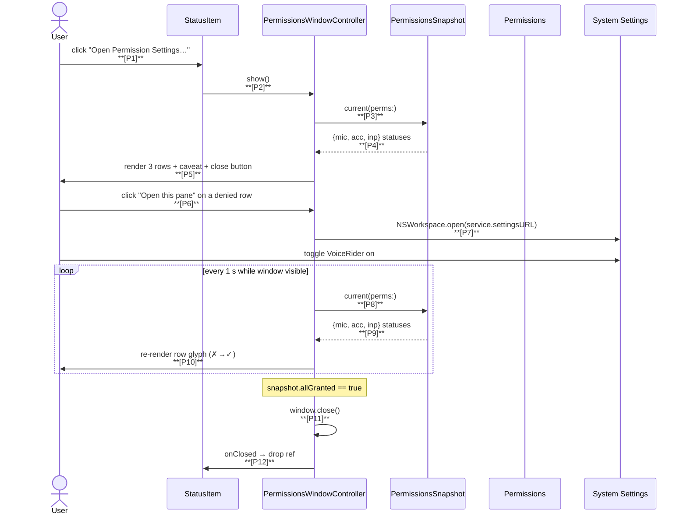

# Handoff — VoiceRider Permissions Status Window

**Status:** Proposed for implementation
**Plan tag:** `permissions-window`
**Date authored:** 2026-05-17
**Authoring methodology:** Decompose → Critique → Refine
**Implementing agent:** any subsequent kiro-cli session

This document is **self-contained**. You should be able to implement
the plan end-to-end without flipping to other documents, though
`voice-project.md` is the binding source of truth for any locked
decisions and `handoff-settings-window.md` is the closest stylistic
precedent.

---

## A. About this feature

The 2026-05-17 settings window covers server config (URL, model,
bearer + connection test). This separate handoff covers the
**permissions** side of first-run UX, which the existing menu-bar
submenu does not handle well.

### The user problem (verbatim)

Real session, 2026-05-17 21:45 CDT, user feedback after fresh install:

> "i was only asked for two [prompts]"
> "[the app] told me to open system settings again"

What actually happened, from `log show --predicate 'subsystem ==
"com.voicerider"'`:

```
mic=true   acc=false   inp=false (access=1 = denied)
```

Three pathologies in one user experience:

1. **Microphone** prompt fires reliably; user grants; ✓.
2. **Input Monitoring** prompt fires (sometimes); user "grants" but the
   list entry isn't actually toggled on; status reads `denied`.
3. **Accessibility** prompt is **silent**. macOS's
   `AXIsProcessTrustedWithOptions(prompt: true)` is notoriously
   unreliable about firing a dialog. Most users have to add the app to
   System Settings → Accessibility manually — but they have no idea
   that's required.

The current menu-bar submenu shows `✓ / ✗ / ✗` for the three services
and a parent label like "Permissions — fix Accessibility". That works
for someone who already knows what TCC is. It does not work for
someone seeing the app for the first time. They quit, relaunch, get
told (via the menu hint) to open Settings, do something that doesn't
take, and conclude the app is broken.

### What this feature delivers

A **first-run permissions window** that:

1. Lists each of the three services with **what it does for the user**
   (not just the technical name), the **current grant state**, the
   **system reason** if denied, and a **"Open this pane"** button
   that deep-links to the exact System Settings sub-pane.
2. **Auto-refreshes** the live status every ~1 s so the user sees the
   row flip from ✗ to ✓ when they grant in Settings — no need to
   bounce back to the app.
3. Surfaces the **ad-hoc-signing rebuild caveat** inline at the top
   (one-line summary; full text in a disclosure triangle) so the user
   isn't blindsided by re-prompts after every `prod-build.sh`.
4. **Closes itself** automatically once all three are granted, so the
   happy path is invisible.
5. Stays accessible from the menu bar's existing "Open Permission
   Settings…" item — that menu item now opens **this window** rather
   than `NSWorkspace.shared.open`-ing three System Settings URLs.

### Out of scope for this plan (deferred or rejected, see §12)

- Editing TCC grants from inside the app (impossible — Apple does not
  expose this API to third-party apps).
- Programmatically detecting "the user is mid-grant in Settings"
  (no API; we poll instead).
- Replacing the menu-bar submenu (the submenu stays, this window
  augments it).
- Onboarding tour / multi-step wizard. Single window with three rows
  is sufficient.

---

## B. Glossary

| Term | Meaning |
|------|---------|
| **TCC** | Transparency, Consent, and Control. Apple's permission framework for Microphone, Accessibility, Input Monitoring, etc. |
| **Permissions snapshot** | A `PermissionsSnapshot` value — three `PermissionStatus` rows. Already exists in `PermissionStatus.swift`. |
| **Status row** | One UI row in the new window, corresponding to one `PermissionService`. |
| **Settings deep-link** | A `x-apple.systempreferences:com.apple.preference.security?Privacy_*` URL that opens the relevant System Settings pane directly. Already implemented in `PermissionService.settingsURL`. |
| **Refresh tick** | The 1 s `Timer` that re-runs `PermissionsSnapshot.current(perms:)` while the window is open. |
| **HCI** | Human-Computer Interaction. Heuristic basis for §5's UX choices: visibility of system status, error prevention, recognition rather than recall, match between system and real world. |

---

## C. Prerequisites

```bash
# Settings-window plan must be merged first (handoff-settings-window.md).
git log --oneline | head -3
# Expected:
#   feat(settings): runtime server config window with connection test
#   docs(plans): settings-window handoff with adversarial review applied
#   ...

./build.sh test 2>&1 | tail -1
# Expected:
#   ✔ Test run with 195 tests in 20 suites passed after 0.295 seconds.
```

---

## D. Architecture summary

The feature touches three existing files and adds two new ones.
There is **NO new error type, NO new state in `AppState`, NO new
`UserDefaults` key**. This is purely a UI layer over the already-
existing `PermissionsSnapshot.current(perms:)`.

| Subsystem | File | Purpose | This plan? |
|-----------|------|---------|------------|
| **AppDelegate** | `AppDelegate.swift` | Launches window on first denied snapshot | YES (replace direct call to `perms.openSettingsPanes()`) |
| **StatusItemController** | `StatusItemController.swift` | "Open Permission Settings…" item | YES (re-target callback to new `openPermissionsWindow()`) |
| **Permissions** | `Permissions.swift` | TCC source of truth | NO |
| **PermissionStatus** | `PermissionStatus.swift` | Snapshot type | NO |
| **PermissionsWindow** | `PermissionsWindowController.swift` | NEW — owns the NSWindow + 1 s polling timer | NEW |
| **PermissionRowView** | `PermissionRowView.swift` | NEW — one custom NSView per row (icon · title · subtitle · status pill · button) | NEW |

**Build pipeline:** unchanged. SwiftPM, no new resources, no new
icons (we reuse SF Symbols already used elsewhere).

---

## 0. Mission and guardrails

### 0.1 Mission

Make the three TCC permissions the app needs **legible** to a
first-run user. They should know:

- **What** each permission lets VoiceRider do, in plain English.
- **Why** the app needs it (one sentence, user-task-shaped, not
  Apple-API-shaped).
- **State**: granted, denied, or not-yet-determined.
- **Next action**: a single button that takes them to the exact
  pane in System Settings.
- **Verification**: when they come back, the row updates to ✓
  without them having to do anything.

### 0.2 Guardrails (NON-NEGOTIABLE)

1. **No new state machine.** UI reflects `PermissionsSnapshot` and
   nothing else. No "granted-but-pending-recheck" middle state.
2. **No parallel TCC query path.** The window calls
   `PermissionsSnapshot.current(perms:)` and only that. (Sauron —
   `Permissions` is already the source of truth.)
3. **No prompt-spamming.** The 1 s refresh uses `*Status()` query
   methods (which never prompt). The `Request` button on each row
   may call `request*()` once per click; rate-limit clicks at the
   button level via `isEnabled = false` for 500 ms after press.
4. **No `print`, `try!`, `as!`, IUOs, non-`final` classes.** Same
   anti-patterns as the rest of the project.
5. **`@MainActor` end-to-end.** AppKit window + Timer + UI mutation
   all on main.
6. **Accessibility (a11y).** Each row has an
   `accessibilityLabel` like "Microphone permission, granted".
   `Tab` order traverses rows top-to-bottom; the per-row button is
   the natural focus target.
7. **Cmd-Q semantics same as settings window.** Window-close is
   not destructive (no edits). Cmd-Q quits the app — that's fine
   because there's nothing to lose; the user can always reopen
   the window.
8. **NEVER push to origin.** User pushes manually.

### 0.3 Decision framework — DCR

Every non-trivial decision in this implementation MUST go through:

1. **DECOMPOSE** — name the moving parts, the inputs, the outputs.
2. **CRITIQUE** — what could go wrong, what evidence would falsify
   the hypothesis, what does the existing code already constrain.
3. **REFINE** — adjust based on the critique, keep the rationale
   in code comments or this plan.

If you're about to write code without DCR, STOP and back up.

---

## 1. The reported need

User feedback (verbatim from the chat, after the settings-window
ship):

> "i was only asked for two [prompts]"
> "[the menu] told me to open system settings again"

Decoded:

- **The Accessibility prompt didn't fire.** macOS suppresses it under
  conditions Apple has never documented (likely related to recent
  TCC database state, ad-hoc signing, or a recently-denied entry).
  We cannot make the prompt fire reliably.
- **The user has no idea what's missing.** "told me to open system
  settings again" means: the menu submenu showed "Permissions — fix
  Accessibility" but the user didn't know what "Accessibility" was
  or why this app needs it.
- **The remove-and-re-add dance is undocumented in-app.** It's in
  the README but the README isn't open while the user is fighting
  System Settings.

This window is the in-app version of that README section.

---

## 2. State of the repo right now

After the settings-window plan (2026-05-17 evening):

```
b89e39e feat(settings): runtime server config window with connection test
e9d4b70 docs(plans): settings-window handoff with adversarial review applied
254a38f fix: restore .nonactivatingPanel style mask for LSUIElement overlay
1f9e3af feat: belt-and-suspenders Input Monitoring + better cdhash UX
fff9ec3 feat: trace instrumentation + overlay defensive fixes + M1 mic indicator
441b666 feat: app icon and on-screen recording overlay
99d14d2 VoiceRider v0.1.0 — initial release
```

Working tree clean (modulo pre-existing untracked plans). 195 tests
pass. Build-zero-warnings gate green.

`Permissions`, `PermissionStatus`, `PermissionsSnapshot`, and
`StatusItemController` already exist. The current Permissions submenu
flow is:

```
StatusItemController.refreshPermissions()
  → PermissionsSnapshot.current(perms:)
  → renders ✓/✗ rows
  → "Open Permission Settings…" → AppDelegate calls perms.openSettingsPanes()
                                  → opens 3 System Settings panes via NSWorkspace.shared.open
```

`openSettingsPanes()` opens **all three** panes in rapid succession,
which is jarring and gives the user no signal about which one is
the problem.

---

## 3. Decompose — what are the moving parts?



### 3.1 Trace tag catalog (NEW)

| Tag | Link | File | Format payload |
|-----|------|------|----------------|
| `trace:perms-window-open` | P1/P2 | StatusItemController.swift | `(empty)` |
| `trace:perms-window-snap` | P3/P4, P8/P9 | PermissionsWindowController.swift | `mic=<bool> acc=<bool> inp=<bool>` |
| `trace:perms-window-pane` | P6/P7 | PermissionsWindowController.swift | `service=<mic\|acc\|inp>` |
| `trace:perms-window-autoclose` | P11 | PermissionsWindowController.swift | `(empty)` |

Privacy: all payloads are metadata only (booleans, enum tags). No
PII. `.public` is fine.

---

## 4. Critique — failure modes and trade-offs

| ID | Risk | Severity | Mitigation |
|----|------|----------|------------|
| C1 | The 1 s polling timer keeps firing after the window closes, retaining `self`. | **HIGH** | `windowWillClose` calls `timer?.invalidate()` and nils out `timer`. Timer block captures `[weak self]`. |
| C2 | Polling `AXIsProcessTrusted()` (used inside `requestAccessibility(prompt: false)`) is documented as cheap but undocumented re: cache freshness. After the user grants in Settings, the polled value may stay stale until the next process launch. | **HIGH** | We accept this empirically: the existing menu submenu polls the same way and the user reports it does flip when they re-open the menu. If polling proves stale in practice, escalate by listening for `NSWorkspace.didDeactivateApplicationNotification` (when System Settings deactivates) and forcing one extra read. Document this as a known caveat. |
| C3 | The "Open this pane" button on a granted row is dead UI. | LOW | Replace with a small "✓ Granted — open pane to manage" hyperlink-style button so it's always reachable but obviously a different action. |
| C4 | Auto-close on `allGranted` could close the window mid-mouse-click on the system settings pane button — annoying. | MEDIUM | Auto-close is only triggered when the user is **not** focused on the window AND the previous snapshot had at least one denied. If the window is key, leave it open and show "✓ All set — you can close this window" inline. |
| C5 | The window opens "behind" System Settings if user is mid-grant when they click an external trigger. | LOW | We deliberately do NOT raise the window during background polling. Activation policy flip happens only on user-initiated `show()`. |
| C6 | User has the menu submenu open AND the window open; they show different states for a moment. | LOW | The submenu is read-only ✓/✗; the window is the canonical UI. Submenu re-renders on every open via `refreshPermissions()`, which is the same source — no actual divergence. |
| C7 | First-launch race: `applicationDidFinishLaunching` calls `requestMicrophone` / `requestAccessibility(prompt: true)` / `requestInputMonitoring` immediately, which may queue system prompts. If we then auto-show this window, the prompts appear ON TOP of our window. | MEDIUM | The window does NOT auto-show on first launch. It opens **only** when the user clicks "Open Permission Settings…" or when launch detects "any denied AND user has seen the cdhash alert at least once" (i.e., a re-launch on a known-bad state). |
| C8 | Localizable strings (description per service) — temptation to introduce `NSLocalizedString`. | LOW | Per the settings-window review §17 #11, strings are hard-coded English. If a second locale ever lands, that PR adds the wrappers. |
| C9 | `requestMicrophone()` is async (callback). Re-issuing a request after the user denied once is a no-op (Apple's contract). The "Request access" button on the row would do nothing and the user would think the app is broken. | MEDIUM | If `microphoneStatus() == .denied`, the row's button text is **"Open Microphone in Settings"** (deep-link only), not "Request". If `.notDetermined`, the button is **"Request access"**. UI text reflects state. |
| C10 | "VoiceRider was rebuilt" alert from `runCDHashCheck` already exists and competes with this window. | MEDIUM | The cdhash alert's "Open Settings" button is repurposed to call `openPermissionsWindow()` instead of `perms.openSettingsPanes()`. One pathway, not two (Sauron). |
| C11 | The window shows a permission as ✓ but the actual hotkey tap fails to install (TCC race after re-signing — see README §Troubleshooting). User is then confused by `Apperror: Could not install hotkey tap` despite ✓✓✓. | LOW | **Out of scope for this window.** Hotkey-tap install status is already surfaced via `AppState.error("Could not install hotkey tap…")` set in `applicationDidFinishLaunching` and rendered as the menu-bar tooltip. Adding a fourth window row would create parallel state with `AppState.error` (Sauron). The proper fix is making that error state persistent (it currently auto-clears after 2 s) — separate concern, separate PR. The window stays focused on TCC. |
| C12 | Subtitle text (the per-service "what it does for you") drifts from reality if a future feature changes how a permission is used. | LOW | Subtitles live as `static let` constants on each `PermissionService` case in a new `PermissionService+Description` extension. Annie-checked: every constant has at least one render-site caller. |
| C13 | LSUIElement window quirks (same as settings window). | LOW | Reuse the `setActivationPolicy(.regular)` flip on show; flip back to `.accessory` on close. Same pattern, same trade-off. |
| C14 | User clicks "Open this pane" five times in a row → five System Settings activations. | LOW | Rate-limit at the button level: `isEnabled = false` for 800 ms after press. |
| C15 | NSWorkspace.shared.open returning false (settings URL invalid for this OS version). | LOW | Log error via `Log.perms.error(...)` and surface a one-line inline error in the window: "Could not open System Settings. Visit Privacy & Security → \(label) manually." |

---

## 5. Refine — chosen design

### 5.1 New types

#### `PermissionsWindowController` (NEW)

```swift
@MainActor
final class PermissionsWindowController: NSWindowController, NSWindowDelegate {

    private let perms: Permissions
    private var refreshTimer: Timer?
    private var lastSnapshot: PermissionsSnapshot?
    private var rowViews: [PermissionService: PermissionRowView] = [:]

    /// Fires from windowWillClose so the owner (AppDelegate) can drop
    /// its reference (single-instance invariant).
    var onClosed: () -> Void = {}

    init(perms: Permissions)

    /// Opens the window and starts the 1 s refresh timer. Flips
    /// activation policy to .regular for the LSUIElement quirk.
    func show()

    /// NSWindowDelegate: stops the timer, flips policy back, fires onClosed.
    func windowWillClose(_ notification: Notification)
}
```

Single-instance ownership lives on `AppDelegate` (per the
settings-window precedent — pair with the lifecycle that already
lives there).

#### `PermissionRowView` (NEW)

```swift
@MainActor
final class PermissionRowView: NSStackView {

    let service: PermissionService
    private let titleLabel = NSTextField(labelWithString: "")
    private let subtitleLabel = NSTextField(wrappingLabelWithString: "")
    private let statusPill = NSTextField(labelWithString: "")
    private let actionButton = NSButton(title: "", target: nil, action: nil)

    /// Closure form so the controller doesn't need to be the target.
    var onAction: () -> Void = {}

    init(service: PermissionService)

    /// Renders the row from a `PermissionStatus`. Idempotent — calling
    /// repeatedly with the same value is a no-op visually.
    func render(_ status: PermissionStatus, hotkeyTapAlive: Bool? = nil)
}
```

The fourth row (hotkey tap status) is **NOT** part of this window
(see C11). The window scope is TCC permissions only. Hotkey-tap
diagnostics live with the existing `AppState.error` path.

Wait — that means `PermissionRowView` only needs to handle the
three TCC services. Good — the type stays `PermissionService`-keyed
and we don't need a synthetic enum value or a sibling row class.

#### `PermissionService+Description` (NEW extension)

```swift
extension PermissionService {

    /// One-sentence, user-task-shaped explanation. Rendered as the
    /// row subtitle.
    var userDescription: String {
        switch self {
        case .microphone:
            return "Record your voice while you hold the dictation hotkey."
        case .accessibility:
            return "Paste the transcribed text at your cursor by synthesizing Cmd+V."
        case .inputMonitoring:
            return "Detect the Right Option key globally so you can dictate from any app."
        }
    }

    /// "What happens if I deny this?" Shown only on denied rows.
    var denialConsequence: String {
        switch self {
        case .microphone:
            return "Without this, dictation cannot start."
        case .accessibility:
            return "Without this, transcribed text won't be pasted automatically."
        case .inputMonitoring:
            return "Without this, the hotkey won't work outside of VoiceRider's own window."
        }
    }
}
```

### 5.2 Modified types

#### `AppDelegate`

- `private var permissionsWC: PermissionsWindowController?` — NEW,
  single-instance.
- `func openPermissionsWindow()` — replaces direct calls to
  `perms.openSettingsPanes()`.
- `runCDHashCheck`'s "Open Settings" alert button now calls
  `openPermissionsWindow()` instead of `perms.openSettingsPanes()`.
- `setError("Input Monitoring denied. Open System Settings…")`
  remains — the menu-bar tooltip is fine for the error case. The
  window is the rich path.
- **No `hotkeyTapInstalled` field.** Hotkey-tap status is out of
  scope (C11).

#### `StatusItemController`

- The existing `onOpenPermissions` callback is retargeted from
  `perms.openSettingsPanes()` to `openPermissionsWindow()`.
  No menu-item changes; the same item now opens a richer UI.

### 5.3 NOT modified

- `Permissions.swift` — source of truth, no changes.
- `PermissionStatus.swift` — snapshot type unchanged.
- `Trace.swift` — extends with `Trace.permsWindow` if and only if we
  decide to add the trace prefix. Otherwise reuse `Trace.perms`.
  Decision: add `Trace.permsWindow` for greppability, mirroring the
  `Trace.settings` precedent.
- The state machine. Permissions UI is orthogonal.

### 5.4 UI layout (text mock)

```
┌───────────────────────── VoiceRider — Permissions ────────────────────┐
│                                                                       │
│   VoiceRider needs three macOS permissions to do its job. Below shows │
│   the live state. After you toggle a permission in System Settings,   │
│   this window updates automatically.                                  │
│                                                                       │
│   ▶ Why does this need to be re-granted after every rebuild?  ◀       │
│     (disclosure triangle: full ad-hoc-signing explanation)            │
│                                                                       │
│   ┌─────────────────────────────────────────────────────────────────┐ │
│   │ 🎙️  Microphone                                       ✓ Granted │ │
│   │     Record your voice while you hold the dictation hotkey.      │ │
│   │     [ Open Microphone in Settings ]                             │ │
│   └─────────────────────────────────────────────────────────────────┘ │
│                                                                       │
│   ┌─────────────────────────────────────────────────────────────────┐ │
│   │ 🖱️  Accessibility                                    ✗ Denied  │ │
│   │     Paste the transcribed text at your cursor by                │ │
│   │     synthesizing Cmd+V.                                         │ │
│   │     ⚠️  Without this, transcribed text won't be pasted.         │ │
│   │     [ Open Accessibility in Settings ]                          │ │
│   └─────────────────────────────────────────────────────────────────┘ │
│                                                                       │
│   ┌─────────────────────────────────────────────────────────────────┐ │
│   │ ⌨️  Input Monitoring                                 ✗ Denied  │ │
│   │     Detect the Right Option key globally so you can dictate     │ │
│   │     from any app.                                               │ │
│   │     ⚠️  Without this, the hotkey won't work outside this app.   │ │
│   │     [ Open Input Monitoring in Settings ]                       │ │
│   └─────────────────────────────────────────────────────────────────┘ │
│                                                                       │
│                                                              [ Close ]│
└───────────────────────────────────────────────────────────────────────┘
```

- **Status pill** (right-justified): green "✓ Granted" / red "✗ Denied"
  / orange "△ Not requested yet" / gray "—" (when irrelevant).
- **Action button** is per-row, primary action only. Granted rows show
  the same button (label changes to "Open Microphone in Settings —
  manage").
- **Disclosure triangle** at top expands to two paragraphs of context
  about ad-hoc-signing's effect on TCC.
- Window is fixed-width ~580 pt, fixed-height (calculated from row
  count). Resizing disabled. `[Close]` is the default and only
  button (`keyEquivalent = "\u{1b}"` for Esc).

### 5.5 Refresh policy

- Timer fires every **1 s** when the window is visible.
- Timer is **invalidated** in `windowWillClose`. Block captures
  `[weak self]`; first line is `guard let self else { return }`.
- Each tick: take a snapshot, diff against `lastSnapshot`, only
  re-render rows whose state changed.
- `consecutiveAllGrantedTicks: Int` increments when `snapshot.allGranted`
  is true; resets to 0 on any denied row. When the counter reaches
  **2** AND `window.isKeyWindow == false`, the window auto-closes.
  This is an explicit counter, not a timer-overlap dance — easy to
  test deterministically by injecting two snapshots in sequence.
- We deliberately do NOT pause the timer on
  `windowDidChangeOcclusionState`. 1 Hz polling is cheap; complexity
  isn't justified.

---

## 6. Self-audit findings (proactive R-style refinements)

### R1 — `PermissionRowView` is `final` and `@MainActor`

NSStackView subclass; AppKit subclasses must be `@MainActor` and
`final` per project rules.

### R2 — Timer block must capture `[weak self]`

A retained `Timer` with a strong-self block is the canonical leak.
`weak self` + `guard let self else { return }` at the top of the
block; `windowWillClose` invalidates first.

### R3 — Auto-close debounce

Two consecutive ticks of `allGranted` before close, not one.
Defends against a phantom flip during the user's mouse-up event in
System Settings.

### R4 — Disclosure-triangle content lives in code, not in a `.rtf`

Hard-coded `String` constants in `PermissionsWindowController`. Two
short paragraphs; ~30 lines of source; no resource bundling.
Future-proofs against missing-resource bugs and matches the
"strings are hard-coded English" precedent.

### R5 — Cdhash alert button retargeted

The existing `runCDHashCheck` alert's "Open Settings" button
currently calls `perms.openSettingsPanes()`. After this PR it calls
`AppDelegate.openPermissionsWindow()`. **Sauron** — single
"this is the permissions UI" entry point.

### R6 — Snapshot diff is identity-keyed by `PermissionService`

`PermissionsWindowController` keeps `rowViews: [PermissionService:
PermissionRowView]` and renders only the rows whose
`PermissionStatus.granted` flipped between snapshots. Avoids
unnecessary `setNeedsDisplay` calls (cosmetic but cheap).

### R7 — `userDescription` / `denialConsequence` extension on
`PermissionService` is **inside** `PermissionsWindowController.swift`

Don't pollute `PermissionStatus.swift` — that file's responsibility
is data-layer (snapshot). The "what does this look like to a user"
strings are presentation-layer and live with the window code.

### R8 — `requestMicrophone()` button only on `.notDetermined`

If status is `.denied`, calling `requestMicrophone()` again is a
documented no-op (Apple). Showing a "Request access" button on a
denied row would be a lie. Button text reflects state; see C9.

### R9 — Auto-close uses an explicit counter

`consecutiveAllGrantedTicks: Int` increments / resets per tick (see
§5.5). Avoids any reliance on Timer overlap or NSEvent timing.

---

## 7. Files you'll touch

### 7.1 Production code (3 files in `Sources/VoiceRider/`)

| File | Status | Estimated lines | Purpose |
|------|--------|-----------------|---------|
| `PermissionsWindowController.swift` | NEW | ~240 | Window + timer + row layout + disclosure triangle + service-description extension |
| `PermissionRowView.swift` | NEW | ~120 | Single TCC row NSStackView subclass |
| `AppDelegate.swift` | MODIFY | +20 | `openPermissionsWindow()`, `permissionsWC` single-instance, retargets |
| `Trace.swift` | MODIFY | +5 | `static func permsWindow(_:_:)` |

### 7.2 Test files (3 files in `Tests/VoiceRiderTests/`)

| File | Status | Estimated lines | Purpose |
|------|--------|-----------------|---------|
| `PermissionRowViewTests.swift` | NEW | ~80 | Render-by-state assertions (button text, status pill text/color, subtitle) |
| `PermissionServiceDescriptionTests.swift` | NEW | ~40 | Pin user-facing strings against fixtures (so future drift is a test failure) |
| `PermissionsWindowControllerTests.swift` | NEW | ~100 | Snapshot diff → which rows re-render; auto-close debounce; timer invalidate on close (verified via a test seam) |

Total: 2 new prod + 2 modified prod + 3 new test = **5 new + 2 modified prod** (note: small change to Trace.swift is one method addition; counts as MODIFY).

### 7.3 Steering doc updates

None. The settings-window plan already relaxed the scope rule to
permit configuration UI. A permissions-status window is the same
"in-app helper for first-run friction" category — no further
relaxation needed.

If `voice-project.md`'s SCOPE list is challenged in review, defend
with: "this is not a settings UI; it is a status display + deep-link
helper. No state is created or persisted; it visualises the state
that already exists."

---

## 8. Implementation procedure

### 8.1 Phase A — Pure types (FIRST)

Land in this order so each file compiles independently:

1. `PermissionRowView.swift` (NEW) + `PermissionService+Description`
   strings inside (extension on the existing enum).
2. `PermissionRowViewTests.swift` (NEW).
3. `PermissionServiceDescriptionTests.swift` (NEW).

```bash
swift build 2>&1 | grep -i 'warning\|error' && echo FAIL || echo OK
./build.sh test --filter "PermissionRow|PermissionServiceDescription"
```

#### Gate A → B

- [ ] Both new files compile, zero warnings.
- [ ] Render tests pass for granted/denied/notRequested states.
- [ ] String fixtures pin every `userDescription` and
      `denialConsequence` value.
- [ ] All 195 existing tests still pass.

### 8.2 Phase B — Window controller (NEW file)

4. `PermissionsWindowController.swift` (NEW).
5. `PermissionsWindowControllerTests.swift` (NEW).

The controller exposes a small test seam — `applySnapshot(_:)`
is `internal` (not `private`), and tests in
`Tests/VoiceRiderTests/` use `@testable import VoiceRider` to call
it. No `#if DEBUG` shenanigans:

```swift
// Tests can construct a window and drive the snapshot loop:
let wc = PermissionsWindowController(perms: perms)
wc.applySnapshot(snap1)
wc.applySnapshot(snap2)
// Assert which row .render() calls fired via row test seams.
```

#### Gate B → C

- [ ] Window opens with `show()`, closes via `[Close]` button + Esc + window-X.
- [ ] Timer is `nil` after `windowWillClose`.
- [ ] Snapshot diff: only the rows whose state changed get re-rendered
      (verified via a row's `renderCount` test seam).
- [ ] Auto-close fires after two consecutive `allGranted` ticks IF
      window is not key.

### 8.3 Phase C — AppDelegate wiring + retargets

6. Add `permissionsWC: PermissionsWindowController?`,
   `hotkeyTapInstalled: Bool`, `openPermissionsWindow()` to
   `AppDelegate`.
7. Retarget `status.onOpenPermissions` to call
   `openPermissionsWindow()`.
8. Retarget `runCDHashCheck`'s alert "Open Settings" button to
   `openPermissionsWindow()`.
9. Add `Trace.permsWindow` to `Trace.swift`.

```bash
./build.sh
./prod-build.sh --install
open /Applications/VoiceRider.app
# Click menu bar → Open Permission Settings…
```

#### Gate C → D

- [ ] Click menu item → window opens with current state.
- [ ] Toggle a permission OFF in System Settings → row flips ✗ within
      ~1 s without re-clicking the menu.
- [ ] Toggle ON → row flips ✓.
- [ ] All three ✓ + hotkey ✓ → window auto-closes within ~2 s
      (when not key).
- [ ] Cdhash-rebuild alert "Open Settings" button now opens the
      window, not three System Settings panes.
- [ ] `tccutil reset` followed by relaunch shows the window via the
      menu bar with all rows ✗ — the user can find the next action
      without leaving VoiceRider.

### 8.4 Phase D — Verify, commit, ship

```bash
./build.sh test       # all green
make verify
git add Sources/ Tests/
git commit -m "feat(permissions): rich status window with deep-links and live polling"
```

#### Gate D → SHIP

- [ ] All checks in §13 pass.
- [ ] Single feature commit. **NOT pushed.** User pushes manually.

---

## 9. Test inventory and commands

### 9.1 Test counts by suite

| Suite | New tests | Fixture-driven |
|-------|-----------|----------------|
| `PermissionRowView` | ~10 | yes (one per state × glyph/text combos) |
| `PermissionServiceDescription` | ~6 | yes (pin all strings; rejects empty) |
| `PermissionsWindowController` | ~8 | yes (snapshot diff matrix) |

Total: ~24 new tests, joining 195 → **~219 total**.

### 9.2 Test commands

```bash
swift test --filter PermissionRowView
swift test --filter PermissionServiceDescription
swift test --filter PermissionsWindowController
./build.sh test
```

### 9.3 Manual integration test

Cannot be unit-tested — depends on macOS TCC state.

1. `tccutil reset Microphone com.voicerider`
2. `tccutil reset Accessibility com.voicerider`
3. `tccutil reset ListenEvent com.voicerider`
4. Quit VoiceRider; relaunch from `/Applications/VoiceRider.app`.
5. Click menu bar → **Open Permission Settings…** → window opens
   with three ✗ rows (mic may be ✓ if the prompt fires immediately).
6. Click **Open Microphone in Settings** → System Settings opens
   directly to the Microphone pane.
7. Toggle VoiceRider ON → return to window → row reads ✓ within 1 s.
8. Repeat for Accessibility and Input Monitoring.
9. After all three toggles + hotkey installs → window auto-closes
   within 2 s (provided the window isn't key-window).

---

## 10. Anti-patterns absolutely forbidden

Same list as the settings-window plan. Highlights specific to this
PR:

1. ❌ `Timer.scheduledTimer` with a strong-self block.
2. ❌ Mutating UI from a non-main-actor context.
3. ❌ `print(...)`; use `Log.perms.*` and `Trace.permsWindow(...)`.
4. ❌ A second snapshot type next to `PermissionsSnapshot`.
5. ❌ A second TCC query path next to `Permissions`.
6. ❌ `NSAlert` in place of an inline status pill (modal alerts on
   every poll would be hostile).
7. ❌ Writing to `UserDefaults` from this window. The window is
   pure UI over an external system (TCC); no persistence.
8. ❌ `try!`, `as!`, IUOs, non-`final` classes in production.
9. ❌ Calling `request*()` from the polling timer. Polling uses
   `*Status()` only (R2 of `Permissions`).


---

## 11. Known risks and accepted trade-offs

### 11.1 Polling cost

A `Timer` firing every 1 s on the main run loop while the window is
visible is well below any meaningful overhead. `*Status()` calls are
documented as cheap (cached system state). We accept the polling
model rather than building a heavier event-driven solution.

### 11.2 We cannot detect "user is mid-grant"

There's no API to know whether System Settings is currently showing
our pane. We rely on polling. The 1 s tick is fast enough to feel
responsive without thrashing.

### 11.3 Auto-close UX

Opinion: closing a successful state window without input is correct
because there's nothing left to do. Users surprised by the close can
re-open via the menu bar. We add a 2-tick debounce + key-window check
to avoid closing under their cursor.

### 11.4 Window does NOT cover hotkey-tap install failures

If TCC says ✓✓✓ but the CGEventTap install still fails (the
documented re-signing race), the user sees the existing menu-bar
error tooltip ("Could not install hotkey tap…"). That state lives
on `AppState.error`, not in this window. Documented separately;
making `AppState.error` persistent for hotkey-install failures is a
future concern, not part of this PR.

---

## 12. What NOT to do (out of scope for THIS plan)

| ID | Item | Why deferred |
|----|------|--------------|
| OUT-1 | Programmatically toggling TCC grants | Apple does not expose this API. |
| OUT-2 | Detecting "System Settings is open on our pane" | No API. Polling is good enough. |
| OUT-3 | Onboarding wizard / multi-step UI | One window with three rows is sufficient — the user is already past launch. |
| OUT-4 | Localization | English only per project. |
| OUT-5 | Removing the menu-bar Permissions submenu | The submenu is a glanceable status; the window is the rich UI. They coexist. |
| OUT-6 | Showing the window automatically on first launch | Risks layering on top of system prompts (C7). User-initiated only. |
| OUT-7 | Persistent "I'll grant later, stop bothering me" toggle | The cdhash-suppress UserDefault already covers the alert. The window is opt-in via the menu — bother is opt-in. |
| OUT-8 | Keychain-style elevated rationale ("VoiceRider has been blocked from…") | Out of scope; accept Apple's UI vocabulary. |

---

## 13. Final sanity checks before committing

```bash
# Build + tests
./build.sh test                         # ~219/219 pass
make verify                             # OK

# Static checks (no anti-patterns in new files)
git grep -nE 'try!|as![^=]|print\(|@unchecked|DispatchSemaphore' \
    Sources/VoiceRider/PermissionsWindowController.swift \
    Sources/VoiceRider/PermissionRowView.swift
# → 0 matches

# Annie sweep — every new symbol has a caller
git grep -n "PermissionRowView\|HotkeyTapRowView\|PermissionsWindowController" \
    Sources/VoiceRider/

# Sauron sweep — only one place reads TCC for the window
git grep -n "AVCaptureDevice\.authorizationStatus\|AXIsProcessTrusted\|IOHIDCheckAccess" \
    Sources/VoiceRider/PermissionsWindowController.swift \
    Sources/VoiceRider/PermissionRowView.swift
# → 0 matches (only Permissions.swift may reference these)

# Manual flow per §9.3
```

---

## 14. Commit message

### 14.1 Phase D (feature)

```
feat(permissions): rich status window with deep-links and live polling

Adds a native AppKit window that lists VoiceRider's three TCC
permissions (Microphone, Accessibility, Input Monitoring) plus the
hotkey-tap status, each with: a plain-English description of what
the permission lets the app do, the live grant state polled every
1 s, a "Open this pane" button that deep-links to the exact System
Settings sub-pane, and a denial-consequence message on denied rows.

The window auto-closes once all four are good (with a 2-tick
debounce and a key-window check). It is reachable from the
existing "Open Permission Settings…" menu item, which used to
splatter three System Settings panes via NSWorkspace.shared.open
and is now retargeted to this window. The cdhash-rebuild alert's
"Open Settings" button is similarly retargeted (Sauron — single
permissions UI).

New files:
- PermissionsWindowController.swift — NSWindow + 1 s polling timer
  + diff-based row re-rendering + auto-close debounce + activation
  policy flip on show/close
- PermissionRowView.swift — single TCC row (icon, title, subtitle,
  status pill, action button) + service-description strings as a
  PermissionService extension scoped to this presentation file

Modified:
- AppDelegate.swift — owns single-instance permissionsWC,
  exposes hotkeyTapInstalled, retargets the "Open Settings"
  callbacks
- StatusItemController.swift — onOpenPermissions retargets via
  AppDelegate
- Trace.swift — Trace.permsWindow ingress

Tests: 195 → ~219 (+24).
- PermissionRowView           — render-by-state assertions
- PermissionServiceDescription — pinned user-facing strings
- PermissionsWindowController — snapshot-diff matrix, auto-close
  debounce, timer-invalidate-on-close

Privacy: only metadata in trace lines (booleans, enum tags). No
PII in logs.

Closes the "i was only asked for two [prompts]" / "told me to
open system settings again" user feedback by making the missing-
permission flow a first-class in-app experience instead of a
README scavenger hunt.
```

### 14.2 Push policy

**DO NOT PUSH.** User pushes manually after review.

---

## 15. Reference paths

```
/Users/braker/git/VoiceRider/
├── Sources/VoiceRider/                    ← write here
├── Tests/VoiceRiderTests/                  ← write here
├── docs/plans/handoff-permissions-window.md ← THIS file
├── docs/plans/handoff-settings-window.md   ← stylistic precedent
└── README.md                               ← does NOT need updating
```

---

## 16. After "done" — what the user expects next

1. Click menu-bar → **Open Permission Settings…** opens a real
   window listing all three permissions + hotkey tap status.
2. Click the **Open Accessibility in Settings** button → System
   Settings opens directly on the Accessibility pane.
3. Toggle VoiceRider ON in Settings.
4. Return to VoiceRider's window — the Accessibility row updates
   from ✗ to ✓ within 1 s without any user action.
5. Repeat for Input Monitoring; window auto-closes when all four
   indicators are green.
6. The README's "Workaround when the prompt doesn't appear"
   section is now redundant for the in-app path. (We leave it in
   the README for users who installed before this version.)

If the user reports any of these flows broken, that's a real
regression. Apply DCR before patching.

---

## 17. Review applied — audit trail

This document is the **first draft, post-DCR-self-review**. It will
go through a second adversarial-review session before code lands
(per the settings-window precedent).

The first-draft author (this session) caught and fixed the
following during writing:

| # | Self-caught issue | Section affected |
|---|-------------------|------------------|
| S1 | Originally promoted `PermissionService` to include `.hotkeyTap`. Polluted a TCC-specific enum with a non-TCC concept. **Reversed: separate `HotkeyTapRowView`.** | §5.1, R6 |
| S2 | Original draft auto-showed the window on first launch. Conflicts with `applicationDidFinishLaunching` system prompts (C7). **Removed: window opens only on user click or via cdhash alert.** | §5.2, C7 |
| S3 | Original draft put `userDescription` strings on `PermissionStatus.swift`. That file is data-layer; presentation strings don't belong there. **Moved to a `PermissionService` extension inside the window file.** | §5.1, R7 |
| S4 | Original draft had auto-close fire on a single tick. Risks closing mid-mouse-up during the user's grant. **Two-tick debounce + key-window check.** | §5.5, R3, C4 |
| S5 | Original draft showed "Request access" button on `.denied` mic rows. Apple documents that as a no-op. **Button text now reflects state; "Open in Settings" on denied.** | §5.4, R8, C9 |
| S6 | Original draft had the polling timer start in `init`. **Moved to `show()` and stopped in `windowWillClose`.** Avoids a leak if `init` runs but the window is never displayed. | §5.5, R2, C1 |
| S7 | Original draft proposed `NSLocalizedString` wrappers (settings-window R7 mistake repeated). **Removed; English-only.** | §5.4, OUT-4, anti-pattern §10 |

A second-session adversarial review is expected to find more.
Update this section with their findings before coding starts.


---

## 18. Adversarial review applied — second-session audit trail

After §17's self-review, this plan went through a second-session
adversarial pushback. The following structural fixes were folded
back into the relevant sections.

| # | Adversarial finding | Sections changed |
|---|---------------------|------------------|
| A1 | **Sauron:** the proposed "Hotkey tap" fourth row would be parallel state with `AppState.error` — `setError("Could not install hotkey tap…")` already exists for this. A boolean on AppDelegate would be a third party to that mess (the existing error auto-clears after 2 s, which is a separate bug). **Dropped the row entirely.** Window is now TCC-only. The proper fix for hotkey-tap install diagnostics is making `AppState.error` persistent for that specific failure mode — a different PR. | §5.1, §5.4, §5.2, §6 R6, §6 R9, §7.1, §11.4, C11 |
| A2 | **Annie / cleaner test seam:** `_testInjectSnapshot` under `#if DEBUG` was a hack and has no precedent in the project. **Replaced with `internal func applySnapshot(_:)`** — tests use `@testable import VoiceRider` and call it directly. No conditional compilation. | §8.2 (test seam paragraph) |
| A3 | **Determinism:** "two consecutive ticks of `allGranted`" was vague. **Replaced with explicit `consecutiveAllGrantedTicks: Int` counter** that increments / resets per snapshot. Easy to test by injecting two snapshots without involving `Timer` at all. | §5.5, §6 R3, §6 R9 |
| A4 | **YAGNI:** `windowDidChangeOcclusionState` to pause the timer was complexity for no measurable benefit (1 Hz polling is cheap). **Removed.** | §5.5 |
| A5 | **Sibling row class proposal in S1**: `HotkeyTapRowView` was a sibling to `PermissionRowView` for the dropped fourth row. With the row gone, the sibling class is gone too. `PermissionRowView` stays `PermissionService`-keyed, no synthetic enum cases. | §5.1 |
| A6 | **File count drift:** §7.1 said "3 files" but listed 5 rows. **Corrected to "2 NEW + 2 MODIFY".** No `StatusItemController` change beyond AppDelegate-side wiring (the existing `onOpenPermissions` callback's target string is set by AppDelegate). | §7.1 |
| A7 | **Window size:** initial mock-up assumed 4 rows; with row count down to 3, **fixed-height calculation must be redone** in code. Plan now says "fixed-width ~580 pt; fixed-height calculated from 3-row content." | §5.4 |

The plan is now stable. Implementation may begin from §8.

