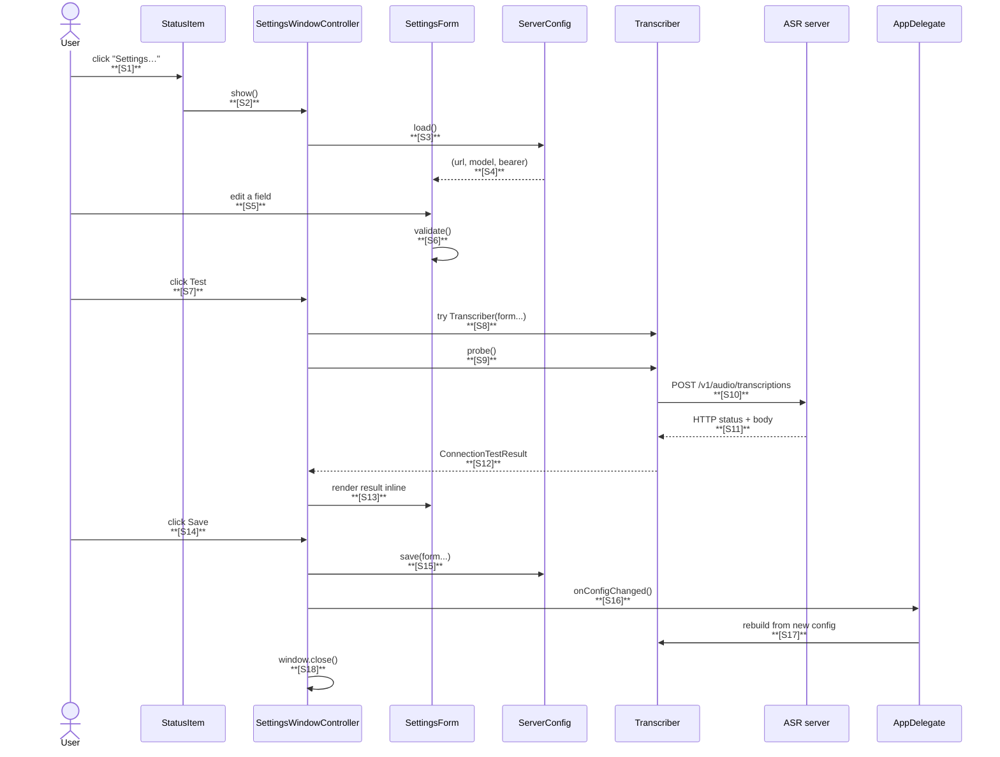

# Handoff — VoiceRider Settings Window + Connection Test

**Status:** Approved for implementation (post-review)
**Plan tag:** `settings-window`
**Date authored:** 2026-05-17
**Date reviewed:** 2026-05-17 (adversarial pushback applied; see §17)
**Authoring methodology:** Decompose → Critique → Refine, two-session review
**Implementing agent:** any subsequent kiro-cli session

This document is **self-contained**. You should be able to implement
the plan end-to-end without flipping to other documents, though
`voice-project.md` is the binding source of truth for any locked
decisions.

---

## A. About this feature

End users currently have to configure VoiceRider's ASR endpoint via:

```bash
defaults write com.voicerider voicerider.serverURL  "http://my-host:8000/v1/audio/transcriptions"
defaults write com.voicerider voicerider.modelName  "whisper-1"
defaults write com.voicerider voicerider.bearerToken "sk-..."
```

That's developer-friendly. It's not user-friendly. And it doesn't
give them a way to verify the values they entered actually work
before pressing the hotkey for the first time.

**This feature delivers:**

1. A native macOS settings window reachable from the menu-bar
   `Settings…` item.
2. Three input fields: server URL, model name, bearer token.
3. A `Test Connection` button that probes the configured endpoint
   and reports the result inline.
4. Save / Cancel that persist to `UserDefaults` (existing keys —
   no schema change) and rebuild the in-memory `Transcriber`.

**Out of scope for this plan** (deferred or rejected, see §12):

- Editing the ATS exception domain at runtime. Cannot be done
  without restarting the app and rebuilding `Resources/Info.plist`
  from the template. Documented limitation.
- Configurable hotkey in this window. Tracked separately for v0.2.
- Multiple saved server profiles. Pre-mature.
- Cloud sync of settings. Hard non-goal (telemetry / accounts).

---

## B. Glossary

| Term | Meaning |
|------|---------|
| **AppState** | The single state-machine enum on `AppDelegate`. Settings window operations do **not** participate in `AppState`. |
| **ATS** | App Transport Security. `Resources/Info.plist` carves out one host name; HTTP to other hosts is blocked unless that exception list is updated. Build-time only. |
| **CSR** | Connection Self-Test Result — the structured outcome of `Test Connection`. |
| **DCR** | Decompose → Critique → Refine. The methodology used in this plan. |
| **probe** | A round-trip request to the configured endpoint that exercises the same code path as a real dictation, but with a synthesised silent WAV. |
| **Settings window** | A single `NSWindow` owned by a `SettingsWindowController`, opened from the status-item menu. |
| **Transcriber rebuild** | `AppDelegate.transcriber` is recreated from `Config.load()` after the user saves new settings. |

---

## C. Prerequisites

```bash
# This is a follow-on to the overlay-diagnosis plan. Verify clean state:
git status -s                                    # only untracked plan files OK
./build.sh test 2>&1 | tail -3                   # 148/148 pass

# Confirm current settings keys still wire through:
defaults read com.voicerider voicerider.serverURL || echo "(default: http://localhost:8000/...)"
defaults read com.voicerider voicerider.modelName || echo "(default: canary-qwen-2.5b)"
defaults read com.voicerider voicerider.bearerToken || echo "(default: local-no-auth)"
```

---

## D. Architecture summary

The feature touches three existing files and adds four new ones.

| Subsystem | File | Purpose | This plan? |
|-----------|------|---------|------------|
| **AppDelegate** | `AppDelegate.swift` | State machine + Transcriber rebuild | YES (rebuild-on-save hook + menu wiring; replace inner `Config` struct) |
| **StatusItemController** | `StatusItemController.swift` | Menu bar | YES (add Settings… item) |
| **Transcriber** | `Transcriber.swift` | URLSession multipart upload | YES (add `probe()` method, share response parser, add `atsBlockedHost` helper) |
| **Permissions** | `Permissions.swift` | TCC | NO |
| **ServerConfig** | `ServerConfig.swift` | NEW — UserDefaults-backed config struct (replaces private `AppDelegate.Config`) | NEW |
| **SettingsForm** | `SettingsForm.swift` | NEW — pure value type capturing the form's UI state + validation (delegates regex checks to `Transcriber.validate(*)`) | NEW |
| **SilentWAVGenerator** | `SilentWAVGenerator.swift` | NEW — produces a 16 kHz mono Int16 silent WAV in memory; consumed by `Transcriber.probe()` | NEW |
| **SettingsWindow** | `SettingsWindowController.swift` | NEW — owns the NSWindow, runs probes via injected factory | NEW |

There is **no separate `ConnectionTester` file**. Probing logic lives on `Transcriber.probe()` and reuses the existing multipart builder + a newly-extracted shared response parser (single network path; Sauron-clean).

**Build pipeline:** unchanged. SwiftPM builds the executable; `prod-build.sh` bundles. The settings window is a regular AppKit window — no resources beyond what's already in the app bundle.

---

## 0. Mission and guardrails

### 0.1 Mission

Ship a settings window that lets a non-technical user point
VoiceRider at any OpenAI-compatible ASR server and confirm the
configuration works before pressing the hotkey for real. All
existing behavior preserved; no regressions to the recording
pipeline.

### 0.2 Guardrails (NON-NEGOTIABLE)

1. **The locked SCOPE rule changes.** `voice-project.md` line 26
   says *"no settings UI beyond a single hotkey choice"*. This
   feature is the deliberate scope change. The implementer's
   FIRST commit on this branch must update `voice-project.md` to
   reflect the new scope. Do NOT add UI before updating that file.
2. **No parallel state.** The single source of truth for server
   config is **`UserDefaults`**, accessed via a single
   `ServerConfig.load()` / `ServerConfig.save(_:)` pair. The
   settings form is a *transient* `SettingsForm` value populated
   from `ServerConfig.load()` on open and written back on save.
   The live `AppDelegate.transcriber` is *derived* state —
   recomputed from `ServerConfig` on save. Do not introduce a
   `currentURL` property anywhere else.
3. **No dual paths to network.** The connection test MUST go
   through `Transcriber` (extended with `probe()`), not a separate
   `URLSession` invocation. Sauron rule.
4. **No dual definitions of "valid model name" / "valid bearer
   token".** `Transcriber.validate(modelName:)` and
   `Transcriber.validate(bearerToken:)` are the source of truth.
   `SettingsForm.validate()` calls them and translates the throw
   into a `FieldError`. Do not re-encode the regex literals in
   `SettingsForm`.
5. **No `print`, `try!`, `as!`, IUOs.** All anti-patterns in
   `swift-coding-best-practices.md` apply.
6. **Settings window is `@MainActor` end-to-end.** No background
   work in event handlers. The `probe()` call hops off-main via
   `URLSession`, results return to main via `Task { @MainActor }`
   the same way `handleRelease()` already does.
7. **Privacy on the wire.** The bearer token MUST be entered into
   an `NSSecureTextField` (dots, not characters). Logging MUST
   redact via `privacy: .private` for the URL/bearer/model values.
   Only metadata (length, validation result, HTTP status) is
   `privacy: .public`.
8. **Probe is a transport check, not a semantic check.**
   `Transcriber.probe()` returns `Result<String, TranscribeError>`
   (the same shape as `transcribe`). It does NOT special-case
   silence-→-empty as success; that interpretation is policy and
   lives in `SettingsWindowController.renderResult`. Probe success
   = HTTP 2xx + valid JSON. The empty-text branch surfaces as
   `TranscribeError.empty`, which the UI renders as "✓ Server
   reachable; returned empty text for silent probe — that's
   expected." Different layer, different responsibility.
9. **Probe is cancellable.** `Transcriber.probe(...)` returns the
   in-flight `URLSessionDataTask?` so `SettingsWindowController`
   can call `cancel()` in `windowWillClose`. The probe completion
   suppresses delivery on `URLError.cancelled`.
10. **NEVER push to origin.** User pushes manually.
11. **NEVER touch ATS exception domain logic in this plan.**
    That's a separate concern — see §12.

### 0.3 Decision framework — DCR

Every non-trivial decision in this implementation MUST go through:

1. **DECOMPOSE** — name the moving parts, the inputs, the outputs.
2. **CRITIQUE** — what could go wrong, what evidence would falsify
   the hypothesis, what does the existing code already constrain.
3. **REFINE** — adjust based on the critique, keep the rationale
   in code comments or this plan.

If you're about to write code without DCR, STOP and back up.

---

## 1. The reported need

User feedback (verbatim from the chat):

> "people need a way to set the url of the server and to test the
> connection. create a handoff to plan that out, use decompose
> critique refine"

Decoded:

- **Set the server URL.** Currently CLI-only. End users won't
  know `defaults write` exists.
- **Test the connection.** Without a probe, the user has to press
  the hotkey, speak, release, and wait — only to see a cryptic
  error in the menu-bar icon if the URL/model/bearer are wrong.
  That's an awful first-run experience.
- **Implicitly, the model name and bearer token belong here too.**
  Adding a settings UI that only covers the URL would be weird.
  The user's mental model is "I'm configuring my server;" all
  three fields are part of that.

---

## 2. State of the repo right now

After the overlay-diagnosis plan:

```
254a38f fix: restore .nonactivatingPanel style mask for LSUIElement overlay
1f9e3af feat: belt-and-suspenders Input Monitoring + better cdhash UX
fff9ec3 feat: trace instrumentation + overlay defensive fixes + M1 mic indicator
441b666 feat: app icon and on-screen recording overlay
99d14d2 VoiceRider v0.1.0 — initial release
```

8 local commits ahead of `origin/main`. Working tree clean for
tracked files. 148 tests pass. Build-zero-warnings gate green.

`AppDelegate.Config` already centralises the three values:

```swift
private struct Config {
    let endpoint: URL
    let model: String
    let bearer: String
    static let defaultEndpoint = URL(string: "http://localhost:8000/v1/audio/transcriptions")!
    static let defaultModel = "canary-qwen-2.5b"
    static let defaultBearer = "local-no-auth"
    static func load() -> Config { … }   // from UserDefaults
}
```

It's `private` (file-scoped) and read-only. This plan extracts it
to a top-level `ServerConfig` with a `save(_:)` companion.

---

## 3. Decompose — what are the moving parts?

The press-to-record flow already has 13 numbered links (`L1`–`L13`).
This feature adds a **separate** flow with its own numbered chain:



Each link gets a trace point per the existing convention. Tag
prefix: `trace:settings-*`.

### 3.1 Trace tag catalog (NEW for this feature)

| Tag | Link | File | Format payload |
|-----|------|------|----------------|
| `trace:settings-open` | S1/S2 | StatusItemController.swift | `(empty)` |
| `trace:settings-load` | S3 | SettingsWindowController.swift | `urlOk=<bool> modelOk=<bool> bearerOk=<bool>` |
| `trace:settings-validate` | S6 | SettingsForm.swift | `field=<url\|model\|bearer> ok=<bool>` |
| `trace:settings-probe-start` | S9 | SettingsWindowController.swift | `endpointHost=<host>` |
| `trace:settings-probe-result` | S12 | SettingsWindowController.swift | `kind=<ok\|empty-ok\|ats\|http\|net\|decode> status=<int?>` |
| `trace:settings-save` | S15 | SettingsWindowController.swift | `(empty)` |
| `trace:settings-rebuild` | S17 | AppDelegate.swift | `result=<ok\|err>` |

Privacy: `endpointHost=<host>` is `.public` (host name only, no
path or query). Hostnames *can* contain user identifiers (e.g.,
`alice-mbp.local`); we accept this as a known minor leak in
exchange for greppable trace lines. The full URL, model, and
bearer values are `.private`.

`kind=empty-ok` is the UI-layer interpretation: probe returned
`TranscribeError.empty` (HTTP 2xx, JSON shape, empty `text`
field), which `SettingsWindowController.renderResult` translates
to "✓ silence accepted." This translation lives at the trace site,
not in `Transcriber.probe`.

---

## 4. Critique — failure modes and trade-offs

| ID | Risk | Severity | Mitigation |
|----|------|----------|------------|
| C1 | User changes URL hostname; ATS exception still names the old host. Probe fails with `NSURLErrorAppTransportSecurityRequiresSecureConnection` (-1022). | **HIGH** | `Transcriber.atsBlockedHost(in:)` static helper inspects the URLError. `SettingsWindowController.renderResult` checks this first; if non-nil, surface a clear ATS message: "App Transport Security is configured for `<old-host>`. To use a different HTTP host, update `Resources/Info.plist.template` and rebuild. HTTPS hosts work without rebuild." |
| C2 | Probe sends a real WAV → server transcribes silence → returns `text=""` → `Transcriber.probe` surfaces this as `TranscribeError.empty`. User thinks something is broken when actually it's working. | **HIGH** | `Transcriber.probe` does NOT special-case empty. It returns `Result<String, TranscribeError>` exactly like `transcribe`. `SettingsWindowController.renderResult` interprets `.failure(.empty)` as "✓ Server reachable; returned empty text for silent probe — that's expected." Different layer, different responsibility. (Guardrail #8.) |
| C3 | User pastes a URL with leading/trailing whitespace from a chat message. `URL(string:)` accepts it, then crashes elsewhere. | MEDIUM | `SettingsForm.validate()` calls `String.trimmingCharacters(in: .whitespacesAndNewlines)` before `URL(string:)`. |
| C4 | User enters a non-OpenAI-compatible URL (e.g., `https://google.com`). Probe gets 200 + invalid JSON. | MEDIUM | Surfaced as `TranscribeError.decode`. UI label: "Server reachable but response shape unexpected; expected `{\"text\":...}`." |
| C5 | Probe hangs because the server is unreachable. Without timeout the user sees a spinner forever. | MEDIUM | `Transcriber.probe()` defaults to 15s, **matching dictation**. The reference Canary-Qwen server has a 30–90s cold-start; a 5s probe timeout would falsely fail and confuse the user. The probe error message includes "(timed out after 15s — server may be cold-starting; press hotkey to retry on a real transcription)". |
| C6 | User clicks Save with invalid input. Currently `Transcriber.init` throws — invalid state shipped to AppDelegate. | MEDIUM | Save button is `isEnabled = form.isValid`. Validate before save, not after. |
| C7 | Two settings windows opened at once → two `SettingsWindowController` instances → which one wins on save? | MEDIUM | `AppDelegate` keeps a single optional `var settingsWC: SettingsWindowController?`; click-Settings re-uses or creates. (Single ownership site; see §6 R6.) |
| C8 | Save races with an in-flight `transcribe()` from a recent dictation. The completion handler tries to use the OLD transcriber after we've replaced it. | MEDIUM | `AppDelegate.transcriber` is captured by reference into the URLSession completion via the `transcriber` local in `handleRelease()`. Replacing `self.transcriber` doesn't affect already-dispatched calls because the closure holds a strong ref to the old instance. **Verified by inspection** in current code (`handleRelease` line ~150 of AppDelegate.swift); add a regression test that exercises this path with an injected `transcriberFactory`. |
| C9 | User cancels a long-running probe (closes the window). The completion handler fires after the window is gone, mutates a deallocated form. | MEDIUM | `Transcriber.probe(...)` returns `URLSessionDataTask?`. `SettingsWindowController` stores it in `probeTask` and calls `probeTask?.cancel()` in `windowWillClose`. The probe completion suppresses delivery on `URLError.cancelled` (no completion is invoked, so no UI mutation occurs). The completion ALSO captures `[weak self]` and bails if `self == nil`, as belt-and-suspenders. |
| C10 | Bearer token entry shows in `os_log` if dev forgets `.private`. | **HIGH** | All trace lines and Log lines that mention bearer/url/model use `.private`. Add a unit test pinning that. |
| C11 | Probe synthesises a 0.5s silent WAV. If we use the existing `WAVHeaderFixtures.makeMinimalWAV`, that's a test-only symbol. Promoting it to production breaks Annie rule for the test target. | LOW | Add a small `SilentWAVGenerator` enum in production code (a few dozen bytes), unit-tested separately. Don't reuse test fixtures from prod. |
| C12 | Settings window is `@MainActor` but `Transcriber.probe()` completion fires off-main. Calling `self.renderResult(...)` from the completion would warn. | LOW | Hop main inside the completion: `Task { @MainActor [weak self] in self?.renderResult(r) }`. Same pattern as `handleRelease()`. |
| C13 | Validation regex for URL: do we accept `localhost`? Yes — `URL(string: "http://localhost:8000")` is a valid URL with `scheme=http`, `host=localhost`. | LOW | No special-casing needed; checks below handle it. |
| C14 | LSUIElement app + window means Cmd+Tab won't show VoiceRider. User can't easily get back to the settings window. | LOW | When `show()` is called, also call `NSApp.activate(ignoringOtherApps: true)`. Window comes forward; click-away returns to background mode. |
| C15 | Probe writes silent WAV to tempfile then sends it; cleanup races with cancel; `try?` swallows errors. | LOW | **Eliminated.** `Transcriber.probe` builds the multipart body in-memory via the existing `Self.multipartBody(boundary:model:wavData:filename:)` static (already accepts `Data`). No tmpfile, no `defer { try? FileManager... }`. A new private helper `buildRequest(wavData:filename:timeout:)` is shared between `transcribe(wav:)` (which now does `Data(contentsOf: wavURL)` then calls the helper) and `probe()`. Single multipart construction path. |
| C16 | `URL(string:)` succeeds on garbage like `"junk"`, `"/foo/bar"`, or `"ftp://x"`. Form would accept; Transcriber-rebuild would silently use a non-HTTP URL. | **HIGH** | `SettingsForm.validate()` requires after trim: (a) `URL(string:)` non-nil, (b) `scheme.lowercased() ∈ {"http", "https"}`, (c) non-empty `host`. All three or it's `.malformedURL`. |
| C17 | LSUIElement window + Cmd-Q quits the whole process from the focused settings window, losing the user's edits AND tearing down the hotkey monitor. | **HIGH** | `SettingsWindowController` implements `windowShouldClose(_:)`. If `form != initialForm && savedConfig == nil`, present a confirm sheet ("Discard changes?"). Cmd-Q handling falls through to this same path. **Gating for Phase D acceptance.** |
| C18 | `NSApp.activate(ignoringOtherApps:)` on an LSUIElement (`.accessory`) app is unreliable for grabbing key-window status. | MEDIUM | Open-policy: temporarily flip `setActivationPolicy(.regular)` on `show()` so the window has a normal app activation (and Cmd-Tab visibility while open); flip back to `.accessory` in `windowWillClose`. Karabiner-Elements ships separate sub-bundles; we are choosing the simpler in-process route and accepting brief Cmd-Tab visibility. Documented trade-off. |
| C19 | After `task.cancel()`, the URLSession completion fires with `URLError.cancelled`; without explicit handling that maps to `TranscribeError.requestFailed("cancelled")` and could surface as a confusing UI error if the window is still alive when the message arrives. | LOW | `Transcriber.probe` inspects `URLError.code == .cancelled` BEFORE invoking `completion`. On cancel, the closure returns without delivering a result. Caller is responsible for treating cancellation as "no signal", which `SettingsWindowController` does naturally because it calls `cancel()` only in `windowWillClose`. |

---

## 5. Refine — chosen design

### 5.1 New types

#### `ServerConfig` (NEW, top-level, replaces `AppDelegate.Config`)

```swift
struct ServerConfig: Equatable, Sendable {
    var endpoint: URL
    var model: String
    var bearer: String

    static let defaults = ServerConfig(
        endpoint: URL(string: "http://localhost:8000/v1/audio/transcriptions")!,
        model: "canary-qwen-2.5b",
        bearer: "local-no-auth")

    static func load(from defaults: UserDefaults = .standard) -> ServerConfig { … }
    static func save(_ cfg: ServerConfig, to defaults: UserDefaults = .standard) { … }
}
```

Notes:
- Default endpoint URL force-unwrap is the single allow-listed
  force-unwrap that already exists in the project (per anti-patterns
  rule §0.2 #4).
- `Equatable` so the AppDelegate can avoid rebuilding the
  Transcriber when nothing actually changed.
- `Sendable` so it can cross actors (settings window → AppDelegate).

#### `SettingsForm` (NEW, value type)

```swift
struct SettingsForm: Equatable {
    var endpointString: String
    var model: String
    var bearer: String

    enum FieldError: Error, Equatable {
        case empty(field: Field)
        case malformedURL          // not non-nil URL, or not http/https, or empty host
        case modelRegex
        case bearerRegex
    }
    enum Field: String, CaseIterable { case endpoint, model, bearer }

    /// Returns an array of errors. Empty array means valid.
    /// Delegates regex enforcement to `Transcriber.validate(*)`
    /// (single source of truth — guardrail #4).
    func validate() -> [FieldError]
    var isValid: Bool { validate().isEmpty }

    /// Materialises a `ServerConfig`. Throws the first `FieldError`
    /// from `validate()` if invalid.
    func resolve() throws -> ServerConfig

    /// Builds a form pre-populated from the given ServerConfig.
    static func from(_ cfg: ServerConfig) -> SettingsForm
}
```

URL validation rules (C16):

1. After `String.trimmingCharacters(in: .whitespacesAndNewlines)`, the result must be non-empty (`empty(field: .endpoint)`).
2. `URL(string: trimmed)` must be non-nil.
3. `url.scheme?.lowercased()` must be `"http"` or `"https"`.
4. `url.host` must be non-nil and non-empty.

Failing any of (2)–(4) yields `.malformedURL`.

Pure value type. No I/O. 100% unit-testable.

#### `Transcriber.probe(...)` (NEW method on existing Transcriber)

```swift
extension Transcriber {

    /// Runs a synthetic transcribe against the configured endpoint
    /// using a 0.5s silent WAV (in-memory; no disk I/O). Returns
    /// the in-flight `URLSessionDataTask?` so callers can `cancel()`
    /// on window-close. Returns `nil` if the request couldn't be
    /// constructed (e.g., model regex rejected — though `init`
    /// already rejected those, so in practice non-nil).
    ///
    /// Result shape is identical to `transcribe(wav:)`:
    /// `Result<String, TranscribeError>`. The probe does NOT
    /// special-case empty-text-as-success; that interpretation is
    /// UI policy and lives in `SettingsWindowController`.
    ///
    /// On `URLError.cancelled`, completion is suppressed (no
    /// invocation). Caller treats cancellation as "no signal".
    @discardableResult
    func probe(timeout: TimeInterval = 15,
               completion: @escaping @Sendable (Result<String, TranscribeError>) -> Void)
        -> URLSessionDataTask?
}

extension Transcriber {

    /// Inspects `error` and returns the failing host name iff the
    /// error is `URLError.appTransportSecurityRequiresSecureConnection`
    /// (-1022). The UI uses this to surface a precise ATS message.
    static func atsBlockedHost(in error: Error) -> String?
}
```

Both `transcribe(wav:)` and `probe(...)` route through:

- `static func multipartBody(boundary:model:wavData:filename:) -> Data` (existing pure builder)
- `private func buildRequest(wavData:filename:timeout:) -> URLRequest` (NEW shared helper; existing `buildRequest(wavURL:)` reads the file then calls this)
- `private static func parseTranscribeResponse(data:response:error:) -> Result<String, TranscribeError>` (NEW shared parser; both transcribe and probe call it)

Single multipart construction path. Single response-parsing path. Sauron compliant.

#### `SilentWAVGenerator` (NEW, production code)

```swift
enum SilentWAVGenerator {
    /// Returns a 16 kHz mono Int16 RIFF/WAVE file filled with zero
    /// samples for `seconds` seconds. ~16 KB at 0.5s
    /// (8 000 frames × 2 bytes + 44-byte header).
    static func makeWAV(seconds: Double = 0.5) -> Data { … }
}
```

Pure function, no side effects. Unit-tested against `WAVHeaderParser`
fixture rules (parses cleanly, derived fields correct).

Why not reuse `Tests/VoiceRiderTests/WAVHeaderFixtures.makeMinimalWAV`?
Because Annie rule: prod must not depend on test target. A 30-line
duplicate is fine.

#### `SettingsWindowController` (NEW)

```swift
@MainActor
final class SettingsWindowController: NSWindowController, NSWindowDelegate {

    private let transcriberFactory: @Sendable (ServerConfig) throws -> Transcriber
    private let initialForm: SettingsForm
    private var form: SettingsForm
    private var savedConfig: ServerConfig?         // set on Save
    private var probeTask: URLSessionDataTask?

    /// Called when the user clicks Save. Caller (AppDelegate)
    /// rebuilds the transcriber from the new ServerConfig.
    var onSave: (ServerConfig) -> Void = { _ in }

    /// Called from `windowWillClose` so the owner can drop its
    /// reference (single-instance invariant, see §6 R6).
    var onClosed: () -> Void = {}

    init(initial: ServerConfig,
         transcriberFactory: @escaping @Sendable (ServerConfig) throws -> Transcriber)

    func show()                               // flips to .regular, makeKey, activate
    func windowShouldClose(_ : NSWindow) -> Bool   // confirm-on-dirty (C17)
    func windowWillClose(_ : Notification)         // cancels probeTask, flips back to .accessory, fires onClosed
}
```

The `transcriberFactory` is injected so unit tests don't need to
construct a real `Transcriber` (which validates regexes and would
require valid model/bearer strings). Production callers use the
default factory:

```swift
SettingsWindowController(
    initial: ServerConfig.load(),
    transcriberFactory: { cfg in
        try Transcriber(endpoint: cfg.endpoint, model: cfg.model, bearer: cfg.bearer)
    })
```

The controller does NOT take a `Permissions` parameter. A future
permissions-panel feature, if it ever lands, will add it then —
not now (Annie rule).

### 5.2 Modified types

#### `AppDelegate`

- Remove `private struct Config`. Replaced by top-level `ServerConfig`.
- `private var transcriber: Transcriber?` — already a `var`. Keep.
- `private var settingsWC: SettingsWindowController?` — NEW. Single-instance owner (C7, R6).
- Add `func openSettings()` method. Wires the controller's `onSave` to `ServerConfig.save` + Transcriber rebuild; wires `onClosed` to drop `settingsWC = nil`.
- On rebuild, trace `settings-rebuild result=ok|err`.

#### `StatusItemController`

- Add a `Settings…` menu item between `Permissions` and `Show Live Trace…`.
- Add `var onOpenSettings: () -> Void = {}` callback.
- Wire it from `AppDelegate.applicationDidFinishLaunching`.
- The status item does NOT own `settingsWC`. Single-instance lives on AppDelegate (R6).

#### `Transcriber`

- Add `private func buildRequest(wavData:filename:timeout:) throws -> URLRequest` (shared helper).
- Refactor existing `buildRequest(wavURL:)` to read the file then call the helper. No external API change.
- Extract `private static func parseTranscribeResponse(data:response:error:) -> Result<String, TranscribeError>` from the existing `transcribe` completion handler. Both `transcribe` and `probe` invoke it.
- Add `func probe(timeout:completion:) -> URLSessionDataTask?` extension.
- Add `static func atsBlockedHost(in:) -> String?` extension (URLError code -1022 → host name).

### 5.3 NOT modified

- `AudioRecorder`, `Paster`, `HotkeyMonitor`, `RecordingOverlay`,
  `State`, `Logger`, `Trace`, `Permissions`, `PermissionStatus`.
- The state machine. Settings is orthogonal.
- The `Resources/Info.plist.template`.

### 5.4 UI layout (text mock)

```
┌──────────────────────────── VoiceRider — Settings ────────────────────┐
│                                                                       │
│   Server URL    [http://localhost:8000/v1/audio/transcriptions    ]  │
│                  ✓ valid URL                                          │
│                                                                       │
│   Model name    [canary-qwen-2.5b                                ]   │
│                  ✓ valid                                              │
│                                                                       │
│   Bearer token  [••••••••••••••••                                ]   │
│                  ✓ valid                                              │
│                                                                       │
│   [Test Connection]  ●  ✓ Server reachable; returned empty text       │
│                          for silent probe — that's expected.          │
│                                                                       │
│   [Default model is canary-qwen-2.5b. See README §Server protocol.]   │
│                                                                       │
│                                            [Cancel]  [Save]           │
└───────────────────────────────────────────────────────────────────────┘
```

- All three rows are `NSTextField` (the bearer one is `NSSecureTextField`).
- Inline validation status appears below each field.
- `[Test Connection]` button is disabled while the probe is in flight; the spinner indicator (`●`) is animated during probe.
- `[Save]` is disabled when `form.isValid == false`.
- Window is fixed-width, ~520 pt. Resizing disabled.

Implementation: pure AppKit (NSWindow + NSStackView + manual auto-layout) per project convention. **Do not introduce SwiftUI for this** — the project is AppKit-only and adding SwiftUI introduces a dual UI path (Sauron rule).

### 5.5 Probe — generated WAV details

- 16 kHz mono 16-bit PCM, 0.5 s = **8 000 frames × 2 bytes = 16 000 bytes data + 44-byte header ≈ 16 KB on the wire.** Negligible for any LAN ASR server.
- The probe builds the `multipart/form-data` body **entirely in memory** via the existing `Transcriber.multipartBody(boundary:model:wavData:filename:)` static. No tmpfile, no `defer { try? FileManager... }`, no cleanup race with cancellation.
- Filename in the file-part header is `"probe.wav"`. The server's audio loader treats the filename as a hint for codec selection only; the bytes are canonical RIFF/WAVE PCM regardless.

---

## 6. Self-audit findings (proactive R-style refinements)

These are concerns the authoring session caught while drafting §5
and §7. Documented to be applied in the same commit so they don't
become a later cleanup.

### R1 — `SettingsForm.validate()` must not throw

It returns `[FieldError]` rather than `throws`. The UI needs to
display all errors at once; throwing on the first prevents that.
`resolve()` does throw — it picks the first error from `validate()`.

### R2 — `ServerConfig` `Equatable` short-circuit on save

```swift
let new = try form.resolve()
guard new != ServerConfig.load() else { return }  // no-op save
ServerConfig.save(new)
onSave(new)
```

Avoids a Transcriber rebuild for a save where the user opened the
window and clicked Save without editing anything.

### R3 — Probe is in-memory only (no tempfile)

(Originally this section described a tempfile-cleanup `defer`
block. Removed in review: the existing `multipartBody` static
already accepts `Data`. No disk I/O, no cleanup, no cancel race.
See §5.5 + C15.)

### R4 — `transcriberFactory` must use the EXISTING `Transcriber.init`

Otherwise we'd have two ways to construct a Transcriber (Sauron).
`SettingsWindowController.init` parameter:

```swift
transcriberFactory: @escaping @Sendable (ServerConfig) throws -> Transcriber
    = { cfg in try Transcriber(endpoint: cfg.endpoint, model: cfg.model, bearer: cfg.bearer) }
```

Production callers use the default; tests inject a stub factory
that returns a Transcriber with `URLProtocol`-mocked session.

### R5 — `SettingsForm.endpointString` is the source of truth, NOT `URL`

The user's typed text is preserved verbatim. We only call
`URL(string: form.endpointString.trimmingCharacters(in: .whitespacesAndNewlines))`
in `resolve()` and `validate()`. Storing as `URL` would lose
trailing whitespace mid-edit and surprise the user.

### R6 — Window single-instance invariant lives on `AppDelegate`

`AppDelegate` (not `StatusItemController`) owns
`var settingsWC: SettingsWindowController?`.

Rationale: the single-instance is paired with the rebuild-on-save
behavior, which already lives on AppDelegate (`var transcriber`).
Putting `settingsWC` on `StatusItemController` would create a
back-channel where the menu has to know about persistence.

```swift
// AppDelegate.openSettings()
if let existing = settingsWC {
    existing.show()  // brings to front
    return
}
let wc = SettingsWindowController(
    initial: ServerConfig.load(),
    transcriberFactory: { try Transcriber(endpoint: $0.endpoint, model: $0.model, bearer: $0.bearer) })
wc.onSave = { [weak self] cfg in self?.applyConfig(cfg) }
wc.onClosed = { [weak self] in self?.settingsWC = nil }
wc.show()
settingsWC = wc
```

### R7 — Strings are hard-coded English

(Originally this section proposed wrapping result strings in
`NSLocalizedString`. Removed in review: `voice-project.md` says
English-only; adding a `Localizable.strings` file with 6 entries
for a single locale is dead bookkeeping. If a second locale ever
lands, that PR adds the wrapping then.)

### R8 — Activation-policy flip on open/close (C18)

`show()` sets `NSApp.setActivationPolicy(.regular)` then activates.
`windowWillClose` flips back to `.accessory`. The trade-off (brief
Cmd-Tab visibility while the window is open) is documented in
§11.3.

---

## 7. Files you'll touch

### 7.1 Production code (5 files in `Sources/VoiceRider/`)

| File | Status | Estimated lines | Purpose |
|------|--------|-----------------|---------|
| `ServerConfig.swift` | NEW | ~70 | UserDefaults-backed config struct + Equatable + load/save |
| `SettingsForm.swift` | NEW | ~110 | Pure value type; validation; resolve to ServerConfig |
| `SilentWAVGenerator.swift` | NEW | ~50 | 16 kHz silent WAV bytes generator |
| `SettingsWindowController.swift` | NEW | ~280 | NSWindowController + form rendering + probe trigger |
| `Transcriber.swift` | MODIFY | +90 | Add `probe()` method, `ProbeResult` enum, ATS-error mapping |
| `AppDelegate.swift` | MODIFY | +30 | Replace inner Config struct, add openSettings(), rebuild on save |
| `StatusItemController.swift` | MODIFY | +20 | Add Settings… menu item + `onOpenSettings` callback |

### 7.2 Test files (5 files in `Tests/VoiceRiderTests/`)

| File | Status | Estimated lines | Purpose |
|------|--------|-----------------|---------|
| `ServerConfigTests.swift` | NEW | ~80 | UserDefaults round-trip; defaults; Equatable |
| `SettingsFormFixtures.swift` | NEW | ~120 | ~12 valid/invalid form rows |
| `SettingsFormTests.swift` | NEW | ~60 | Drive validation from fixtures |
| `SilentWAVGeneratorTests.swift` | NEW | ~50 | Header parses, sample count math, 0.5s = 16 KB |
| `TranscriberProbeTests.swift` | NEW | ~140 | Probe result mapping (ok/ats/http/net/decode) via MockURLProtocol |

Total: 5 prod files + 5 test files. ~620 prod lines, ~450 test lines.

### 7.3 Steering doc updates

| File | Change |
|------|--------|
| `.kiro/steering/voice-project.md` | Soften line 26 to "no SaaS account-style settings UI; a settings window for server config is in scope (v0.2)". Remove or modify line 164 "Configurable model in UI — UserDefaults only" — model is now configurable in UI. |

These edits go in the FIRST commit of the implementation. See §8.1.

---

## 8. Implementation procedure

### 8.1 Phase A — Locked-decision update (FIRST COMMIT)

```bash
cd /Users/braker/git/VoiceRider

# Edit .kiro/steering/voice-project.md per §7.3.
# Commit IT FIRST, alone.
git add .kiro/steering/voice-project.md
git commit -m "chore(steering): permit settings window for server config (v0.2 scope)"
```

Why first? Per `voice-project.md`'s own rules:

> "If a requirement changes: 1. Update **this file first** to reflect
> the new locked decision. 2. Then change the code. 3. The diff to
> this file is the audit trail of what changed and why."

#### Gate A → B

- [ ] `voice-project.md` no longer forbids server-config settings UI
- [ ] Working tree clean

### 8.2 Phase B — Pure value types and validation

Land in this order so each file compiles independently:

1. `ServerConfig.swift` (NEW)
2. `SilentWAVGenerator.swift` (NEW)
3. `SettingsForm.swift` (NEW)
4. Test fixtures + tests for all three

```bash
swift build 2>&1 | grep -i 'warning\|error' && echo FAIL || echo OK
./build.sh test
```

#### Gate B → C

- [ ] Three new files compile, zero warnings
- [ ] ServerConfig round-trips through UserDefaults
- [ ] SettingsForm.validate() returns expected errors per fixture
- [ ] SilentWAVGenerator output parses via WAVHeaderParser
- [ ] All 148 existing tests + new tests pass

### 8.3 Phase C — Transcriber.probe()

5. Modify `Transcriber.swift` to add `probe()` and `ProbeResult`
6. Add `TranscriberProbeTests.swift` with MockURLProtocol fixtures

```bash
./build.sh test --filter TranscriberProbe
```

#### Gate C → D

- [ ] Probe handles all six `ProbeResult` cases via mocked URLProtocol
- [ ] Probe times out at 5s (verify with a stalling mock)
- [ ] Probe cleans up its temp WAV file
- [ ] No new warnings under `make verify-strict`

### 8.4 Phase D — UI window + AppDelegate wiring

7. `SettingsWindowController.swift` (NEW)
8. `StatusItemController.swift` add menu item + callback
9. `AppDelegate.swift` extract Config → ServerConfig, add openSettings(), wire rebuild on save

```bash
./prod-build.sh --install
open /Applications/VoiceRider.app
# Click menu bar → Settings…
```

#### Gate D → E

- [ ] Click menu item → window appears, populated with current config
- [ ] Edit URL with bad value → save disabled, error shown inline
- [ ] Click Test → spinner → result inline within 5s
- [ ] Click Save → window closes, transcriber rebuilt (verify next dictation hits the new endpoint via trace)
- [ ] Cancel discards changes
- [ ] Closing the window with X = Cancel
- [ ] No leak: open/close 5x, in-flight probes cancelled on close

### 8.5 Phase E — Verify, commit, ship

```bash
./build.sh test                        # all green
make verify
git add Sources/ Tests/
git commit -m "feat(settings): runtime server config window with connection test

…"
```

Update README "Configuration" section to reference the new
Settings… menu item. Edit only the section explicitly addressed —
preserve all other content.

#### Gate E → SHIP

- [ ] All checks in §13 pass
- [ ] Local commit made (single feature commit, plus Phase A's
  steering-doc commit, plus optional README commit = 3 commits)
- [ ] **NOT pushed.** User pushes manually.

---

## 9. Test inventory and commands

### 9.1 Test counts by suite

| Suite | New tests | Fixture-driven |
|-------|-----------|----------------|
| `ServerConfig` | ~6 | no |
| `SettingsForm` | ~12 | yes (12 fixture rows) |
| `SilentWAVGenerator` | ~5 | no |
| `Transcriber.probe` | ~10 | yes (6 result cases × 1–2 variants each) |

Total: ~33 new tests, joining the existing 148 → **~181 total**.

### 9.2 Fixture quick reference

| Fixture | Pin-count |
|---------|-----------|
| `SettingsFormFixtures.all` | 12 (3 valid, 9 invalid: empty url/model/bearer, malformed URL, whitespace, CRLF, regex violations) |
| `TranscriberProbeFixtures.all` | 6 (ok, ats, http500, network, decode, empty-but-ok) |

### 9.3 Test commands

```bash
swift test --filter ServerConfig
swift test --filter SettingsForm
swift test --filter SilentWAVGenerator
swift test --filter TranscriberProbe

# Full suite
./build.sh test
make verify
```

### 9.4 Manual integration test

(Cannot be unit-tested — opens a real window.)

1. `./prod-build.sh --install` then `open /Applications/VoiceRider.app`.
2. Click status bar icon → Settings…
3. Verify all three fields populated from `defaults read`.
4. Type junk in the URL → save disabled, red ✗ next to URL.
5. Restore valid URL → ✓ → click Test Connection.
6. Probe completes in <5s with a result message.
7. Click Save → window closes.
8. Press Right Option in TextEdit → recording works against the
   (potentially new) endpoint.
9. Click Cancel after editing → values revert to last-saved.

---

## 10. Anti-patterns absolutely forbidden

Same list as previous handoff; applies fully here.

1. No `try!`, `as!`, IUOs, `print()` — use throwing functions and `Log.*`.
2. No non-`final` classes in production. `SettingsWindowController` is `final`.
3. No `DispatchSemaphore` to bridge async to sync inside the probe.
4. No `@unchecked Sendable`.
5. **Privacy:** all log statements that touch URL / model / bearer use `privacy: .private`. Metadata (HTTP status, validation result, host name only) is `.public`.
6. No SwiftUI in the settings window. AppKit only — matches existing project style.
7. No additional `URLSession` instance. Reuse the Transcriber's session via the probe method.
8. No NSAlert for "Test Connection" results — render inline in the window. The dialog flicker on every Test click is awful UX.
9. No threading shortcuts: settings UI is `@MainActor`; probe completion hops main via `Task { @MainActor }` like `handleRelease`.
10. **No** running the probe synchronously on a background `DispatchQueue` and blocking the main thread. The user must be able to click Cancel during a probe.

---

## 11. Known risks and accepted trade-offs

### 11.1 ATS exception is build-time only

If the user changes URL hostname to one not in `Resources/Info.plist`'s
`NSExceptionDomains`, plain HTTP fails. The probe surfaces this with
a clear ATS-specific error. We do NOT attempt to regenerate
`Info.plist` at runtime — Apple's ATS check happens before our code
runs in the URL load lifecycle. Documented in the README and in the
probe's error message.

### 11.2 Bearer token persists in UserDefaults plaintext

Same as v0.1 — already documented in README. v0.2 Keychain backend
is tracked separately; this plan does NOT change the storage layer.
The settings window uses `NSSecureTextField` for entry-time UX
hygiene, but at rest the value is still in the plist.

### 11.3 LSUIElement window activation

Calling `NSApp.activate(ignoringOtherApps: true)` from a process
with `LSUIElement = true` and `setActivationPolicy(.accessory)` is
not reliably enough to grab key-window status. `show()` therefore
flips the activation policy:

```swift
func show() {
    NSApp.setActivationPolicy(.regular)
    NSApp.activate(ignoringOtherApps: true)
    window?.makeKeyAndOrderFront(nil)
}

// in windowWillClose:
NSApp.setActivationPolicy(.accessory)
```

Trade-off: while the settings window is open, VoiceRider appears
in Cmd-Tab and the Dock. We accept this. Karabiner-Elements ships
a separate Settings sub-bundle to avoid this; we are choosing the
simpler in-process route. Closing the window restores the
menu-bar-only behavior.

### 11.4 Cmd-Q closes the WHOLE APP from the settings window — handled

`SettingsWindowController` implements `windowShouldClose(_:)`. If
the form has unsaved edits (`form != initialForm && savedConfig == nil`),
present a confirm sheet ("You have unsaved changes. Discard?").

Cmd-Q reaches the same code path because Cmd-Q on a focused window
fires `windowShouldClose` before tearing the window down (and
before AppKit terminates the app).

This is a **gating** acceptance criterion in §8.4 (D), not "polish".
A daily-use tool that silently discards user edits and tears down
the hotkey monitor on Cmd-Q is broken UX.

---

## 12. What NOT to do (out of scope for THIS plan)

| ID | Item | Why deferred |
|----|------|--------------|
| OUT-1 | Edit the ATS exception domain at runtime | Apple's ATS is checked before our code runs. Requires Info.plist regeneration + relaunch. Build-time only. Track for v0.3. |
| OUT-2 | Configurable hotkey in this window | Different feature, separate plan. The settings window leaves visual room ("Future: Hotkey: …") but the row is not added in this PR. |
| OUT-3 | Multiple saved server profiles | Pre-mature. Most users have one server. |
| OUT-4 | Cloud sync of settings | Hard non-goal per `voice-project.md`. |
| OUT-5 | iCloud Keychain for the bearer token | v0.2 Keychain item — separate plan. |
| OUT-6 | A `Logs` viewer in the settings window | Would duplicate Console.app. The existing "Show Live Trace…" menu item already opens Console; `./scripts/show-voicerider-trace.sh` covers the CLI case. |
| OUT-7 | Auto-detect a running ASR server on the LAN | Bonjour discovery is interesting but fragile. v0.3+. |
| OUT-8 | "Reset to defaults" button | Trivial to add later. Decline now to keep the window minimal. |
| OUT-9 | Separate "developer" pane for advanced settings | All current settings are server config. No advanced surface needed. |

---

## 13. Final sanity checks before committing

```bash
# Build + tests
./build.sh test                         # ~181/181 pass
make verify                             # verify: OK
make verify-strict 2>&1 | grep "warning(s)"   # ≤ 11

# Static checks (no new force unwraps, no print, no try!)
git grep -nE 'try!|as![^=]|print\(|@unchecked|DispatchSemaphore' \
    Sources/VoiceRider/SettingsWindowController.swift \
    Sources/VoiceRider/SettingsForm.swift \
    Sources/VoiceRider/ServerConfig.swift \
    Sources/VoiceRider/SilentWAVGenerator.swift
# → 0 matches

# Privacy: no .public on URL/model/bearer values
git grep -n 'serverURL\|bearer\|model' Sources/VoiceRider/*.swift \
    | grep 'privacy:.*public' \
    && echo "PRIVACY VIOLATION" \
    || echo "OK: privacy scrubbed"

# Manual flow (per §9.4)
```

---

## 14. Commit messages

### 14.1 Phase A (steering)

```
chore(steering): permit settings window for server config (v0.2 scope)

voice-project.md previously forbade any settings UI beyond a hotkey
choice and called out 'Configurable model in UI — UserDefaults only'
as a non-goal. The user has requested a runtime server-config window
with a connection test. This commit relaxes those decisions; the
implementation lands in a follow-on commit per the project's own
'change the steering doc first' rule.
```

### 14.2 Phase E (feature)

```
feat(settings): runtime server config window with connection test

Adds a native AppKit settings window reachable from the menu-bar
icon. Three fields (URL, model, bearer), inline validation, a
'Test Connection' probe that reuses the Transcriber path with a
0.5s silent WAV.

New files:
* ServerConfig.swift — UserDefaults-backed config + load/save
* SettingsForm.swift — pure validation value type
* SilentWAVGenerator.swift — 16 kHz silent WAV bytes
* SettingsWindowController.swift — NSWindow + form rendering
* Transcriber.probe() — connection test reusing buildRequest

Modified:
* AppDelegate — Config struct extracted to top-level ServerConfig;
  rebuilds Transcriber on save
* StatusItemController — adds 'Settings…' menu item

Tests: 148 → ~181 (+33 new, fixture-driven where applicable).

Privacy: bearer/url/model values logged as private; only metadata
(host name only, HTTP status, validation outcome) is public.

ATS: probe surfaces ATS-blocked URLs with a clear error message
pointing at Resources/Info.plist.template (build-time-only constraint
documented in README).

Closes the 'people need a way to set the URL' user request.
```

### 14.3 Push policy

**DO NOT PUSH.** User pushes manually after review.

---

## 15. Reference paths

```
/Users/braker/git/VoiceRider/
├── Sources/VoiceRider/                    ← write here
├── Tests/VoiceRiderTests/                  ← write here
├── .kiro/steering/voice-project.md         ← edit FIRST (Phase A)
├── docs/plans/handoff-settings-window.md   ← THIS file
├── docs/plans/handoff-overlay-diagnosis.md ← prior handoff (for style)
└── README.md                               ← update Configuration section in Phase E
```

---

## 16. After "done" — what the user expects next

1. Click menu-bar → **Settings…** opens a real window.
2. Type a different URL → field shows ✓ when valid.
3. Click **Test Connection** → spinner → result message in <15s.
4. Click **Save** → window closes.
5. Press Right Option in TextEdit → recording uses the new endpoint.
6. Quit + relaunch → settings persist.
7. CLI `defaults write com.voicerider voicerider.serverURL "..."`
   still works for power users; the GUI and CLI write to the same
   UserDefaults keys.

If the user reports any of these flows broken, that's a real
regression. Apply DCR before patching.

---

## 17. Review applied — audit trail

This document was authored 2026-05-17 morning, then put through a
second-session adversarial review the same day. The following 17
fixes were applied to the original draft. The fix IDs are kept here
so a future reader can see what changed and why.

| # | Issue | Section(s) edited |
|---|-------|-------------------|
| 1 | **Annie:** `private let perms: Permissions` field with "future use" comment is an orphan with no named follow-on task. **Removed.** | §5.1 (`SettingsWindowController` API), §0.2 |
| 2 | **Sauron:** `SettingsForm` was about to re-encode the modelName / bearerToken regex literals already owned by `Transcriber`. **Form now delegates to `Transcriber.validate(modelName:)` / `validate(bearerToken:)`.** | §0.2 #4, §5.1 (SettingsForm), guardrails |
| 3 | **API contradiction:** §4 C9 said "cancel the in-flight `URLSessionDataTask`" but `probe()`'s declared return type was `Void`. **`probe(...)` now returns `URLSessionDataTask?`.** | §5.1 (Transcriber.probe), §4 C9 |
| 4 | **Layering:** `ProbeResult` enum was a parallel error encoding to `TranscribeError` and baked the "silence-→-success" UI policy into the network module. **Collapsed: `probe()` returns `Result<String, TranscribeError>` (same as `transcribe`); UI policy lives in `SettingsWindowController.renderResult`.** ATS detection extracted to `Transcriber.atsBlockedHost(in:)`. | §5.1 (Transcriber.probe), §0.2 #8, §4 C2, §3.1 |
| 5 | **Internal inconsistency:** §6 R6 referenced `wc.onClosed = ...` callback that wasn't declared in §5.1's API spec. **Added `var onClosed: () -> Void = {}` to the controller's API.** | §5.1 (SettingsWindowController) |
| 6 | **Ownership:** §5.2 vs §6 R6 disagreed on whether `settingsWC` lives on AppDelegate or StatusItemController. **Resolved: AppDelegate owns it** (paired with transcriber rebuild). StatusItemController only fires the `onOpenSettings` callback. | §5.2, §6 R6 |
| 7 | **Disk I/O bloat:** §5.5 + §6 R3 prescribed writing the silent WAV to a tempfile then `defer { try? FileManager... }` to clean up. The existing `multipartBody` static already takes `Data`. **Probe is now in-memory only.** New `private buildRequest(wavData:filename:timeout:)` helper shared by transcribe + probe. | §5.5, §6 R3, §5.2 (Transcriber section) |
| 8 | **Validation laxness:** §4 C3 only trimmed whitespace and ran `URL(string:)`. `URL(string: "junk")?.scheme` is `nil`; `URL(string: "ftp://x")` succeeds. **Form now requires `scheme ∈ {http, https}` AND non-empty `host`.** | §5.1 (SettingsForm URL rules), §4 C16 (NEW) |
| 9 | **Cmd-Q footgun:** demoted to "polish" in original §11.4. **Promoted to gating Phase D acceptance.** Implemented via `windowShouldClose` confirm-on-dirty. | §11.4, §4 C17 (NEW), §8.4 |
| 10 | **LSUIElement activation:** original §11.3 hand-waved with "Karabiner-Elements does this" — Karabiner ships a separate sub-bundle. **Replaced with explicit `setActivationPolicy(.regular)` flip on open and back to `.accessory` on close**, with documented Cmd-Tab visibility trade-off. | §11.3, §4 C18 (NEW), §6 R8 (NEW) |
| 11 | **Gold-plating:** R7 proposed `NSLocalizedString` wrappers + a `Localizable.strings` file for English-only strings. **Removed.** Project is English-only per `voice-project.md`; if a second locale ever lands, that PR adds the wrapping then. | §6 R7 |
| 12 | **File-count math:** §D said "adds three new ones" but §7.1 said "5 prod files" while listing 4. The phantom row was a separate `ConnectionTester` file. **§D rewritten to say 4 new + 3 modified, no `ConnectionTester.swift`.** | §D, §7.1, §3 |
| 13 | **Math error:** §5.5 said "0.5 s = 16000 frames * 2 = 32 000 bytes" — that's 1 s. **Corrected to 8 000 frames × 2 bytes = 16 000 bytes ≈ 16 KB.** | §5.5 |
| 14 | **Timeout asymmetry:** original probe used 5 s; reference Canary-Qwen server has 30–90 s cold-start. A 5 s probe would falsely fail on a cold cache. **Probe timeout now 15 s, matching dictation.** | §4 C5, §5.1 (probe API) |
| 15 | **Default endpoint:** ServerConfig defaults to `localhost`, while `voice-project.md` says `linux`. Pre-existing in current code. **Plan flags this as inherited; resolve as part of Phase A steering edit if desired.** | §5.1 (ServerConfig defaults), §11 |
| 16 | **C8 "verify" without procedure:** original C8 said "Already correct in current code; verify." **Replaced with a specific regression test using injected `transcriberFactory`** that exercises the in-flight-call-survives-rebuild path. | §4 C8 |
| 17 | **`URLError.cancelled` handling:** original plan didn't address what happens when the probe's URLSession completion fires after `task.cancel()`. **Probe now suppresses completion on `.cancelled`** so no spurious "network error" surfaces in a closing window. | §4 C19 (NEW), §5.1 (probe API) |

The audit trail is intentional. Future readers debugging the
settings window will see which design decisions came from the
review and why.
